

#### IT инфраструктура

Начнём с вопроса - кто такой системный администратор? Человек, который занимается настройкой и отвечает за штатную работу компьютерной техники, сети и программного обеспечения. В совокупности это называется IT-инфраструктурой. Её можно сравнить с инфраструктурой города - есть системы, вроде водоснабжение, электричество, дороги, вывоз мусора и прочее - и они нужны, чтобы люди могли спокойно жить и работать в городах. Также и в IT - без нормальной инфраструктуры пользователи не смогут спокойно работать. Хоть инфраструктура есть во всех городах, но в каждом она уникальна. Так и IT инфраструктура - везде что-то по разному, но база одна и та же. Поэтому ответ на вопрос "Как устроена инфраструктура?" - зависит от компании.

#### Сеть

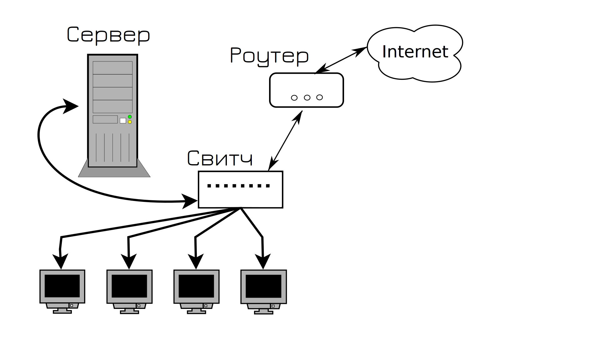

Давайте мы создадим свою компанию со своей инфраструктурой. Говорим с провайдером, он нам даёт роутер и интернет. Берём какой-нибудь системный блок и называем его сервером. Ставим на него Linux, поднимаем какой-нибудь сервис, выдаём IP адрес. Чтобы связать между собой пользователей, сервер и роутер, покупаем какой-нибудь простой свитч и подключаем всё между собой медными патч-кордами. Вот и готова наша инфраструктура. 

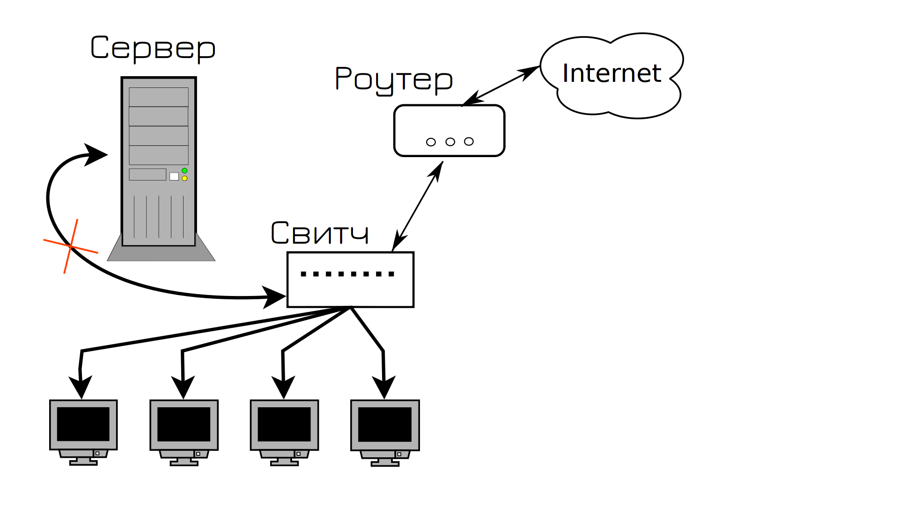

И всё работает, пока в один из дней кто-то случайно не положит что-то тяжелое на кабель, идущий к серверу. Кабель испортится и сервер становится недоступным. А вы в этот день взяли отгул. Пользователи не могут зайти на сервер, клиенты не довольны и вам в срочном порядке нужно ехать в офис и подключать новый кабель. 

Вся эта история знакомит нас с таким термином, как SPOF - single point of failure - единая точка отказа. Это такой элемент системы, выход из строя которого приводит к остановке работы сервиса. Сервис не в плане программы в системе, а в плане услуги для потребителя. Так вот, в нашей инфраструктуре кабель, соединяющий сервер со свитчом, был единой точкой отказа - он вышел из строя и сервис стал недоступен. Даже если операционка работает, программа внутри работает - для пользователей она недоступна. 

SPOF - это движущая сила IT, это один из главных терминов, отвечающих на большинство вопросов, в том числе - почему инфраструктура устроена так, а не иначе. Впрочем, вы всё поймёте, давайте продолжим.

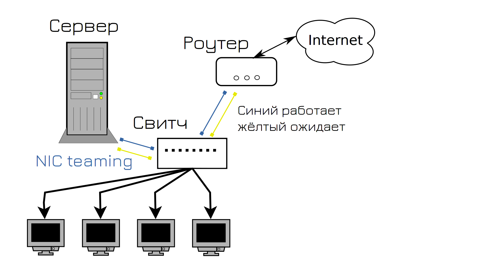

Конечно, мы могли бы просто заменить кабель и надеяться, что это больше не повторится, но мы поступим умнее и попытаемся предотвратить эту ситуацию. И в интернете мы нашли ответ, как это сделать - NIC teaming. Мы можем объединить в системе два порта, один будет работать, а второй ждать. Если с первым портом или кабелем что-то случится, всё перейдёт на второй порт. Так мы соединили сервер со свитчом двумя портами, ну и заодно решили также поступить с роутером, мало ли, и там что-то случится с кабелем. Можно было бы и с пользовательскими компьютерами заморочиться, но у нас портов на свитче не так много, а если у юзера повредится кабель - он может и на wifi пересесть.

И всё вроде нормально, пока в один из дней на сервере не выходит из строя сетевой адаптер. А так как вышел из строя адаптер, к которому были подключены оба кабеля, опять сервис стал недоступен, опять пользователи недовольны.

И чтобы решить эту проблему и предотвратить в будущем, мы покупаем два сетевых адаптера. Выйдет из строя один - всё автоматом перейдёт на второй, а мы в это время купим новый адаптер и заменим.

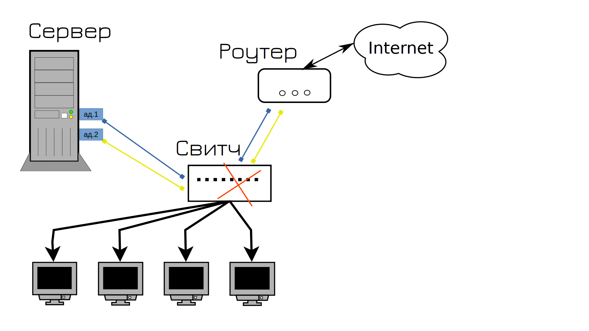

Знаете что потом вышло из строя? Свитч. И как мы это решим и предотвратим?

Правильно, купим второй свитч, одни кабели воткнём в первый свитч, вторые во второй, ну и свяжем между собой свитчи. Теперь, какой бы из кабелей не вышел из строя, сеть продолжит работать. Да? Ну почти, у нас сеть ляжет в первую же минуту.

Подключив два свитча между собой двумя кабелями, мы создали [петлю](http://xgu.ru/wiki/%D0%9F%D0%B5%D1%82%D0%BB%D1%8F_%D0%BA%D0%BE%D0%BC%D0%BC%D1%83%D1%82%D0%B0%D1%86%D0%B8%D0%B8). Если вкратце, свитчи начнут пересылать друг другу одни и те же пакеты, которые будут лавинообразно множиться и в итоге забьют всю сеть, из-за чего вся сеть станет недоступна.

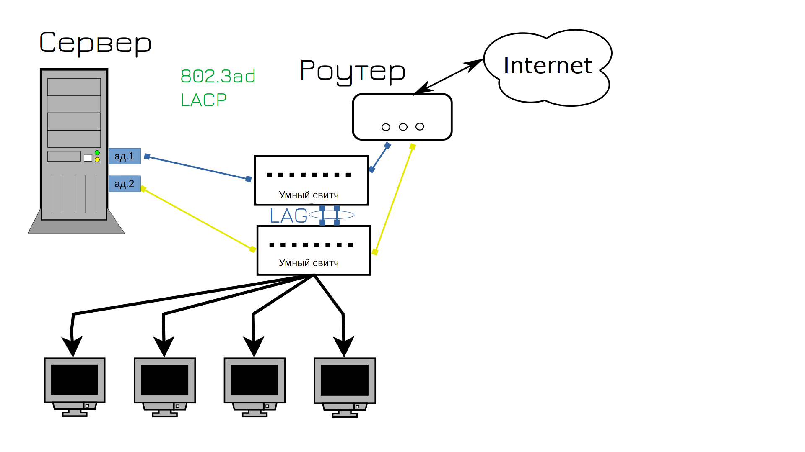

И мы находим решение этой проблемы - нужны свитчи поумнее. Они ещё называются управляемыми свитчами, т.е. managed switch. В них много полезного функционала, который бы нам пригодился. Например - агрегация портов - link aggregation - LAG. Это тот же самый NIC teaming, но со стороны свитча. Но если с тупыми свитчами нам приходилось один из кабелей держать в режиме ожидания, то теперь мы можем использовать оба кабеля. Мало того, что будет отказоустойчиво, ещё и будут использоваться оба кабеля одновременно. Раньше у нас использовался тип агрегации портов "активный и бэкапный", т.е. один из портов был в режиме ожидания, то теперь оба порта будут активны. Этот тип NIC-тиминга называется LACP, его ещё часто называют 802.1ad - под таким названием он описан в стандартах. НО LACP позволяет соединять несколькими портами только два устройства. Т.е. мы по LACP можем соединить два свитча. А как нам LACP использовать между сервером и двумя свитчами, чтобы оба порта были активны, при том что получается 3 устройства: два свитча и один сервер?

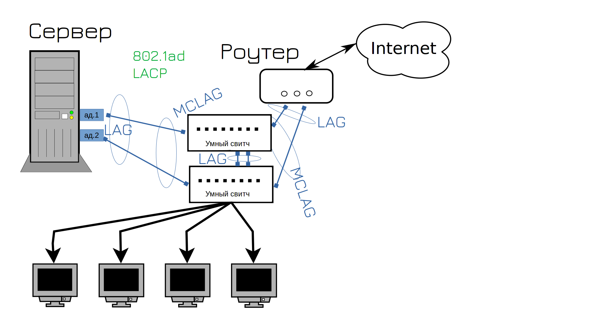

Для этого современные свитчи поддерживают так называемый MCLAG - multi-chassis lag - агрегация портов между несколькими устройствами. Так мы можем объединить в одну группу порты на первом и втором свитче. Сервер будет думать, что с другой стороны одно устройство, один свитч, поэтому на нём получится настроить NIC-teaming с поддержкой LACP. И теперь у нас выросла скорость сети и её отказоустойчивость. Ну теперь то у нас сеть не упадёт, так?

Рано радуетесь. Теперь вышел из строя роутер. Ну вот не везёт нам. Что делать дальше? Правильно, покупать второй роутер.

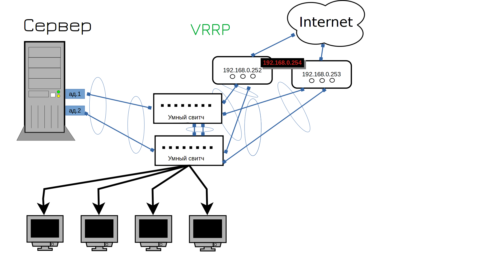

Окей, мы подключили второй роутер, но ведь у него другой адрес. А наши пользователи для выхода в интернет используют в качестве гейтвея только один адрес. Что, нам теперь бегать и везде менять гейтвей? Не. Как же нам на обоих роутерах поставить один и тот же адрес? Технически, так нельзя делать, у каждого устройства должен быть свой IP адрес. Но есть протокол VRRP, который позволяет разделить IP на два устройства. Сначала этим адресом пользуется одно устройство, но если оно перестанет работать - IP начнёт работать на другом. Скажем, если всё работает, то адрес 254 будет на первом роутере. А если первый роутер выйдет из строя - второй роутер возьмёт себе этот адрес. Ну теперь то точно всё?

А тут сюрприз от провайдера - интернет лёг. Кто-то что-то копал и повредил линию, интернет будет через пару часов. Ну ё-моё, что нам теперь, два интернет провайдера покупать?

А вы думали нет? Да, нужен второй провайдер. Кстати, ISP - это internet service provider - т.е. интернет провайдер. На этом этапе начинаются танцы с бубном, потому что нередко один провайдер даёт только один кабель, т.е. на два роутера его не подключить. И тут надо либо подключать один роутер к одному провайдеру, либо подключать провайдеры к свитчу - но тогда свитч становится единой точкой отказа. Можно воткнуть один кабель в один свитч, а второй кабель во второй свитч, но тогда при падении свитча переключится и интернет канал. Что обычно не критично, но будет неприятно. Два разных провайдера дают два разных публичных адреса, соответственно, один из ваших адресов станет недоступен. И те, кто по нему подключались, скажем, на ваши вебсервера, потеряют доступ. Ну и это можно обойти, если у ДНС провайдера настроить проверку доступности IP, но давайте такие дебри оставим на потом.

Ладно, сеть у нас нормализовалась. На неё теперь можно положиться - вряд ли с ней возможны проблемы. В реальной инфраструктуре свитчей будет побольше, но это просто количество, суть останется та же. Роутеры по разному можно объединять, мы с вами разобрали VRRP, который является стандартным открытым протоколом. А нередко в компаниях два роутера программно работают в одном кластере и переход IP адресов реализован иначе, через внутренний софт этого роутера.

#### Системы

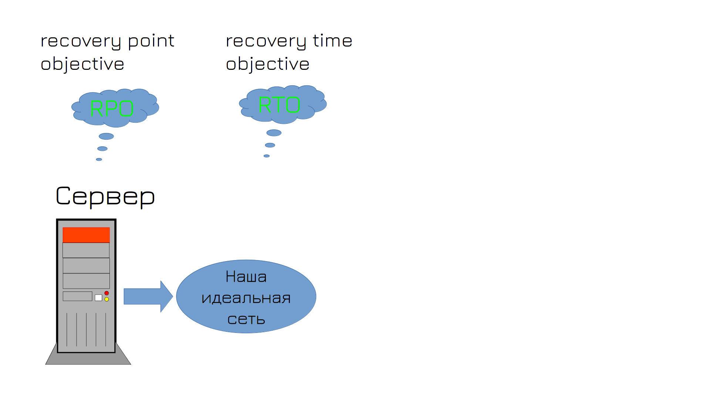

И после того, как вы с трудом объяснили начальству все проблемы и с трудом выбили бюджет, у вас ложится сервер - вышел из строя жёсткий диск. В этот момент у вас в голове зарождается много мыслей, среди которых есть термины RPO и RTO. 

- RPO - recovery point objective - это максимальный период времени, за который могут быть потеряны данные. Никто не хочет терять данные, но и делать бэкап ежесекундно и хранить кучу бэкапов выйдет нереально дорого. Поэтому вы с начальством соглашаетесь, что если что-то пойдёт не так, вы готовы потерять данные, например, за два последних часа. Это ваш RPO. Соответственно, бэкапы должны делаться примерно с такой периодичностью. 
- RTO - recovery time objective - промежуток времени, в течении которого система может оставаться недоступной. Т.е. сколько времени вам нужно будет, чтобы вернуть всё как было? Предположим, час, вы за это время успеете поставить новый диск, восстановить на него бэкап и всё запустить.

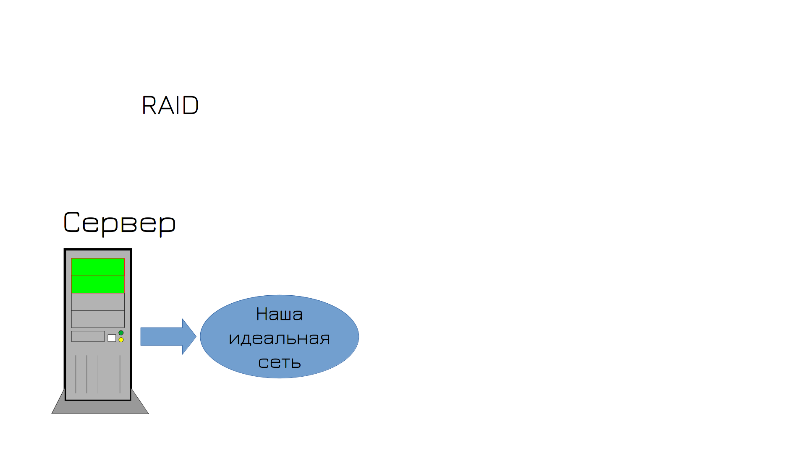

Но чтобы избежать повторения ситуации, вы решаете приобрести второй диск и настроить RAID. У вас два сетевых адаптера, два диска, что ещё может пойти не так?

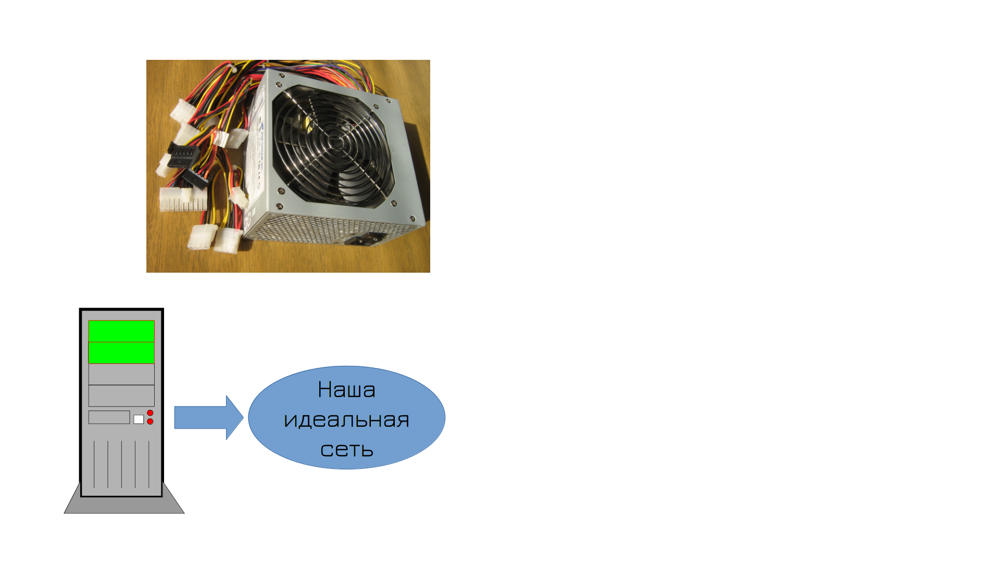

Например, может сгореть блок питания. Но второй блок питания на комп не поставишь. 

Зато мы наконец-то можем избавиться от этого хлама и купить настоящий сервер. У него есть рейд контроллер, процессор и оперативка, рассчитанные на постоянную работу и много всего полезного, например, отслеживание состояния всего оборудования. И целых два блока питания! Теперь то что может пойти не так?

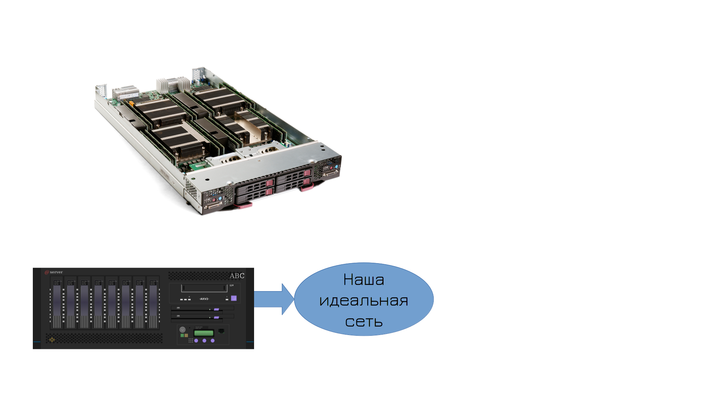

Почему бы не выйти из строя операционной системе? Или не сгореть материнке? Как насчёт второй материнки? А вот никак. 

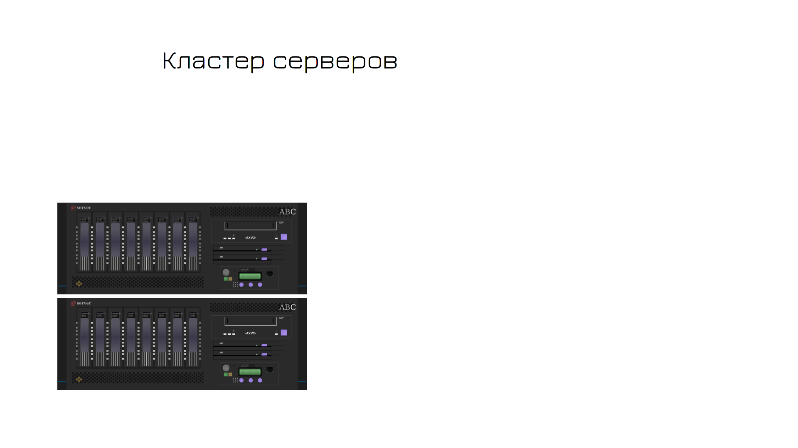

Что ж, придётся раскошелиться. Нужно купить второй сервер и сделать кластер. Кластер можно сделать на основе гипервизора, чтобы всё было в виртуалках и они запускались на разных серверах. Но делать кластер из двух серверов очень плохая затея, потому что если сервера потеряют связь друг с другом, то каждый из них посчитает, что упал второй сервер. И каждый попытается запустить виртуалки. Тогда получится каша и с большой вероятностью всё приведёт к порче данных. 

Поэтому кластер нужно делать из 3 серверов. Если выйдет из строя один сервер - другие два продолжат работать. Если какой-то сервер увидит, что потерял связь с двумя - то он посчитает, что проблема в нём и не станет запускать виртуалки. 

Окей, предположим, помер один из серверов. Как запустить виртуалку с того сервера на другом? Файлы виртуалки то лежат на сервере, который недоступен. Что, постоянно бэкапить виртуалки с одного сервера на другой? Тогда при падении сервера мы будем терять часть данных, а мы этого не хотели бы. Нам нужно данные держать как-то централизовано, чтобы они были одновременно доступны на всех трёх серверах.

Для этого есть готовые решения - системы хранения данных, часто называемые стораджами. Это эдакий сервер, где куча дисков, который нужен для раздачи пространства на сервера. Сервера подключаются к специальному свитчу, называемому SAN-свитчом, а он подключен к стораджу. На нём вы создаёте виртуальные диски, а сервера видят эти диски по сети. Только это не обычная сеть, которую мы изучали, а именно стораджовая сеть. Т.е. одновременно у вас работает и обычная сеть, где ходят сетевые пакеты, и также есть пара адаптеров оптических, которые выделены для доступа к дискам по сети. Такая сеть называется SAN - storage area network.

Сторадж, сам по себе, имеет два контроллера - т.е. что-то вроде двух материнок, поэтому для отказоустойчивости нет необходимости покупать второй сторадж. Внутри стораджа есть и рейд, и дедупликация, и снапшоты, и куча других технологий, полезных для хранения данных. 

Засчёт того, что все три сервера будут видеть одни и те же виртуальные диски, виртуалки будут спокойно перемещаться с одного сервера на другой.

Такая инфраструктура, когда есть сервера и системы хранения данных, называется классической. Есть и другие, но это отдельная тема.

И так, у нас накопились сервера, системы хранения данных и свитчи. Всё это оборудование сильно греется, выделяет много тепла и очень чувствительно к окружению. Стандартная температура, при которой такое оборудование чувствует себя в порядке - где-то 20 градусов. Скажем, при 30-35 градусах могут начаться проблемы и даже что-то испортиться. Также влажность должна быть где-то 40%. Такое окружение в обычных условиях организовать сложно, да и шум от серверов не даст вам спокойно работать. Поэтому всё это оборудование нужно хранить в специальных комнатах с подходящими условиями - в серверных комнатах. 

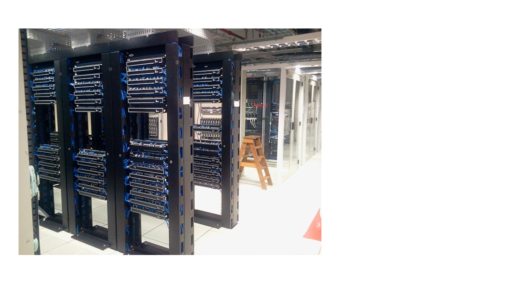

Ну и чтобы всё это оборудование не ставить на пол, есть специальные металлические шкафы, называемые рэками. Они стандартизированы - в основном высота и ширина у многих шкафов одинаковая. В рэках есть промежутки пространств, называемые Unit-ами, или просто U, по русски они звучат как "монтажная единица". И у неё высота где-то 4,5 сантиметра. У серверов, свитчей и прочего оборудования, как правило, высота соотвествует этим юнитам. Скажем, обычно свитчи занимают 1U, сервера - 1, 2, иногда 4U, в зависимости от мощностей и древности этих серверов. 

Есть определённые требования к серверным - откуда должен поступать воздух, как он должен циркулировать, должны быть специальные кондиционеры для регулирования температуры и влажности в серверной, специальные системы мониторинга окружения, чтобы следить за температурой, влажностью и другими параметрами, а также специальные системы пожаротушения. В общем, к серверным комнатам огромное количество требований.

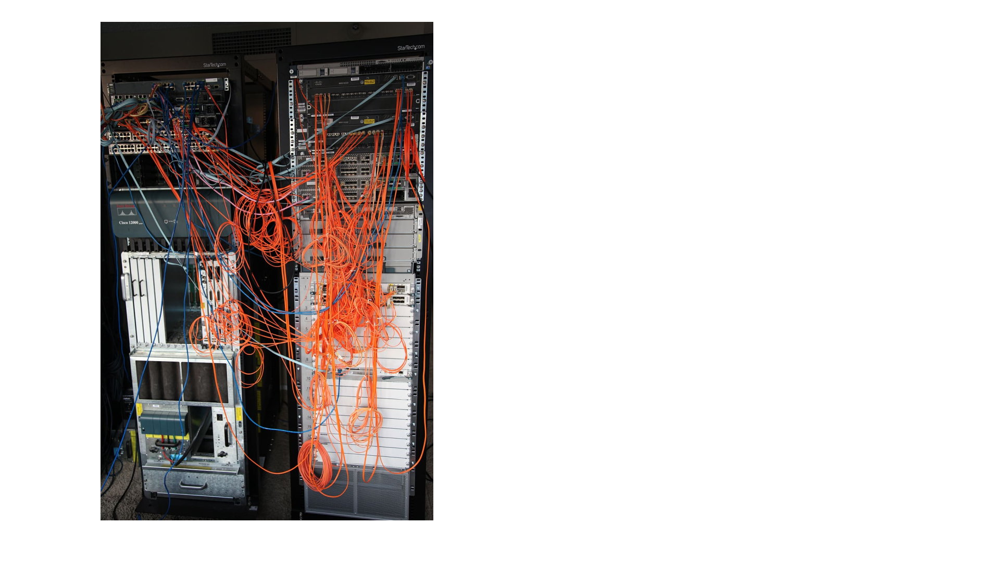

Что, думаете потратив столько денег и собрав такую серверную, вы избавились от единой точки отказа? Ха, как бы не так. В один день у вас просто вырубает электричество. Это ж не ваша вина, что можно с этим поделать? Что-то я не слышал, чтобы у гугла свет отрубили, поэтому он стал недоступен. 

Так что берём деньги в руки и покупаем UPS-ы. Но домашние не подойдут, вы в курсе сколько электричества жрёт всё это оборудование? Нужны UPS-ы помощнее. Если у вас один-два шкафа оборудования, то сойдут UPS-ы для рэков. Да и на один UPS рассчитывать не стоит, поэтому нужно минимум два. А бывает, что оборудования много, да и вы не хотите, чтобы по всему зданию пропадал свет. Поэтому можно под UPS-ы хоть отдельную комнату выделить. Но это уже не совсем касается IT, нам важно, чтобы сервера работали, чтобы сервис был доступен.  

А что, если электричество пропадёт надолго? Разбиваем последнюю копилку и 
проводим вторую линию электричества. Один блок питания UPS-ов сажаем на одну линию, второй блок - на вторую. Ляжет электричество с одной стороны - будет работать на другой. 

Что, думаете на этом всё? А если серверную затопит? Если по всему городу пропадёт электричество? Если на город упадёт метеорит? Что, из-за этого бизнес должен перестать работать? Как бы не так. 

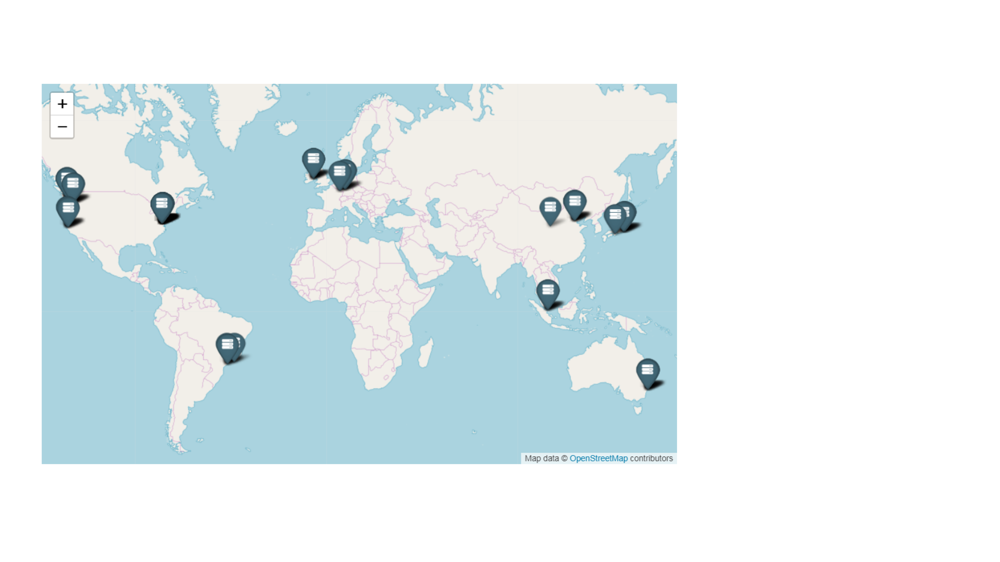

Строим копию нашего датацентра в другом здании, другом городе, другой стране, другом континенте, другой планете. Чтобы ни случилось, наша инфраструктура должна работать. Вы думаете Илон Маск осваивает Марс для людей? Поверьте, первое что там появится - датацентр.

Теперь вы понимаете, почему SPOF - главный термин в IT и почему IT такое дорогое удовольствие? Есть много других нюансов, которые я не упомянул, но со временем вы многому научитесь. Да, не каждая компания строит запасной датацентр, но вы растёте как специалист, когда вместо одного кабеля подключаете два.