

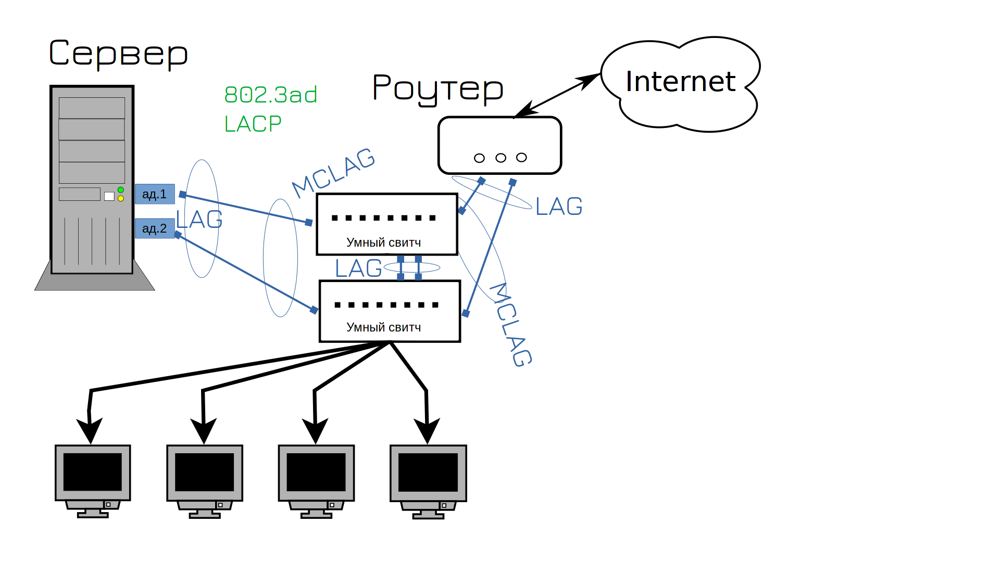

Ещё одна задача, с которой администратор сталкивается с точки зрения взаимодействия со свитчом - настройка агрегации каналов, т.е. объединение нескольких портов. Мы об этом говорили в первой теме, мол, нужно использовать два сетевых адаптера и два свитча. На самом деле можно больше портов и проводов, хоть 4, хоть 8. Но, обычно, это либо 2, либо 4. 

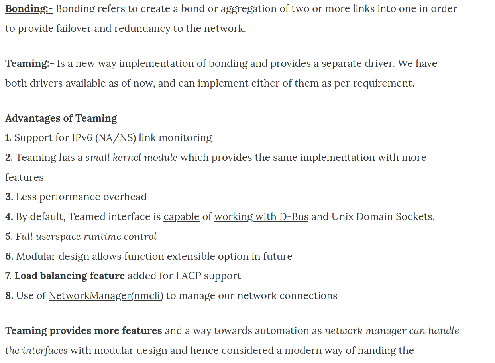

Агрегацию каналов называют по разному - к серверам обычно относят понятия NIC teaming, bonding, а к свитчам etherchannel, portchannel, lag и т.п. Но обычно все под этим подразумевают одно и тоже. Правда в линуксах есть два модуля, раньше был только bonding, но потом добавили новый и более продвинутый вариант - тиминг.


В итоге при настройке вы будете натыкаться и на bonding, и на teaming, оба делают одно и тоже, просто teaming немного получше.  

LAG даёт сразу два плюса - во-первых, повышает отказоустойчивость, во-вторых - пропускную способность. Насчёт второго, кстати, не любая агрегация портов это позволяет, а только конкретная реализация  - LACP. При этом не путайте скорость с пропускной способностью. Для одного соединения максимальная скорость будет всё равно скоростью одного линка. Т.е. условно, если будете качать один файл - то скорость будет максимум гигабит, а если несколько файлов - то они распределятся по портам и суммарно выйдет примерно два гигабита. Ну и нельзя делать LACP между портами с разными скоростями.

LACP нужно настраивать с двух сторон - т.е. и на сервере, и на свитче. А на тупых свитчах этого не настроить - соответственно, для LACP нужны управляемые свитчи. Но это обычно не проблема - сервера к тупым свитчам цепляют разве что в совсем грустных компаниях.

Но именно в такой ситуации мы с вами и оказались - свитчи, которые даёт GNS - почти что тупые. С одной стороны в них есть настройка VLAN-ов - а это нельзя сделать на неуправляемых свитчах. С другой - это всё, что они могут. Может быть в будущем мы с вами в GNS поднимем другие свитчи, на линуксах, но пока будем довольствоваться этими. 


Поэтому в нашей схеме вместо LACP мы будем использовать "activebackup" - в таком случае из двух соединений будет работать только одно. Но для примера мы настроим LACP между двумя хостами, просто чтобы было понимание. 


Для начала запустим alma1. Нам опять придётся пользоваться консолью, но скоро мы пересядем на удобный ssh. Посмотрим список активных интерфейсов:

```
ip a
```

Так как мы подключили 0 и 1 адаптеры в GNS, то первые два интерфейса в системе будут в UP-е - enp0s3 и enp0s8. Используя их нам нужно будет создать один логический интерфейс. 


Сегодня, вместо nmtui мы будем пользоваться nmcli - командной версией этой утилиты. Это будет немного нагляднее. Помните, заходя в nmtui мы в edit connection видели список профилей сетей? В командной строке их можно увидеть с помощью команды:

```
nmcli connection show
```

Network manager по-умолчанию создал для активных интерфейсов профили - и по столбику Device их можно распознать. Нам нужно будет создать новый профиль, в котором мы будем использовать эти устройства. И чтобы профили друг с другом не конфликтовали, эти надо удалить. Можно даже все 4 удалить.


Для этого используем опцию delete и указываем все профили через пробел:

```
nmcli connection delete enp0s3 Wired\ connection\ 1 Wired\ connection\ 2 Wired\ connection\ 3
nmcli con sh
```

Как видите, теперь профилей не осталось.


Теперь надо создать новый профиль. Для этого используем опцию add:

```
nmcli connection add type team con-name teams3s8 ifname myteam
```

При создании мы должны указать тип интерфейса. Помните, мы при создании VLAN-а в списке выбирали VLAN? А тут мы выбираем team. Дальше даём имя профилю с помощью опции con-name. Пусть будет teams3s8. Ну и помните при создании VLAN-а мы указывали device? Мы создаём логический интерфейс и можем назвать его как угодно. Назовём myteam. Ну и посмотрим, что получилось:

```
nmcli con sh
```

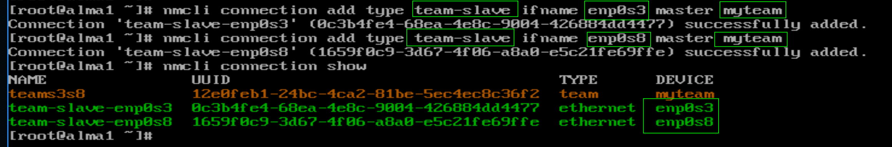

Теперь нужно привязать enp0s3 и enp0s8 к этому тиминг интерфейсу. Для этого надо создать два новых профиля с типом team-slave:

```
nmcli con add type team-slave ifname enp0s3 master myteam
nmcli con add type team-slave ifname enp0s8 master myteam
```

В них указываем имена интерфейсов, которые будет входить в группу портов - ifname enp0s3 и enp0s8. Также после master указываем имя общего интерфейса - myteam. 

Ещё раз проверим, что получилось:

```
nmcli con sh
```

Как видите, теперь тут 3 профиля.

Теперь всё что касается IP адресов и прочего нужно настраивать на мастер интерфейсе, т.е. на профиле teams3s8. 


Начнём с раннера. Это,  собственно,  механизм, как несколько интерфейсов будут работать вместе. Тот же самый lacp или activebackup. Есть и другие раннеры, но они специфичны и используются не так часто. Можете почитать о них по [ссылке](https://access.redhat.com/documentation/en-us/red_hat_enterprise_linux/8/html/configuring_and_managing_networking/configuring-network-teaming_configuring-and-managing-networking#understanding-the-teamd-service-runners-and-link-watchers_configuring-network-teaming). В нашей ситуации нужно выбрать activebackup. И так, в профиле teams3s8 меняем runner на нужный:

```
nmcli con modify teams3s8 team.runner activebackup
```

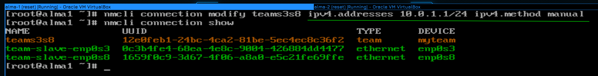

Ну и напоследок пропишем IP адрес в этом профиле:

```
nmcli con mod teams3s8 ipv4.addresses 10.0.1.1/24 ipv4.method manual
```

Также мы должны указать метод получения IP - manual. Помните, мы в nmtui меняли Automatic на manual? То же самое.

Чтобы увидеть всевозможные настройки интерфейса, можно посмотреть его с помощью опции show:

```
nmcli con show teams3s8
```

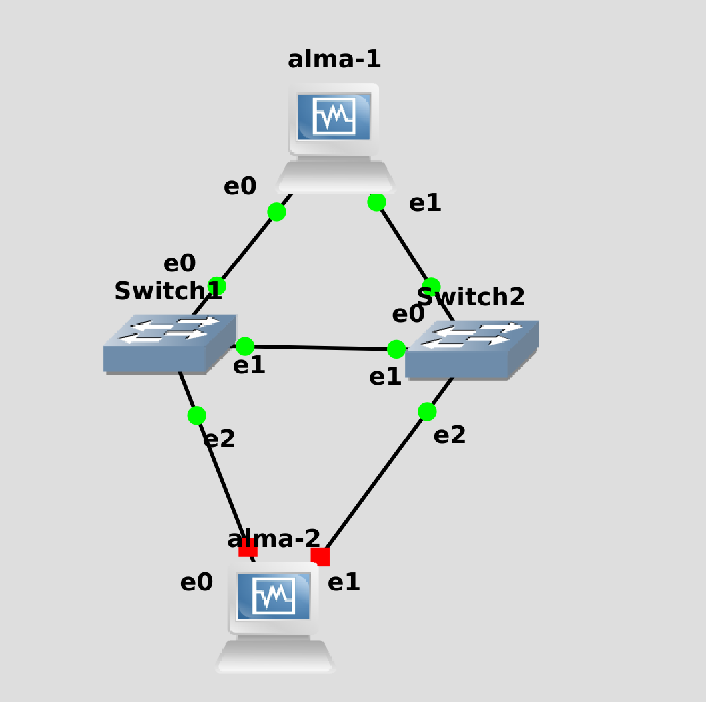

Мы вроде всё настроили, но для проверки нужен второй хост. Давайте подключим к этой же сети alma2 и на ней настроим такую же сеть.


Для начала посмотрим список всех профилей и удалим их:

```
nmcli con show 
nmcli con del enp0s3 Wired\ connection\ 2 VLAN2 Wired\ connection\ 1 Wired\ connection\ 3
nmcli con sh
```

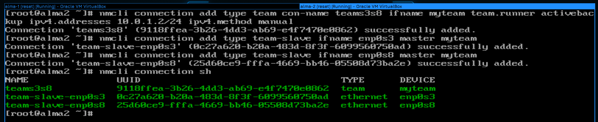

Затем можно в одну строчку создать тиминг интерфейс со всеми нужными параметрами:

```
nmcli con add type team con-name teams3s8 ifname myteam team.runner activebackup ipv4.addresses 10.0.1.2/24 ipv4.method manual
```

Ну и добавим к этому мастеру слейв интерфейсы:

```
nmcli con add type team-slave ifname enp0s3 master myteam
nmcli con add type team-slave ifname enp0s8 master myteam
```

И посмотрим, что получилось:

```
nmcli con show
```


Осталось на обоих хостах поднять профиль, чтобы настройки применились:

```
nmcli con up teams3s8
```

Убедиться, что появился интерфейс и на нём есть IP адрес:

```
ip a show myteam
```

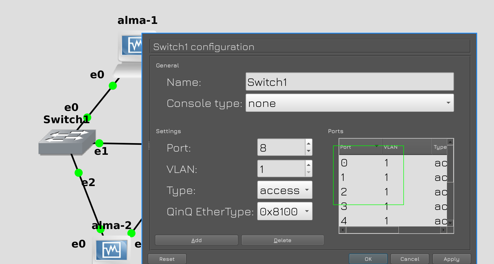

Ну и вернём настройки свитча в исходное положеное, т.е. уберём VLAN-ы и транк интерфейс.

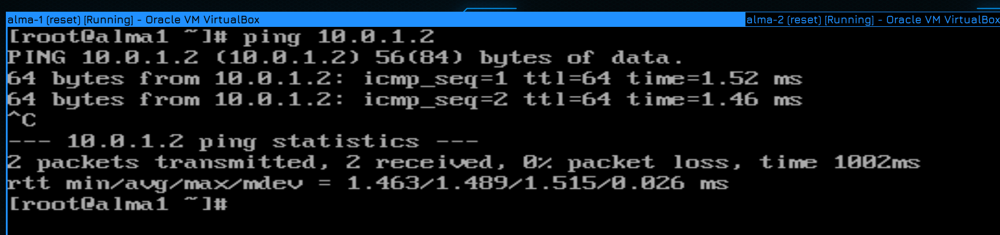

Теперь попробуем пингануть альму 2 с первого хоста:

```
ping 10.0.1.2
```

Всё пингуется, значит связь есть.

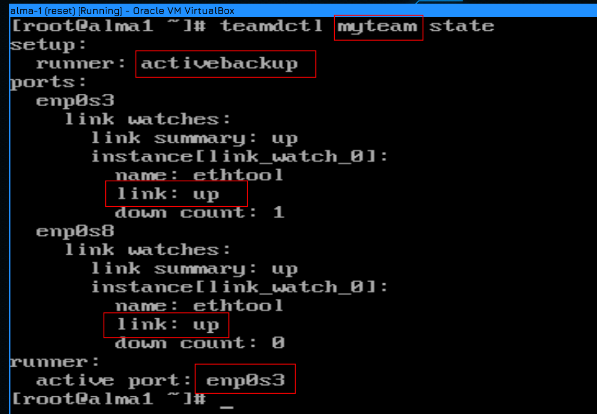

Мы говорили, что при activebackup работает только один интерфейс. С помощью утилиты teamdctl мы можем просмотреть информацию о тиминг интерфейсе:

```
teamdctl myteam state
```

Обратите внимание, что утилите нужно указывать имя интерфейса, а не имя профиля. Здесь мы видим, что для этого интерфейса в качестве раннера используется activebackup, что оба интерфейса в апе, и что активным является enp0s3. На второй альме ситуация та же, т.е. активный интерфейс - enp0s3.


Мы помним, что интерфейс enp0s3 - это e0 в GNS. Оба хоста этими интерфейсами идут к свитчу 1, т.е. сейчас всё проходит через свитч 1. 

Для наглядности, давайте в GNS "испортим" провод, ведущий от альмы 1 к первому свитчу. Но сперва запустим пинг к хосту 2, чтобы увидеть, как себя ведёт сеть. 

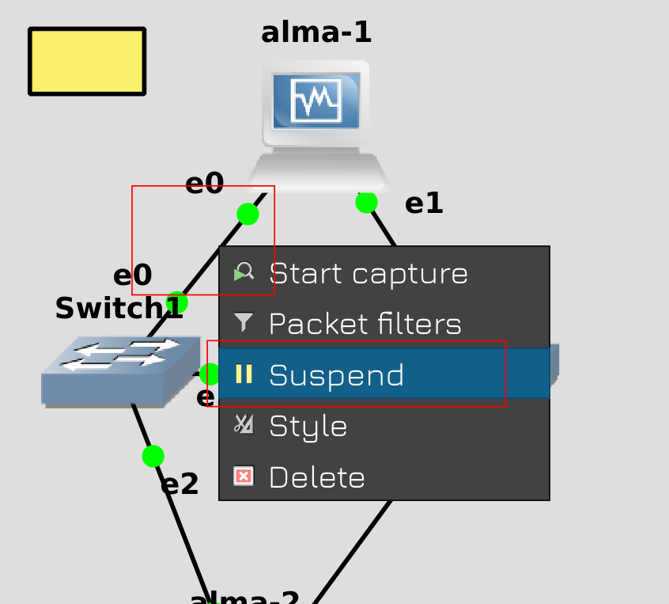

Затем нажмите правой кнопкой мыши на кабеле и нажмите Suspend. 

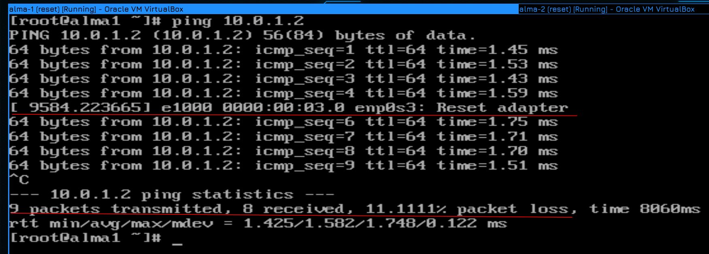

Вернёмся к альме 1. Как видите, в момент пинга мы увидели ошибку c адаптером enp0s3, а затем пинг продолжился. После остановки пинга в результатах видно, что была потеря пакетов, но небольшая - всего 1 пинг. Для большинства случаев потерять пару пакетов не критично, сеть в целом сделана так, чтобы потерянные пакеты потом в любом случае дошли.

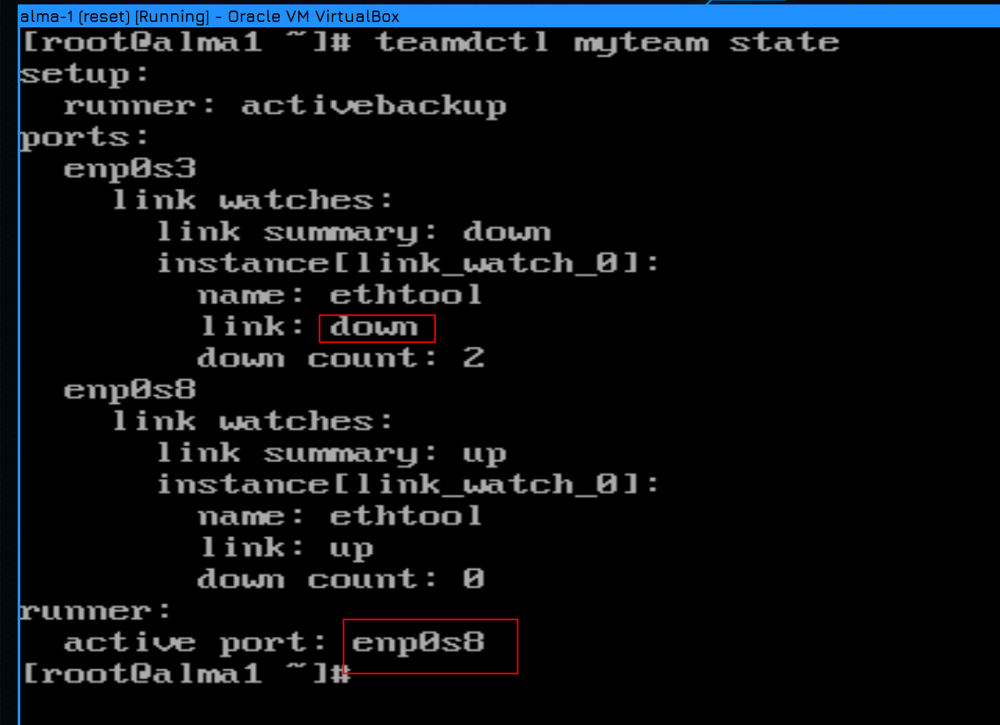

Если ещё раз глянуть вывод команды teamdctl, то можно увидеть, что enp0s3 теперь недоступен и вместо него активным стал enp0s8.

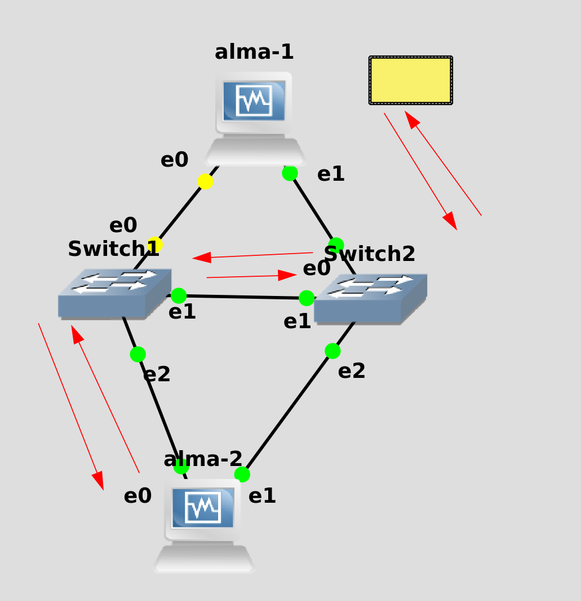

Теперь альма 1 видит только свитч2. Но на альма2 по прежнему активен интерфейс е0, поэтому он обращатеся только к свитчу 1. В итоге пакет из альмы 1 идёт сначала на свитч 2, потом на свитч 1 и только потом на альму 2.


Давайте ещё раз запустим пинг, но теперь вырубим кабель, идущий от второй альмы к первому свитчу. И опять мы потеряли один пакет. Теперь для общения между хостами остался только второй свитч. 

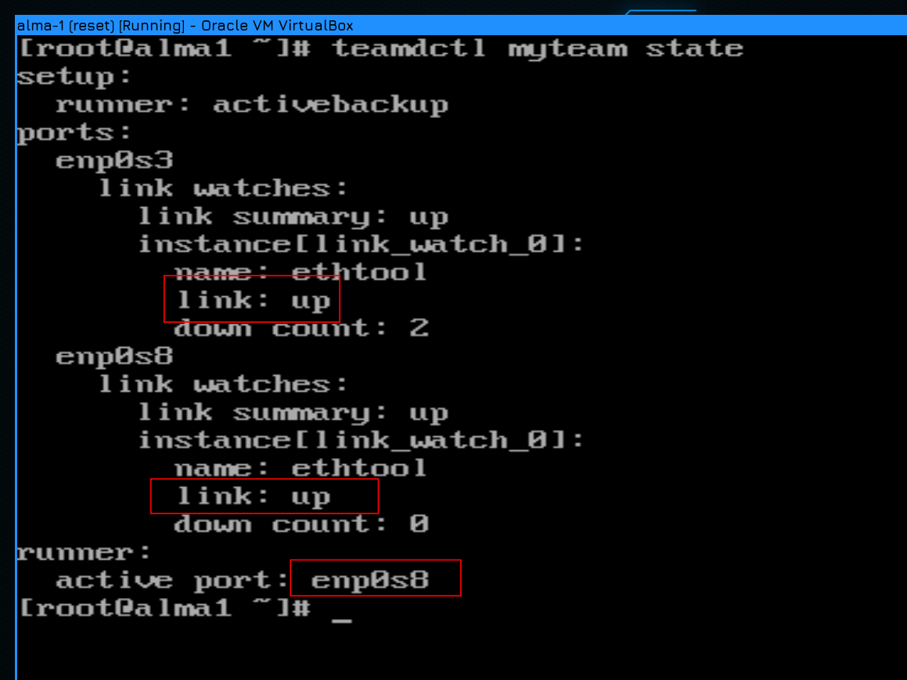

Ну и после восстановления обоих проводов teamdctl показывает, что оба линка доступны.


Теперь настроим LACP. Как вы, возможно, догадываетесь, отличий в настройке вообще не будет, кроме опции team.runner. Поэтому для разнообразия альму 2 подключим сразу двумя тиминг интерфейсами - activebackup будет смотреть на свитчи, а lacp будет смотреть на третью альму. 


После подключения на alma2 мы видим:

```
ip a
```

что интерфейсы enp0s9 и enp0s10 поднялись.


А дальше те же команды создания тиминг интерфейса и слейвов:

```
nmcli con add type team con-name teams9s10 ifname myteam2 team.runner lacp ipv4.addresses 10.0.2.2/24 ipv4.method manual
nmcli con add type team-slave ifname enp0s9 master myteam2
nmcli con add type team-slave ifname enp0s10 master myteam2
nmcli con show
```

Разве что для имени интерфейса придумываем другое название  - myteam2, указываем раннер lacp, ну и другой айпи адрес. И на слейвах мастером указываем myteam2. Мои названия myteam и myteam2, конечно, не лучшие. В реальной среде обычно называют team0, team1 и т.д., но для наглядности я использовал такие названия, чтобы вы отличали имя профиля в network-manager-е от имени интерфейса.

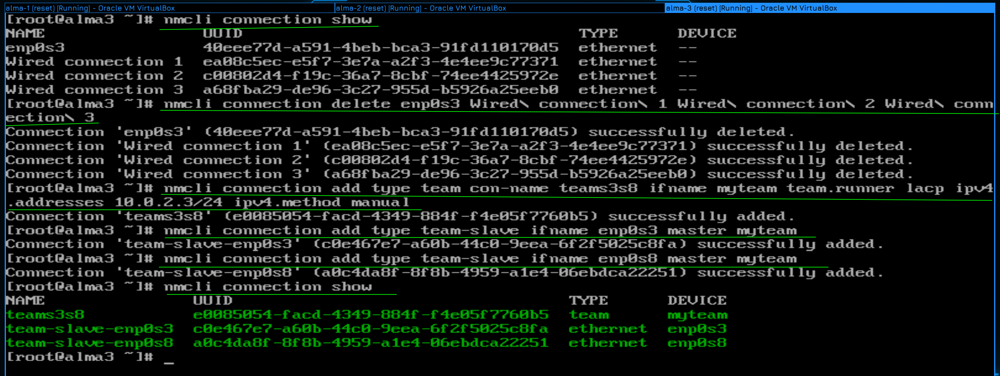

Ну и на alma3 всё по той же схеме - очищаем профили, создаём профиль с тиминг интерфейсом с раннером lacp и создаём слейвы:

```
nmcli con show 
nmcli con del enp0s3 Wired\ connection\ 2 VLAN2 Wired\ connection\ 1 Wired\ connection\ 3
nmcli con add type team con-name teams3s8 ifname myteam2 team.runner lacp ipv4.addresses 10.0.2.3/24 ipv4.method manual
nmcli con add type team-slave ifname enp0s3 master myteam2
nmcli con add type team-slave ifname enp0s8 master myteam2
nmcli con show
```

Понимаю, в консоли со шрифтами беда и неудобно читать, но для настройки ssh нужно было бы настроить сеть и NAT, а это будущие темы, поэтому не хотелось прыгать вперёд.


После настройки сети попробуем с альмы3 пингануть второй хост:

```
ping 10.0.2.2
```

Всё пингуется - значит сеть работает.

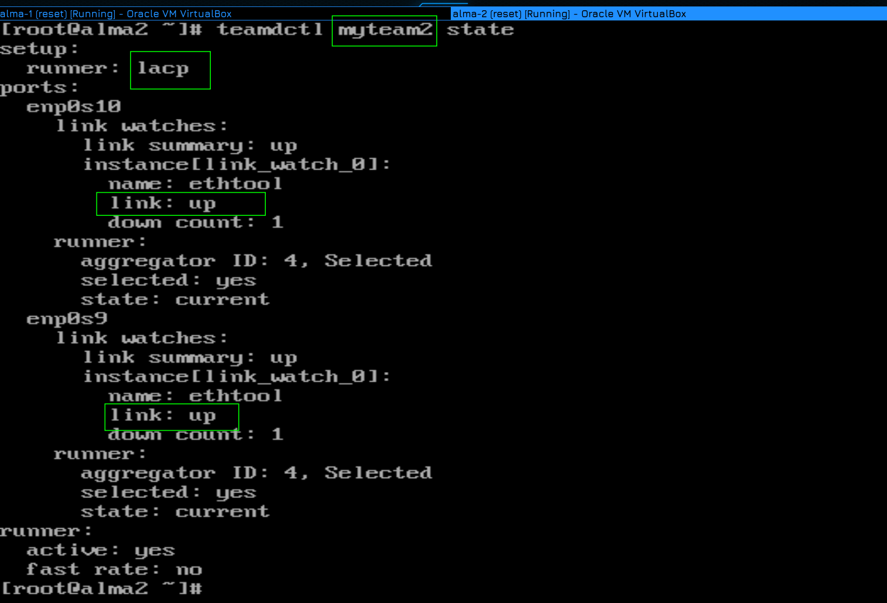

Давайте ещё на альме 2 посмотрим teamdctl на второй интерфейс:

```
teamdctl myteam2 state
```

Как тут видно, в качестве раннера выбран lacp и оба интерфейса в апе.

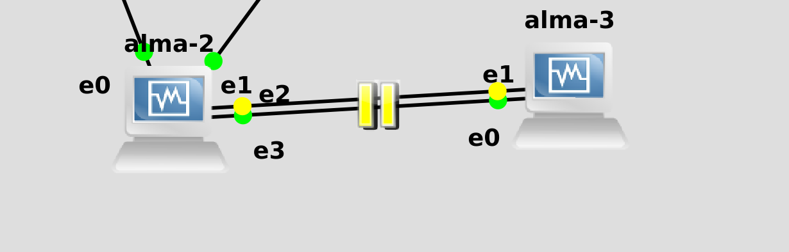

Ну и давайте тестировать. Я запускаю пинг:

```
ping 10.0.2.3
```

потом вырубаю один из линков в GNS, жду пару секунд, врубаю его, потом жду пару секунд, чтобы первый интерфейс пришёл в себя, затем выключаю второй линк, опять жду и включаю. 


И, как видите, по результатам пинга ни одного потерянного пакета,  т.е. всё работает идеально. Поэтому LACP более предпочтительнее в рабочей среде, но, в крайнем случае, даже с тупыми свитчами можно настроить отказоустойчивость через activebackup.

Что касается одновременной настройки никтиминга и вланов, то сначала следует создать тиминг интерфейс, а уже потом использовать его в качестве интерфейса для вланов.


Для примера создадим второй влан и пустим его между альма 1 и альма 2. Сначала надо на обоих свитчах на портах 0, 1 и 2 выставить тип dot1q. Эти свитчи не умеют пропускать только два влана, поэтому они пускают либо 1, как стоит по дефолту, либо все. Ну вот мы сейчас все и разрешаем. При этом первый влан остаётся нетегированным.

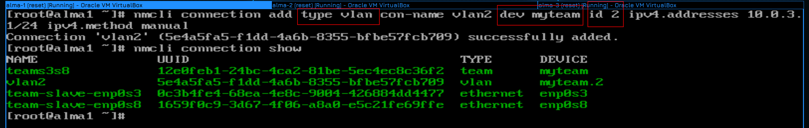


Дальше на альме 1 и 2 создаём через nmcli профили с типом vlan:

```
nmcli con add type vlan con-name vlan2 dev myteam id 2 ipv4.addresses 10.0.3.1/24 ipv4.method manual
```

```
nmcli con add type vlan con-name vlan2 dev myteam id 2 ipv4.addresses 10.0.3.2/24 ipv4.method manual
```

Обратите внимание, что при создании я указываю интерфейс, поверх которого будет влан - dev myteam, и id этого влана - id 2. А имя профиля и адреса - всё по стандарту.

Ну и посмотрим список полученных интерфейсов:

```
nmcli con show
```

Как видите, профили создались.


Ну и пинги тоже работают, т.е. всё как мы и хотели.


Суммируя всё что мы сегодня сказали, вам нужно будет создать показанную схему. Т.е. подключите 3 хоста к двум свитчам используя ник тиминг в режиме activebackup и настройте на этих интерфейсах 3 влана с тремя сетями. Ну и конечно же убедитесь, что всё работает - что все друг друга пингуют по всем трём сетям, потом поотключайте провода и проверьте на отказоустойчивость. 

Подводя итоги, сегодня мы с вами разобрали, что такое никтиминг, научились его настраивать, разобрали разницу между activebackup и lacp, и даже научились пускать вланы поверх агрегированного интерфейса. И пусть вас не пугают команды, они хоть и длинные, но довольно простые.