


Представим, что у нас в сети есть 2 VLAN-а - VLAN 1 для пользователей и VLAN 2 для серверов. Устройства в одном влане могут видеть друг друга напрямую, используя лишь свитчи для соединения. Можно даже без свитчей, просто соединив два компьютера патч-кордом. Но мало видеть друг друга - нужно, чтобы и адреса были в одной подсети - скажем, 10.0.1.0/24. У пользователей IP адреса находятся в подсети 10.0.1.0 и могут варьироваться от 10.0.1.1 до 10.0.1.254. У серверов всё тоже самое, но только с приставкой 10.0.2. Считайте, что VLAN-ы - это физические границы, а подсети - логические. Но чем вообще обусловлены логические границы, почему именно от 10.0.1.1 до 10.0.1.254?

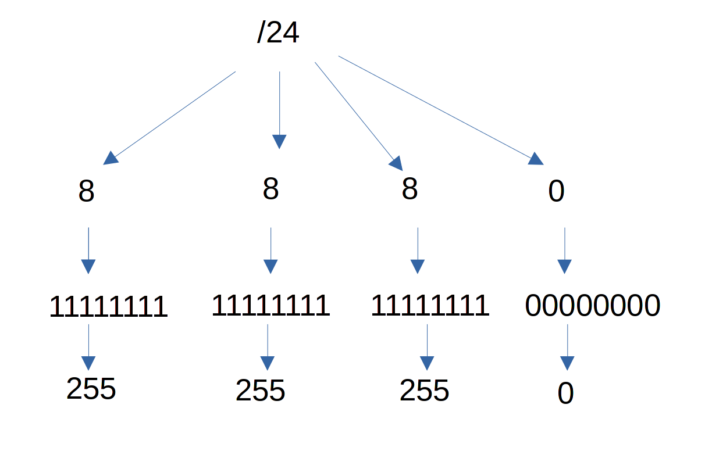

Всё дело в маске подсети, в том самом /24, который мы указываем после адреса. Я не буду сильно вдаваться в подробности, но вкратце: в ipv4 всё сводится к 4 байтам, для IP адреса есть 4 байта и для маски есть 4 байта. Каждый байт состоит из 8 бит в которых можно уместить 256 значений - от 0 до 255. Скажем, в маске /24 - который по другому будет 255.255.255.0 - полностью забиты первые 3 октета, т.е. первые 3 байта, но последний байт полностью свободен. А значит он может принять 256 значений. Это и говорит нам, какие адреса могут быть использованы в этой подсети. Правда адрес 0 выделяется как адрес сети, а адрес 255 - как броадкаст адрес. Скажем, если послать какой-то пакет на адрес 10.0.1.255 - то этот пакет придёт всем хостам, у которых адрес в подсети 10.0.1.0/24. 

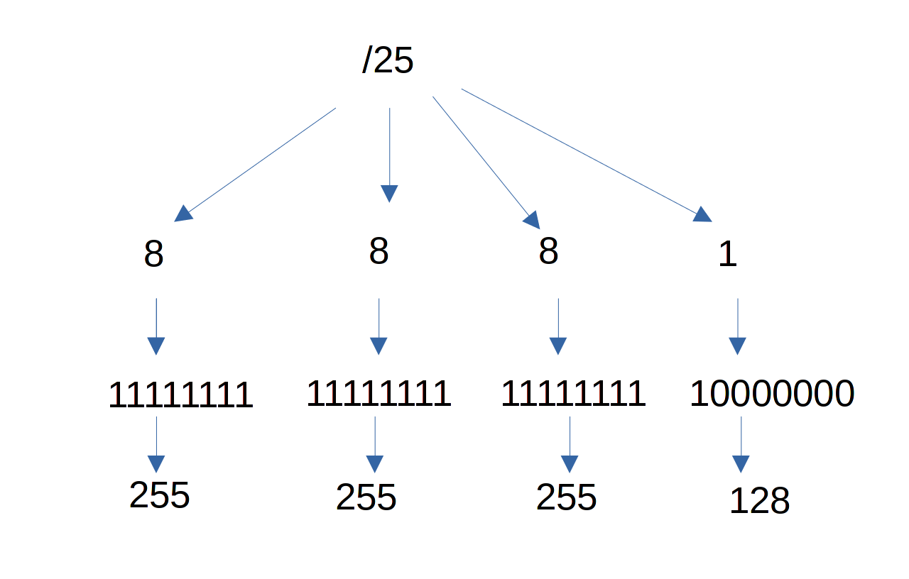

Для примера возьмём другую маску - /25. В таком случае в последнем октете забивается первый бит, поэтому количество вариаций сокращается вдвое - остаётся только 128 адресов. В итоге адреса будут от 0 до 127, при этом 0 останется адресом сети, а broadcast адресом станет 127. Устройствам же можно будет назначить адреса от 1 до 126. 


При этом, из-за того, что мы поделили сеть пополам, появляется вторая сеть - она начинается от 10.0.1.128 до 10.0.1.255. Ну и IP адреса будут варьироваться от 129 до 254. 


По той же логике /26 - теперь у нас свободными останутся 64 адреса. 


И таким образом появятся 4 сети по 64 адреса, ну и естественно не забывайте про адрес сети и броадкаст, из-за чего -2 адреса.

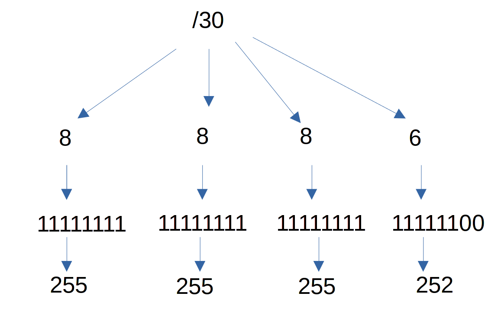

Если вы арендуете у провайдера один публичный адрес, очень часто провайдер выделяет вам вместе с адресом маску /30 - в такую сетку входит 4 адреса. Отнимаем -2 - получается два адреса. Один адрес будет адресом вашего роутера, а второй - адресом роутера провайдера. Просто провайдер не хочет сажать всех клиентов в одну сеть, так как это не очень безопасно. Но при этом не может ради вас одного выделить целых 254 публичных адреса. Поэтому и нужна такая сегментация - когда адресов мало, но вам нужно как-то делить их. 

Если у вас в компании не десятки тысяч устройств, то зачастую можно не заморачиваться с масками - адресов для локальных сетей огромное количество, поэтому на каждую сеть можно вешать маску /24. Хотя иногда приходится делить подсеть, т.е. делать из одной большой подсети несколько небольших. 


Но обычно подсчёты подсетей, масок и адресов это задача сетевого администратора, однако системный администратор должен иметь об этом представление. Чтобы хотя бы понимать, что выставляя такую-то маску, такие-то хосты будут с ним в одной подсети, а такие-то в другой. В целом неплохо бы уметь это делать просто увидев маску, но это приходит с опытом. В любом случае, в интернете есть огромное количество калькуляторов подсетей - просто погуглите subnet calculator. Они позволят вам понять, какую маску нужно выставлять, ну или какие хосты входят в вашу подсеть.


А видя кто входит в вашу подсеть, вы понимаете, кто в неё не входит. И хотя мы отделяем, изолируем подсети - мы всё же хотим, чтобы хосты могли общаться. Отделяя пользователей от серверов, нам всё равно нужно, чтобы пользователи могли обращаться к серверам. 


И для этого нам нужно устройство, которое будет одновременно и в первой сети, и во второй. Если каждая подсеть это комната, то нужна дверь, которая есть одновременно в обоих комнатах. И этой дверью выступает маршрутизатор, ну или по другому его называют роутер. Основная задача роутера - перенаправлять пакеты из одной подсети в другую. Т.е. роутер обитает на 3 уровне модели OSI - сетевом.

Скажем, alma1 хочет обратиться к alma3. Для этого alma1 должна понимать, что путь к alma3 ведёт через router. А роутер при этом должен иметь адрес как в сети 10.0.1.0, так и в сети 10.0.2.0. Т.е. свитчи соединяют устройства в рамках одной подсети, а роутеры соединяют разные подсети, формируя целую сеть. А соединяя одни роутеры с другими мы связываем сети и в итоге это всё формирует целый интернет. 


С домашними роутерами вы все знакомы - небольшая коробочка, в которой как минимум 2 порта - один идёт к провайдеру, а второй к вашей локальной сети. 


Естественно, в средних и крупных компаниях много трафика и такой коробочки недостаточно, поэтому используются роутеры посерьёзнее, которые могут передавать десятки и сотни гигабит в секунду, при этом их можно монтировать в рэки. 

Возможно, вы задались вопросом - а зачем нам нужно отделять сети, если в итоге мы их соединяем через роутеры? В чём смысл?

Если бы роутер был только роутером, то смысла действительно было бы мало. Не то чтобы совсем не было, как минимум через роутер не ходит l2 broadcast трафик, и поэтому он не ходил бы от миллиардов устройств и не перегружал бы все свитчи в мире. Но я не об этом. В современном мире смысла от чистого роутера нет - недостаточно просто пропускать трафик, надо его ещё проверять. Да, мы хотим, чтобы юзеры могли обращаться к серверам, но не ко всем и не по любому протоколу. Не каждому юзеру нужен доступ на сервер по ssh, обычно хватает доступа по HTTPS. Ну и мало кому из юзеров нужно на напрямую на сервер с базой данных.

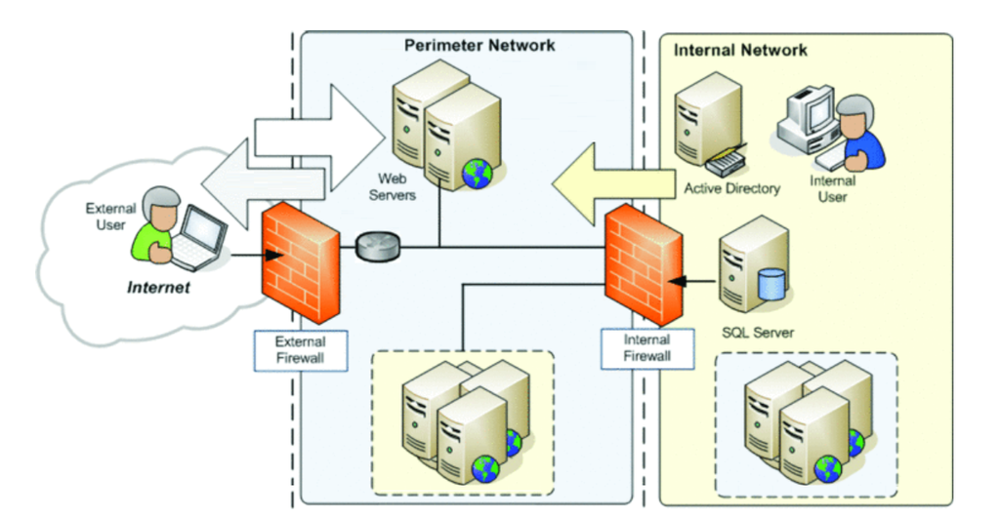

Поэтому на роутерах почти всегда есть сетевой firewall. Он не просто пропускает весь трафик, но и проверяет - а можно ли компьютеру 1 доступ к серверу 1? Если нет - то этот пакет блокируется. Но недостаточно просто проверить доступ от одного IP к другому - может мы хотим разрешить доступ по 80, но блокировать по 22 порту? Значит из-за файрвола роутер должен выйти за рамки l3 - и, как минимум, мыслить на 4 уровне - транспортном, который отвечает за порты.

Но для современных роутеров даже этого недостаточно. Да, мы хотим, чтобы пользователь мог заходить на сервер по 80 порту, но мало ли что там пользователь делает? А вдруг он пытается использовать какую-то уязвимость вебсервера? Или, скажем, мы разрешаем нашему пользователю доступ в интернет, но не хотим, чтобы он заходил на какие-то опасные сайты? Просто дав ему доступ по 80 и 443 порту мы никак не проверим, на какой именно сайт он заходит. 


Поэтому простые сетевые файрволы также давно утратили смысл, вместо них используются так называемые UTM - это одновременно и роутер, и сетевой файрвол, и VPN сервер, и антивирус, и у него есть куча других примочек касательно безопасности. Это устройство уже действует на всех уровнях сети для комплексной защиты инфраструктуры. Естественно, такие решения стоят гораздо дороже обычных роутеров. Но если уж мы взялись связывать то, что изолировали - то и эта связь должна быть безопасной. Однако какие бы многофункциональные не были современные решения, основы маршрутизации остались те же, всё остальное это примочки.


Поэтому для начала надо разобраться с роутингом. Не мало современных роутеров основаны на Linux, ну и мы сделаем так же. Пусть alma2 будет нашим роутером.

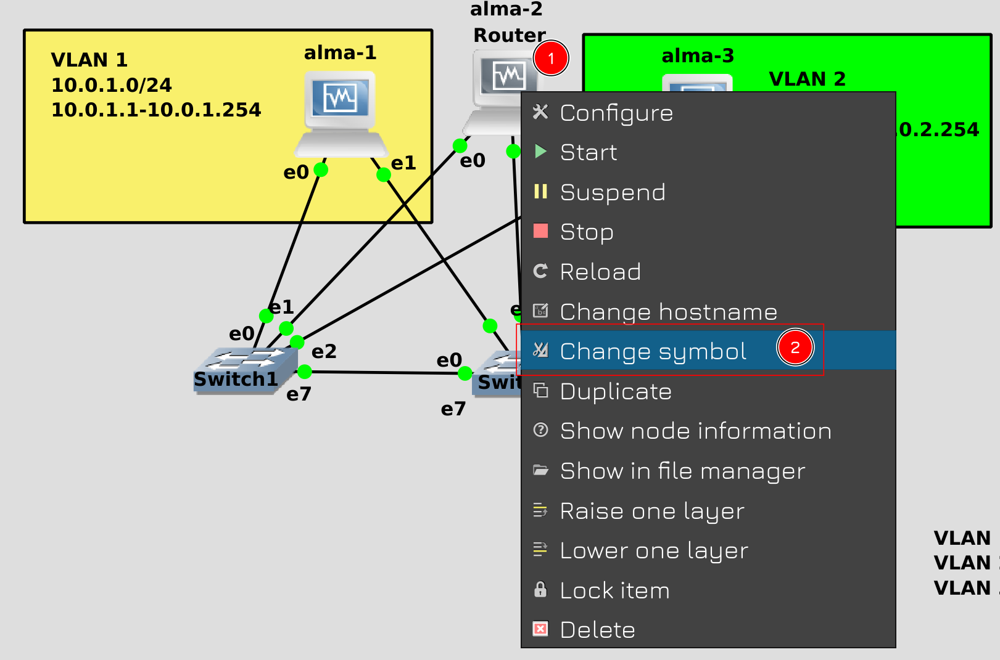

При этом для аутентичности поменяем его иконку на символ роутера. Для этого правой кнопкой мыши нажмите на alma2 и выберите "Change symbol".


Раскройте Classic и в поле Filter напишите router. Выберите указанный символ и нажмите Apply.

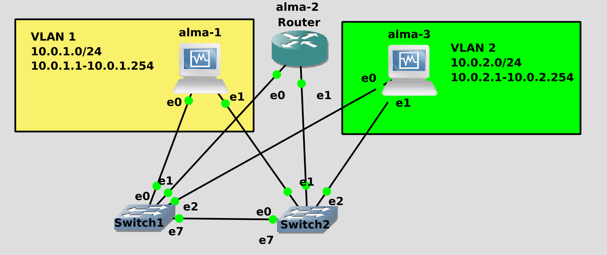

Теперь у alma2 символ роутера. Осталось его таковым сделать. 


Но для начала надо подготовить сеть на хостах. В прошлый раз на всех 3 хостах мы добавили все 3 влана, поэтому хосты будут видеть друг друга напрямую:

```
nmcli con sh
```

Нам же надо, чтобы хост 1 был только в первом влане - для этого удаляем влан 2 с первого хоста:

```
nmcli con del vlan2
nmcli con sh
```

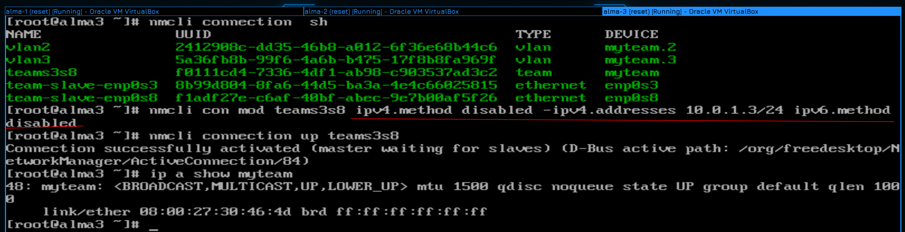

На alma3 не всё так просто:

```
nmcli con sh
```

Мы не можем просто удалить тиминг интерфейс, от этого второй влан перестанет работать. Поэтому надо удалить адрес на тиминг интерфейсе:

```
nmcli con mod teams3s8 ipv4.method disabled -ipv4.address 10.0.1.3/24 ipv6.method disabled
```

При этом отключив получение IP адреса и на IPv4, и на IPv6, иначе NetworkManager будет перегружать интерфейс. После чего нужно применить настройки на интерфейсе и убедиться, что всё сработало:

```
nmcli con up teams3s8
ip a show myteam
```

Да, теперь alma1 не сможет обратиться к alma3 напрямую, так как на alma1 нет сети 10.0.2.0, а alma3 тоже не сможет ответить напрямую, потому что у неё нет сети 10.0.1.0. Им придётся общаться через роутер.

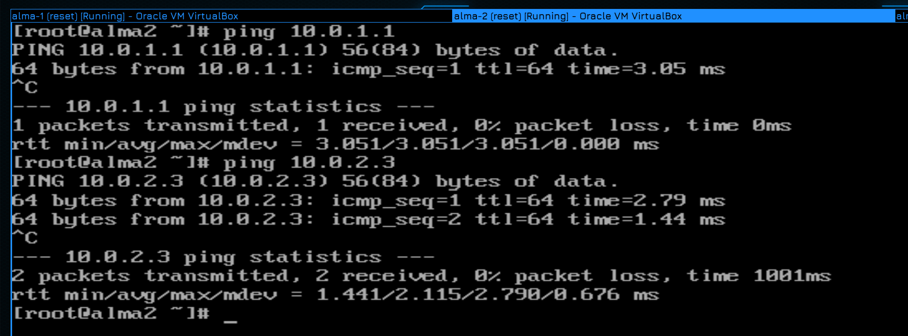

Для начала убедимся, что alma2 видит первый хост по сети 1.0:

```
ping 10.0.1.1
```

и третий по сети 2.0:

```
ping 10.0.2.3
```

Всё пингуется, значит сеть готова.


Дальше мы должны на уровне ядра включить маршрутизацию. Это можно сделать временно, но давайте лучше сразу сохраним это в настройках. Для этого надо в файле /etc/sysctl.conf добавить строчку net.ipv4.ip_forward=1:

```
echo "net.ipv4.ip_forward=1" >> /etc/sysctl.conf
```

После чего для применения настроек используем sysctl с опцией -p:

```
sysctl -p
```

Если всё нормально - вы увидите параметр с новым значением. А чтобы в любой момент проверить, включена ли эта опция, можно просто указать её с sysctl:

```
sysctl net.ipv4.ip_forward
```

И теперь alma2 будет перенаправлять пакеты с одного интерфейса на другой.


Но этого недостаточно. Если мы попытаемся с alma1 пингануть 10.0.2.3:

```
ping 10.0.2.3
```

мы увидим ошибку - network is unreachable. Просто alma1 вообще без понятия, как достучаться до этого адреса. Чтобы это понять, посмотрим таблицу маршрутизации:

```
ip ro sh
```

Как видите, alma1 знает только о сетях 10.0.1.0 и 10.0.3.0. 


Т.е. мы ей должны указать, что путь к адресу 10.0.2.3 лежит через альму2, причём через тот адрес, который нам доступен:

```
ip route add 10.0.2.3 via 10.0.1.2
ip ro sh
```

Как видите, у нас появился ещё один маршрут. Попробуем пингануть?

```
ping 10.0.2.3
```

И ничего, нет ответа. Есть идеи, почему так? Попытаемся разобраться.


Для этого стартуем пинг и идём на alma2, где запускаем tcpdump:

```
tcpdump
```

И так, в выводе мы видим, что пакеты от alma1 всё таки доходят до alma2. Более того, они перенаправляются на alma3. Но мы не видим, чтобы alma3 присылала ответ - все пакеты исходят исключительно от alma1. Если ответов нет - значит либо alma3 не хочет отвечать, либо не знает куда.

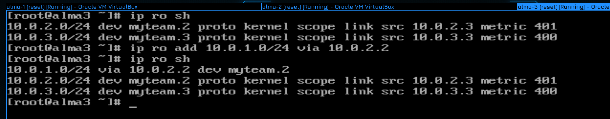

Смотрим таблицу маршрутизации на alma3:

```
ip ro sh
```

И действительно, alma3 без понятия, как ответить alma1. Давайте добавим маршрут, но, на этот раз, не на один конкретных хост, а на целую сеть:

```
ip ro add 10.0.1.0/24 via 10.0.2.2
ip ro sh
```

Теперь alma3 на любой из адресов сети 10.0.1.0 будет направлять пакет через 10.0.2.2.

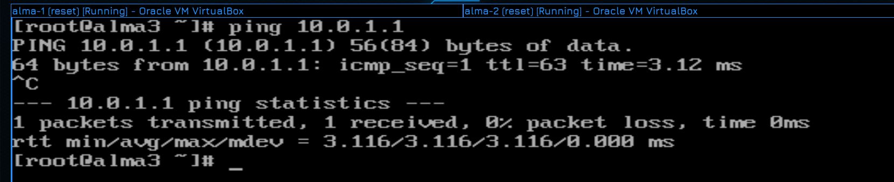

И теперь при попытке пинга:

```
ping 10.0.1.1
```

всё работает.

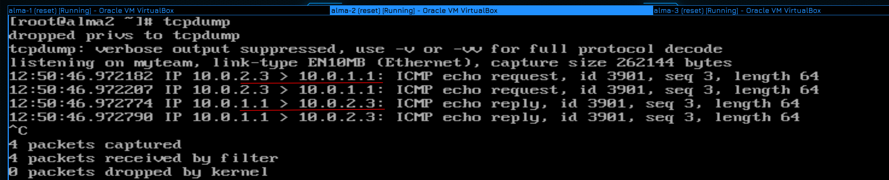

А в tcpdump видно, что пакеты идут в обоих направлениях. 


Но это у нас 2 подсети. А если их 5? 10? 100? Сколько подсетей в интернете? Разве мы можем прописать каждую подсеть в мире? Нет конечно! Вместо этого мы используем специальный маршрут, называемый шлюзом или gateway, или default gateway. Когда компьютеру надо обратиться к сети, куда он не знает маршрута, он всё посылает в гейтвей. Мы можем на хостах вместо всех маршрутов указать, что гейтвеем является alma2. И не нужно будет указывать, в какие сети этот гейтвей ведёт - просто все неизвестные сети по-умолчанию будут посылаться на alma2. 

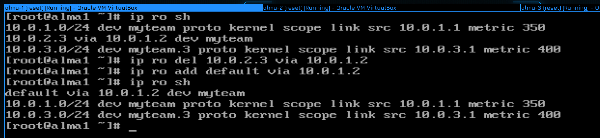

Для этого на первой альме удалим маршрут, ведущий к третьему хосту:

```
ip ro sh
ip ro del 10.0.2.3 via 10.0.1.2
```

После чего добавим дефолтный маршрут:

```
ip ro add default via 10.0.1.2
ip ro sh
```

Как видите, появилась надпись default. 

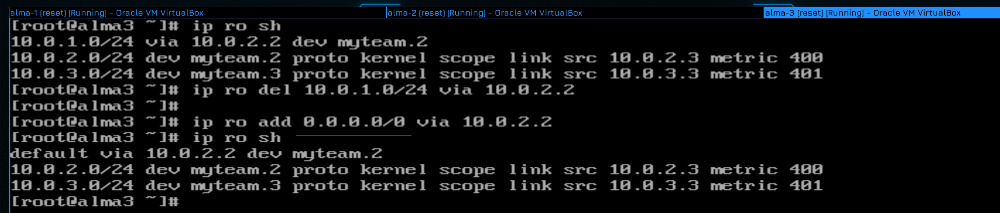

На альме 3 тоже удаляем добавленный маршрут:

```
ip ro sh
ip ro del 10.0.1.0/24 via 10.0.2.2
```

После чего добавляем gateway. Гейтвей можно указывать и в виде специального IP адреса:

```
ip ro add 0.0.0.0/0 via 10.0.2.2
ip ro sh
```

Это означает любой адрес в любой подсети.

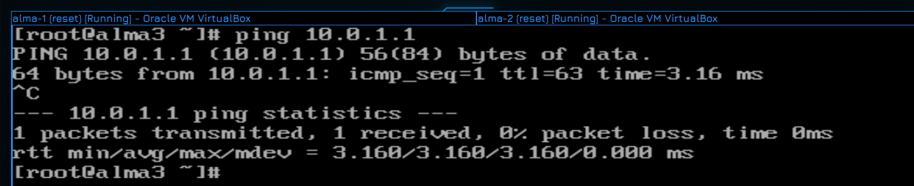

Ну и для проверки запустим пинг:

```
ping 10.0.1.1
```

Как видно, всё работает.


Маршрутов и роутеров, ведущих к одним и тем же хостам может быть несколько. Но приоритет у тех маршрутов, которые точнее. Т.е. условно, если я укажу маршрут через роутер 1 к конкретному хосту, через роутер 2 к целой подсети, а роутер 3 укажу в качестве гейтвея, то обращаясь к хосту будет использоваться маршрут через роутер 2.

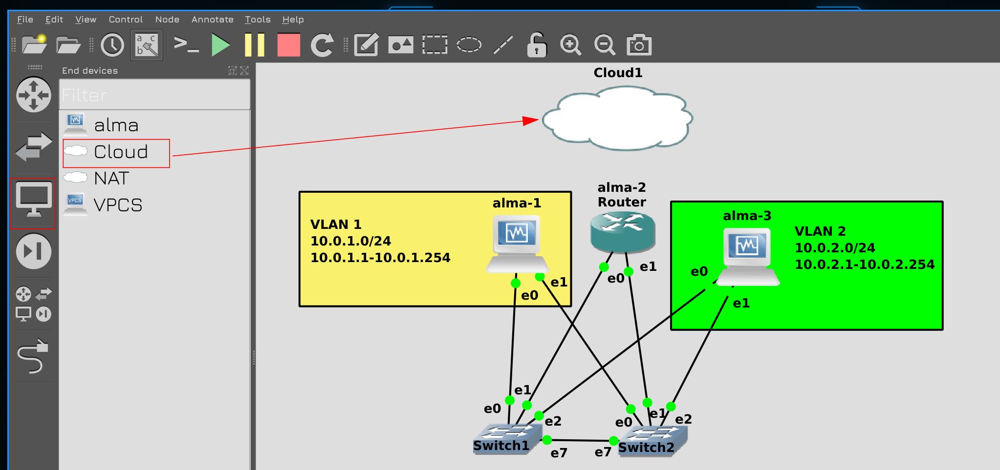

Теперь давайте подключим нашу схему к интернету. Для этого нажмите в GNS на иконку монитора в левой панели, выберите Cloud и перетяните в центр.

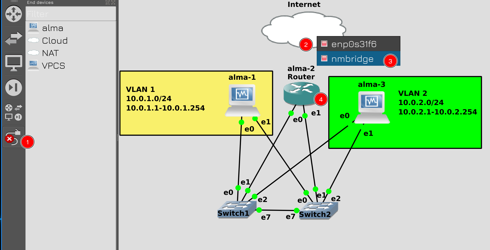

Затем подключите облако к роутеру с помощью кабеля. Облако представляет ваш компьютер, и как мы в VirtualBox выбирали адаптер для сетевого моста, также и тут нужно выбрать адаптер компьютера, подключенный к сети. Со стороны alma2 выберите 3 порт.


В итоге у вас получится такая схема. Здесь у нас локальная сеть, состоящая из 3 виртуалок. Одна из виртуалок выступает роутером и будет подключена как к локальной сети внутри GNS, так и к домашней сети.

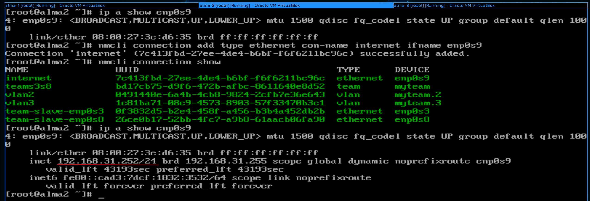

Так как на alma2 мы подключили провод к третьему порту, то поднимется интерфейс enp0s9:

```
ip a show enp0s9
```

Нам в NetworkManager надо будет создать новый профиль:

```
nmcli con add type ethernet con-name internet ifname enp0s9
nmcli con sh
```

типом выбираем ethernet, так как это не vlan и не тиминг интерфейс, а в качестве интерфейса указываем enp0s9. IP адрес указывать не нужно, так как наш домашний роутер по DHCP даст ему адрес:

```
ip a show enp0s9
```


При этом по DHCP мы получаем также default gateway:

```
ip ro sh
```

Им выступает наш домашний роутер. Ну и давайте убедимся, что интернет доступен, пинганём 1.1.1.1 и ya.ru:

```
ping 1.1.1.1
ping ya.ru
```

Всё пингуется. 


Теперь давайте поправим маршруты на alma1 и alma3. Мы их прописывали с помощью команды ip, а значит эти настройки слетят. Нам же нужно указать gateway в профиле NetworkManager-а:

```
nmcli con mod teams3s8 ipv4.gateway 10.0.1.2
```

После чего поднять заново профиль и проверить:

```
nmcli con up teams3s8
ip ro sh
```

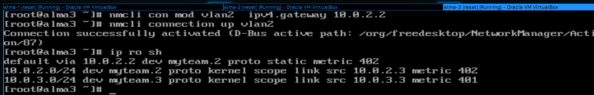

Тоже самое проделываем на alma3, изменяем профиль:

```
nmcli con mod vlan2 ipv4.gateway 10.0.2.2
```

Затем поднимаем интерфейс и проверяем маршруты:

```
nmcli con up vlan2
ip ro sh
```

Всё как мы и хотели.

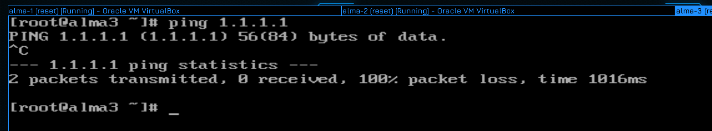

Как думаете, интернет заработает на этих хостах? Давайте проверим:

```
ping 1.1.1.1
```

Как видите, не пингуется. При этом нет ошибки network unreachable - у нас есть gateway, а значит мы знаем куда обращаться, за кем искать этот адрес. Но почему тогда не пингуется?

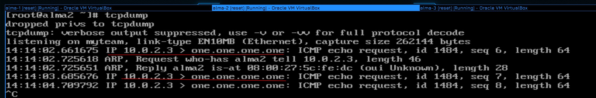

Помните проблему, когда мы в начале пытались с alma1 пингануть alma3? Давайте также запустим пинг и посмотрим tcpdump на alma2:

```
tcpdump
```

Ошибка ничего не напоминает? Пакет идёт от хоста 3 к 1.1.1.1, но ответов то нет. С чем это было связано в прошлый раз? Правильно, другой хост не знал обратный маршрут, нам нужно было на alma3 прописать маршрут к alma1. 

Но можем ли мы на сервере 1.1.1.1 прописать маршрут к нашей виртуалке? Конечно нет, между нашей виртуалкой и этим сервером десяток разных роутеров, стоящих у разных провайдеров. У каждого из этих провайдеров может быть своя сеть с адресом 10.0.2.3, потому что это адрес, выделенный для приватного использования. А как тогда наш домашний комп видит интернет? Правильно, наш роутер на исходящие пакеты вешает свой адрес, заменяя адрес нашего компьютера. И это называется NAT. 

И мы по тому же принципу, должны на alma2 на исходящем интерфейсе применить NAT, т.е. заменять адреса всех исходящих пакетов на адрес интерфейса enp0s9 на alma2.

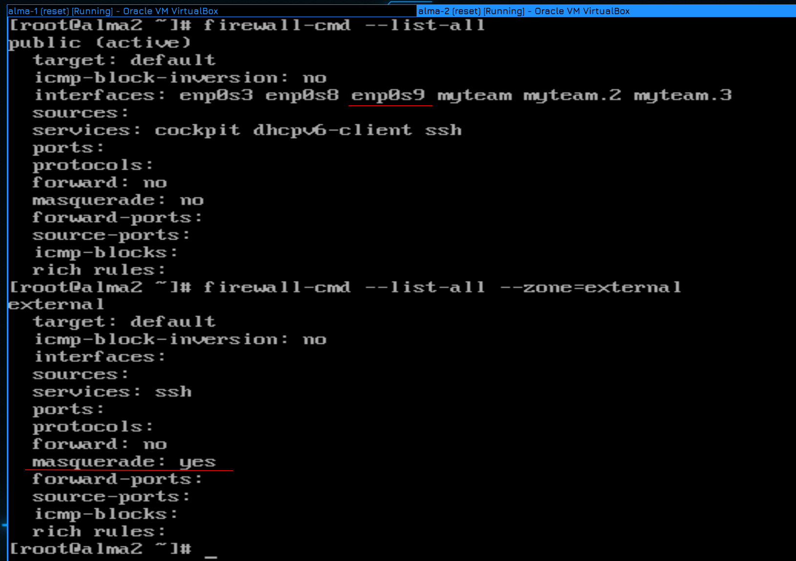

Обычно за NAT отвечает firewall:

```
firewall-cmd --list-all
```

Наш интерфейс enp0s9 сейчас находится в зоне public. Нам в идеале нужна отдельная зона для внешней сети и чтобы исходящие пакеты из этой зоны натились. И такая зона есть - external:

```
firewall-cmd --list-all --zone=external
```

Как видите, в этой зоне опция masquerade имеет значение yes, а это именно то, что нам нужно для NAT-а.

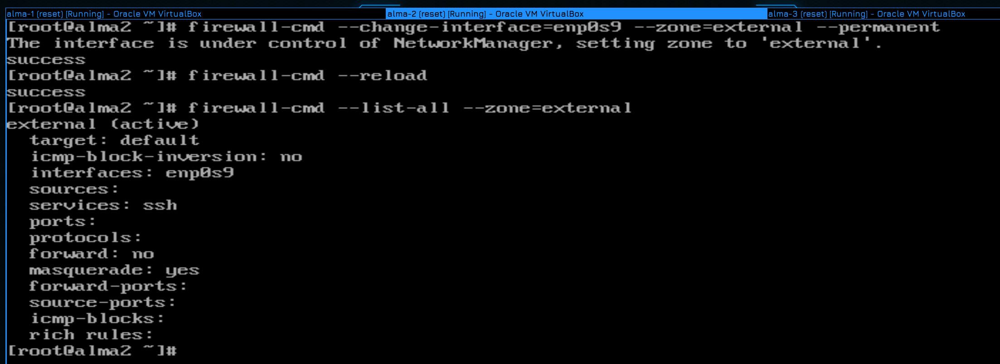

Поэтому всё что нам остаётся - сменить зону для интерфейса enp0s9:

```
firewall-cmd --change-interface=enp0s9 --zone=external --permanent
```

После чего не забудьте перечитать настройки файрвола и убедиться, что всё применилось:

```
firewall-cmd --reload
firewall-cmd --list-all --zone=external
```

Как видите, теперь enp0s9 находится в зоне external.


Проверим ping:

```
ping 1.1.1.1
```

Пинги идут.


В итоге получается такая схема. Когда alma1 пытается обратиться к серверу 1.1.1.1, то сначала она посылает пакет на alma2, которая натит пакет и отправляет его на мой домашний роутер. Дальше мой домашний роутер натит пакет и отправляет провайдеру. Если на моём роутере внутренний адрес провайдера, т.е. серый IP, то провайдер сам в свою очередь натит, но если провайдер даёт мне публичный адрес - то он просто перенаправляет пакет на следующего провайдера, скажем, государственного. И дальше по цепочке от одного провайдера к другому пересылается пакет, пока он не доходит до сервера 1.1.1.1. А дальше сервер сможет ответить, потому что знает куда.

На самом деле я мог бы избежать двойного использования NAT-а, если бы на домашнем роутере прописал маршрут к внутренней сети моего GNS через alma2. И тогда мой компьютер смог бы видеть все виртуалки, потому что он бы посылал все пакеты на мой домашний роутер, тот бы перенаправлял их на alma2, а она бы в свою очередь перенаправляла на alma1 и 3. 

Но я хочу, чтобы наша сетка в GNS оставалась в изолированном виде и единственным способом попасть в неё был бы один внешний адрес alma2.

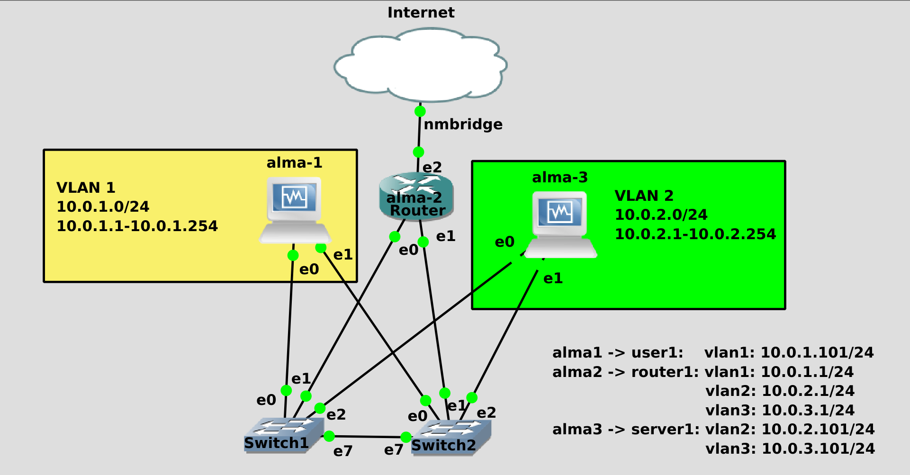

Суммируя всё что мы сегодня прошли, я хочу, чтобы вы немного перестроили сеть: 

- переименуйте alma1 в user1 и оставьте на ней только влан1 с адресом 1.101. 

- переименуйте alma2 в router1 и поменяйте IP адреса всех 3 вланов на 1. Обычно в организациях гейтвеям дают либо первый, либо последний адрес подсети.

- переименуйте alma3 в server1 и оставьте на ней только 2 и 3 вланы. Адреса поменяйте на 2.101 и 3.101 соответственно.

И, естественно, убедитесь, что всё работает - что все друг друга пингуют по разным сетям, и что со всех хостов пингуются 1.1.1.1.

Давайте подведём итоги. Сегодня мы с вами разобрали, что такое подсети, что такое маска подсети, для чего нужна маршрутизация, зачем нужен gateway и в чём смысл NAT-а. Это, конечно, совсем основы маршрутизации, но для системного администратора этого хватает для решения большинства задач. 