


В прошлый раз мы наконец настроили связь между сетью в GNS и нашей домашней сетью. Связывает их router1, у которого на одном из интерфейсов есть адрес из домашней сети. Точно также в реальной инфраструктуре у вас есть роутер, у которого на одном из интерфейсов есть публичный адрес, выданный провайдером.


В реальной сети вы не можете так просто из дома подключиться в рабочую сеть:


```
ping 10.0.2.101
ip ro sh
```

Как правило, для удалённой работы сотрудников организуют VPN сервер, с помощью которого создаётся безопасный туннель из одной сети в другую. Почти все современные роутеры и UTM решения имеют такой функционал, поэтому мы тоже будем поднимать свой впн сервер, но не сегодня. Даже без VPN-а мы можем организовать безопасный туннель и для этого достаточно одного ssh. Для начала представим, что нам надо подключиться по ssh к серверам. 

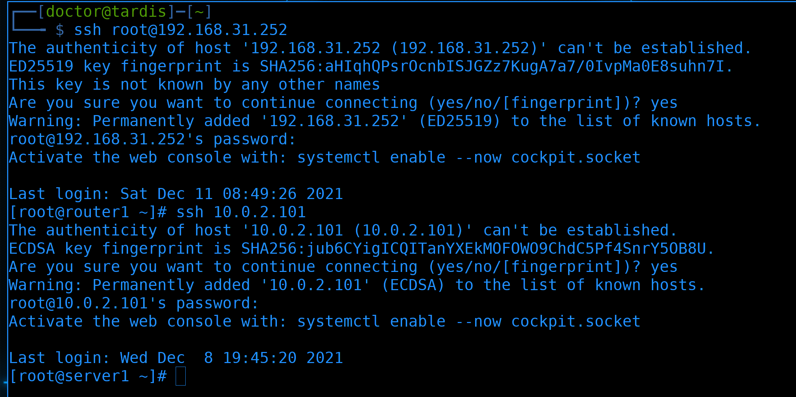

Самый примитивный способ - подключиться по ssh к роутеру:

```
ssh root@192.168.31.252
```

а дальше из него подключаться к другим машинкам, например, к серверу1:

```
ssh root@10.0.2.101
```

В принципе, и так сойдёт. Но если у нас множество машин и нам постоянно нужно заходить туда-сюда, это становится немного неудобно. 


Мы роутер используем как промежуточный хост для подключения. Такие промежуточные хосты, через которые можно попасть из одной сети в другую, при этом без маршрутизации - называются jump host-ами. Не обращайте внимания, что мы используем роутер как джамп хост, на деле это может быть любая машинка, у которой есть доступ в обе сети.

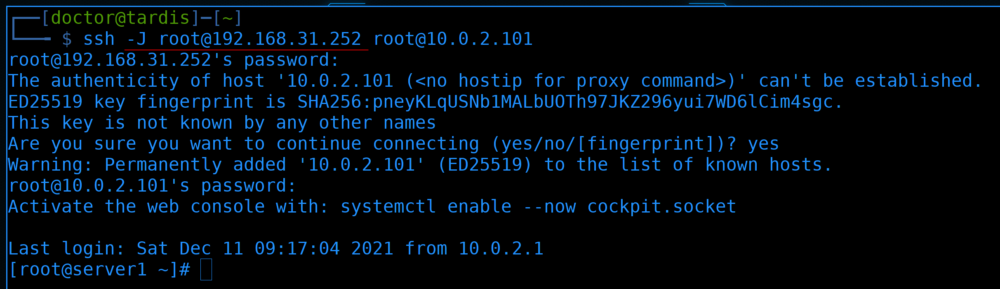

Так вот, ssh клиент может упростить подключения через джамп хосты. Достаточно сразу указать с помощью ключа -J, что такой-то сервер является джамп хостом, а мы хотим подключиться туда-то:

```
ssh -J root@192.168.31.252 root@10.0.2.101
```

На фоне происходит тот же процесс, что и в прошлый раз - сначала мы заходим на роутер, а уже потом на сервер1. Мы всё равно должны указывать пароли от обоих хостов. Но теперь для нас это выглядит не как два шага, а как один. Да, команда получилась подлиннее, но это дело поправимое.

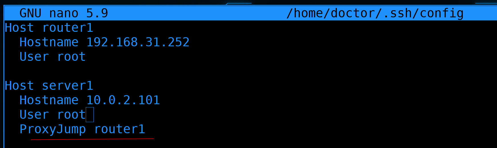

Мы можем в конфигах своего ssh клиента ``` ~/.ssh/config ``` указать оба хоста. И сказать, что для подключения к server1 нужно использовать router1 как ProxyJump:

```  
Host router1
  Hostname 192.168.31.252
  User root

Host server1
  Hostname 10.0.2.101
  User root
  ProxyJump router1
```

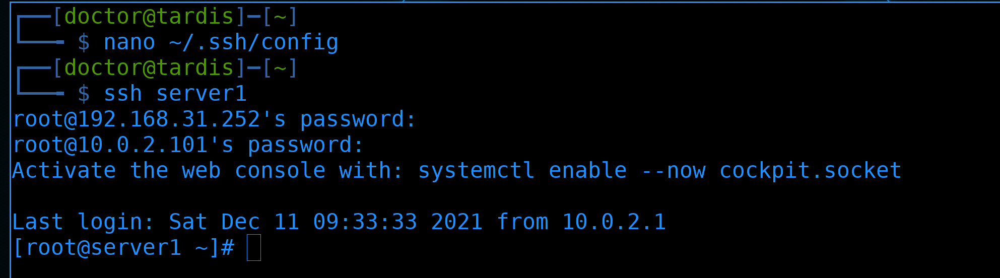

И теперь для подключения достаточно указать имя целевого хоста, которое мы прописали в конфиге:

```
ssh server1
```

Мы по прежнему должны вводить пароли как от джамп хоста, так и целевого. Но даже это дело поправимое. Для этого нам нужны ssh ключи.

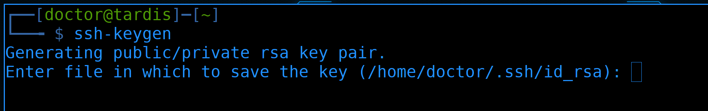

Для начала сгенерируем ключи. 

```
ssh-keygen
```

Раз уж взялись строить инфраструктуру, давайте делать это правильно. 


Для начала вопрос - должны ли мы делать для каждого сервера отдельный ключ? Или использовать один ключ на всех серверах? Не смотря на всю очевидность, вопрос довольно сложный. С одной стороны, иметь для каждого сервера отдельный ключ кажется безопаснее - потеряв один приватный ключ мы не подвергнем опасности остальные. С другой стороны - какая вероятность, что мы потеряем только один ключ, а не все сразу? Они же лежат в одной директории на одном компе админа. Плюс ещё куда-то бэкапятся. Из-за того что подобрать приватный ключ практически нереально, взломщикам гораздо легче будет украсть ключи с компьютера админа. От этого мы можем защититься поставив пароль на ключи. Правда взломщик может генерацией паролей подобрать нужный. И тут, если у нас один пароль на все ключи - то опять же он получит доступ на все сервера. А вот если мы поставим разные пароли на разные ключи - то взлом всех ключей займёт гораздо больше времени. Но, опять же,  и это теоретически возможно. Поэтому, в идеальном случае, у нас должны быть разные ключи для разных хостов с разными паролями и мы их должны периодически менять. Когда инфраструктура не маленькая, так заморачиваться с ключами отнимает слишком много времени. Возможно, если у нас очень критичные данные и нас постоянно кто-то пытается взломать - этого того стоит.


Но в более спокойных условиях можно пойти на компромисс. Скажем, делить хосты по группам и на каждую группу выдавать одну пару ключей с отдельным паролем. Ну и естественно, периодически менять ключи.


И следуя нашему выводу, сгенерируем отдельный ключ для джамп хоста:

```
ssh-keygen
```

Назовём ключи ```.ssh/jumphost ``` и зададим пароль для приватного ключа.


После генерации закинем ключ на джамп хост с помощью команды ssh-copy-id:

```
ssh-copy-id -i .ssh/jumphost.pub router1
```

И после ввода пароля ключ добавился на сервер. Теперь, при подключении к серверу, надо указывать ключ, с помощью которого мы хотим зайти на роутер1:

```
ssh -i .ssh/jumphost router1
```

При подключении нас просят ввести пароль от ключа, который мы создали. А после ввода пароля от ключа, на сам сервер мы попадаем без пароля.


Теперь сгенерируем ключи для серверов:

```
ssh-keygen
```

Указываем для них отдельный файл и пароль.


Прежде чем закинуть ключ на сервер1, укажем в конфиг файле ``` ~/.ssh/config ```, что для джампхоста требуется отдельный ключ:

```
...
IdentityFile ~/.ssh/jumphost
...
```

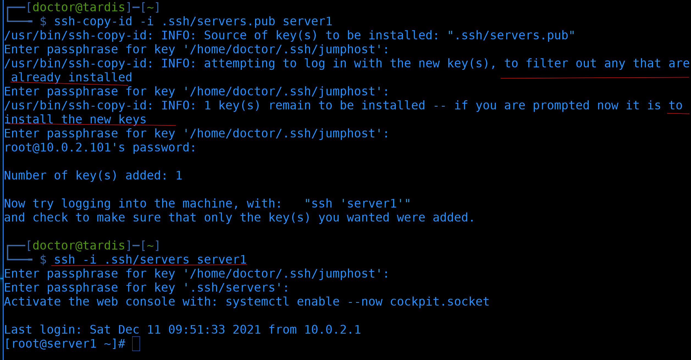

Теперь попытаемся закинуть ключ на сервер1:

```
ssh-copy-id -i .ssh/servers.pub server1
```

ssh у нас попросит несколько раз ввести пароль от ключа для джампхоста - один раз он попытается зайти с помощью ключа, мало ли, вдруг он уже установлен на сервере, затем он попытается добавить ключ, для этого он дополнительно попросит пароль от самого сервера. Затем же мы увидим информацию о том, что ключ успешно добавлен. Теперь можем попытаться зайти с помощью ключа:

```
ssh -i .ssh/servers server1
```

Для этого надо будет ввести пароли от ключей джампхоста и серверов. После чего на сам сервер мы зайдём без пароля.


Также укажем ключ в конфиг файле ``` ~/.ssh/config ```, чтобы не указывать ключи при подключении:

```
...
IdentityFile ~/.ssh/servers
...
```


На этот раз при подключении мы опять же не указываем никакие опции, а просто вводим пароли от ключей. Но вводить эти пароли при каждом подключении может быть неудобно, особенно, когда у нас множество серверов и мы постоянно подключаемся туда-сюда. И вроде не охота постоянно вводить пароли, но они должны быть на ключах. Для этого есть простое решение - ssh-agent. Вкратце - вы запускаете процесс ssh-agent-а и добавляете в него ключи. Пока процесс работает - вам не нужно будет вводить пароли от ключей. Условно, начинаете работать - запускаете ssh-agent и добавляете в него ключи, вводя пароли от ключей. Дальше спокойно работаете без паролей. Прекращаете работать - идёте на обед или перерыв - убиваете процесс.

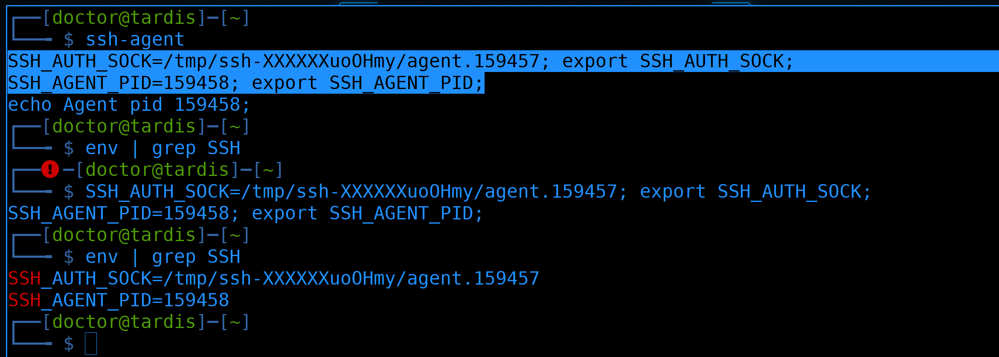

Для запуска агента используете команду:

```
ssh-agent
```

При этом команда показывает вам пару команд, с помощью которых вы должны создать переменные окружения. Без этих команд переменные не пропишутся:

```
env | grep SSH
```

И тогда вы не сможете работать с агентом. ssh-агент сам не может прописать эти переменные. Поэтому нужно вручную скопировать эти команды и выполнить:

```
SSH_AUTH_SOCK=/tmp/ssh-XXXXXXuoOHmy/agent.159457; export SSH_AUTH_SOCK;
SSH_AGENT_PID=159458; export SSH_AGENT_PID;
env | grep SSH
```


Но это может быть не совсем удобно. Есть и другой способ, но для этого давайте завершим процесс агента:

```
pkill ssh-agent
```

А затем запустим новый, но через команду eval:

```
eval $(ssh-agent)
```

Она сразу добавит переменные:

```
env | grep SSH
```


Теперь мы можем добавить ключи в агент с помощью команды ssh-add:

```
ssh-add .ssh/jumphost
ssh-add .ssh/servers
```

После чего, при попытке логина на сервер или джампхост, никакого пароля не потребуется:

```
ssh server1
ssh router1
```

И, с одной стороны, у нас ключи защищены паролем, а с другой - теперь это также удобно, как без пароля, разве что перед работой надо прописать пару команд. 


Давайте постараемся сделать нашу схему чуть реальнее. Обычно в компаниях на роутере не стоит линукс, либо там такой урезанный линукс, что мало что сделаешь. Поэтому сам роутер использовать в качестве джамп хоста не получится. Пусть лучше им будет сервер1. Но как, спросите вы, он же недоступен из интернета? А это дело поправимое. Когда у нас какой-то хост находится в изолированной сети и у нас нет к нему прямого доступа, мы всё же можем к нему попасть используя NAT. 


В прошлый раз мы разбирали source nat, когда у наших пакетов на выходе из сети подменялся Source IP и Source Port, чтобы пакеты могли вернуться обратно в сеть с приватными адресами. 

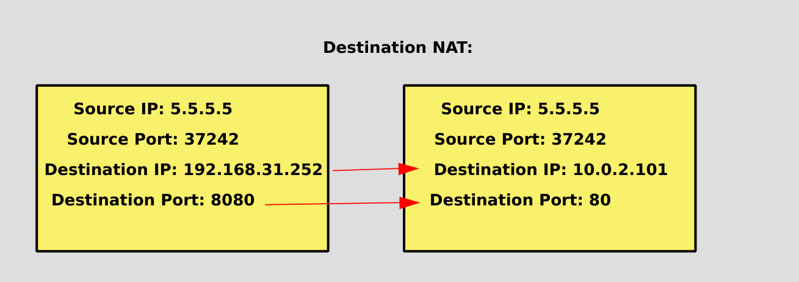

Сейчас же нам нужно, чтобы подменялись destination адреса, так как тот, кто хочет подключиться, не знает или не может подключиться к внутренним адресам, а нам нужно перенаправлять пакеты на внутренний адрес. Поэтому с помощью NAT-а мы можем заменить destination адрес и порт. Это называется dnat или проброс портов.


И так, мы хотим, чтобы указывая адрес роутера1, мы подключались по ssh к server1. При этом, из-за того, что наш роутер, условно, находится в интернете, 22 порт использовать не стоит - в интернете куча ботов, которые будут пытаться взломать наш сервер. Поэтому выберем какой-нибудь нестандартный порт для ssh.

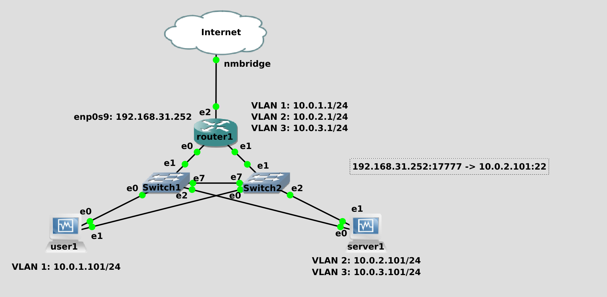

Давайте перенаправлять всё, что приходит на внешний адрес роутера на порт 17777 на адрес сервера 1 по порту 22.


Для этого заходим на роутер:

```
ssh router1
```

Интерфейс с внешним адресом у нас находится в зоне external на файрволе:

```
firewall-cmd --list-all --zone=external
```

Здесь мы и должны пробросить порт.


Команда получится чуть длинная, но ничего сложного в ней нет: 

```
firewall-cmd --zone=external --add-forward-port=port=17777:proto=tcp:toaddr=10.0.2.101:toport=22 --permanent
```

Для начала мы указываем зону, в которой хотим добавить правило. Так как интерфейс находится в зоне external, её и указываем. Дальше используем ключ ``` --add-forward-port ``` чтобы добавить правило для проброса порта. После равно пишем, какой порт мы хотим пробросить - ``` port=17777 ```, какой протокол - ``` proto=tcp ```,  на какой адрес - ``` toaddr=10.0.2.101 ``` и на какой порт - ``` toport=22 ```. Все эти значения разделяются двоеточиями. Ну и в конце не забываем указать ``` --permanent ```, чтобы наши изменения сохранились в настройках.

После чего перегружаем правила:

```
firewall-cmd  --reload
```

И проверяем результат:

```
firewall-cmd --list-all --zone=external
```

Как видите, в зоне external появилось правило под forward-ports.


Так как теперь наш сервер1 доступен напрямую из интернета, то в настройках ssh - ``` ~/.ssh/config ``` - убираем строчку ProxyJump, а вместо неё прописываем внешний адрес роутера и порт:

```
...
Hostname 192.168.31.252
Port 17777
...
```


При первом подключении:

```
ssh server1
```

мы увидим сообщение, что наш компьютер узнал этот хост и раньше у него был адрес 10.0.2.101, сейчас же мы подключаемся к нему по другому адресу. Пишем yes и подключаемся без проблем. 


Теперь поднастроим роутер. Сейчас, условно, любой желающий может к нему подключиться по ssh:

```
firewall-cmd --list-all --zone=external
```

Для большей безопасности убираем эту возможность:

```
firewall-cmd --remove-service=ssh --zone=external --permanent
firewall-cmd --reload
```

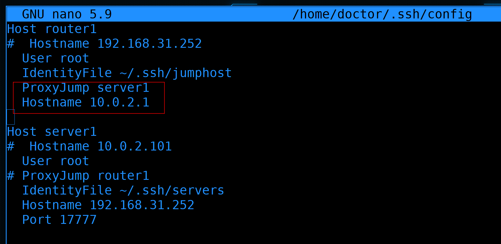

Теперь у нас сложилась такая ситуация, что напрямую на роутер мы попасть не сможем, зато можем через сервер1. Т.е. теперь в ``` ~/.ssh/config ``` указываем, что для подключения к роутеру нужно использовать server1 в качестве JumpHost-а. Ну и пишем внутренний адрес роутера:

```
...
ProxyJump server1
Hostname 10.0.2.1
...
```

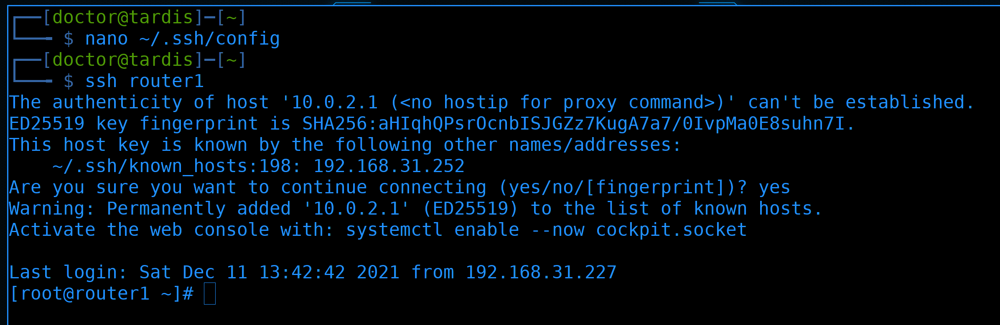

Проверяем подключение:

```
ssh router1
```

всё работает.


И наше соединение к роутеру теперь выглядит так. Сначала мы подключаемся к внешнему адресу роутера по порту 17777, откуда файрвол перекидывает наши пакеты на сервер1 на порт 22. Там мы логинимся по ssh и сразу же подключаемся оттуда по ssh к внутреннему адресу роутера. И всё это одной командой:

```
ssh router1
```

У вас может возникнуть вопрос - почему бы просто не пробрасывать порты на все сервера? Зачем нужен jump host? Тут несколько причин:

- во-первых, безопасность. Когда у вас jump host, то снаружи по ssh доступен только один хост. А это значит, что все попытки взлома будут направлены только на него. Пока его не взломают, все остальные хосты будут невидимы. По сути, jumphost это ваша дверь в сеть. Легче защитить одну дверь, чем множество. 
- во-вторых, удобство. Когда у вас 3 сервера - можно и пробросом портов обойтись. А что, если у вас 300 серверов? Что, если они постоянно добавляются и удаляются? Что, сидеть и постоянно пробрасывать порты? А так, с одного jump-хоста можно попасть на все другие машинки.

И так, как сделать наше подключение ещё безопаснее? 


Ну, для начала, перестать использовать рута. Давайте вместо рута логиниться с помощью юзера. А для этого ключи нужно закинуть на пользователя:

```
ssh-copy-id -i .ssh/jumphost.pub user@server1
ssh-copy-id -i .ssh/servers.pub user@router1
```

Так как теперь у нас джамп хостом является server1, то и ключ кидаем соответствующий. А для роутера кидаем второй ключ. Потом нужно будет подтереть старые ключи у рута.


Подправляем ssh config файл - ``` ~/.ssh/config ```. Во-первых, меняем пользователя на user-а, чтобы не приходилось при каждом подключении указывать его. Во-вторых - меняем ключи. 

```
...
User user
...
```


После того, как убедимся, что подключение работает:

```
ssh server1
```

лучше всего кое-что поправить на ssh-сервере, который доступен из интернета:

```
sudo nano /etc/ssh/sshd_config
```


Находим строчку PermitRootLogin и меняем значение на no:

```
...
PermitRootLogin no
...
```

Эта опция позволяет подключаться по ssh пользователем root. А так как все знают, что на любой линукс системе есть пользователь рут, то и большинство ботов будут пытаться ломиться этим пользователем. Поэтому запретив логиниться пользователем root - мы немного усложняем работу ботам, так как теперь им придётся угадывать логин пользователя, а не только пароль.


А дальше находим строчку PasswordAuthentication и меняем на no:

```
...
PasswordAuthentication no
...
```

Тем самым запрещая логин по паролю. Теперь единственным способом залогиниться будет использование ssh ключей, что отсеивает всех ботов, потому что вряд ли они могут достать наши ssh ключи. Хотя, теоретически, какие-то боты могут использовать базу из каких-то слитых приватных ключей, но это прям редкость. Этих настроек вполне хватает для большинства случаев, поэтому сохраняем конфиг и выходим.

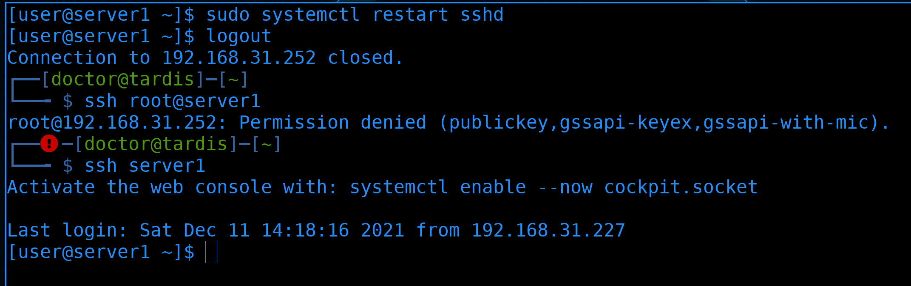

Чтобы применить настройки перезапускаем sshd:

```
sudo systemctl restart sshd
```

Для теста попытаемся залогиниться рутом:

```
ssh root@server1
```

Как видите, сразу получаем ошибку - permission denied.

А если попытаться зайти обычным user-ом:

```
ssh server1
```

всё получится. 

Хотя использование нестандартного порта, запрет логина руту и запрет логина по паролям почти решают проблему с ботами, я не могу не рассказать про ещё один механизм - fail2ban. В нашей ситуации он не особо нужен, но, если вы не можете по каким-то причинам поменять стандартный порт, не можете запретить логиниться по паролям - то fail2ban вам пригодится.

По сути, большинство ботов просто сканирует публичные адреса по 22 и по другим частоиспользуемым портам и пытаются подобрать пароль. Зачастую пароль рута, но иногда и какие-то другие стандартные логины. Этот тип атаки называется brute-force. Лёгкие пароли могут подобрать за пару минут, ну а сложные - как повезёт. Ну и один из вариантов хоть как-то сдерживать это - блокировать адреса, которые часто вводят неправильный пароль. Для этого собственно и нужен fail2ban. Он работает не только с ssh, но и с другими сервисами.


Чтобы установить fail2ban, для начала надо подключить репозиторий epel:

```
sudo dnf install epel-release
```

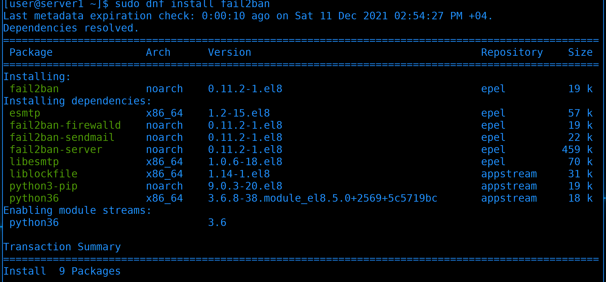

А затем установить пакет с названием fail2ban:

```
sudo dnf install fail2ban -y
```


После установки давайте стартанём сервис и добавим его в автозагрузку:

```
sudo systemctl enable --now fail2ban
```

fail2ban очень гибкая штука, которая позволяет защитить от брутфорса почти всё что угодно. Для некоторых сервисов, таких как ssh, есть готовые шаблоны, а для каких-то самописных программ можно настроить самостоятельно. Дефолтные настройки fail2ban могут отличаться в зависимости от дистрибутива. Давайте проверим, защищает ли fai2ban сейчас что-то? Многие вещи делаются через утилиту fail2ban-client:

```
sudo fail2ban-client status
```

Сейчас мы видим, что fail2ban ничего не защищает.


А значит нам надо создать файл ``` /etc/fail2ban/jail.local ```. 

```
sudo nano /etc/fail2ban/jail.local
```

Настройки различных сервисов есть в соседнем файле jail.conf. В jail.local мы лишь перезаписываем эти настройки, а также включаем их.


Например, чтобы включить настройки sshd, добавим здесь пару строчек:

```
[sshd]

enabled = true
```

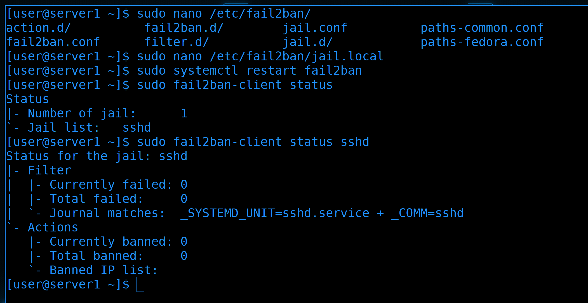

После чего перезапустим сервис fail2ban:

```
sudo systemctl restart fail2ban
```

И ещё раз проверим статус через fail2ban-client:

```
sudo fail2ban-client status
sudo fail2ban-client status sshd
```

Как видите, теперь у нас есть 1 jail - sshd. И пока что ни одного забаненного IP.

На пока этого хватит. Настроек много, но детальнее с fail2ban поработаем как-нибудь в будущем. Если вам интересно - в интернете множество статей, да и в системе есть документация. 

Напоследок покажу, как с Windows подключаться. Любой ssh клиент поддерживает работу с jump хостами и ключами, и mobaxterm - не исключение.


Для начала сгенерируем ключи для ssh. В интерфейсе выбираем Tools - MobaKeyGen.


В появившемся окне нажимаем Generate, немного водим мышкой, чтобы сгенерировать ключ, затем, опционально, пишем комментарий к ключу, задаём пароль и подтверждаем его.


Затем нажимаем Save public key, выбираем папку для сохранения и название файла. Также проделываем для приватного ключа.

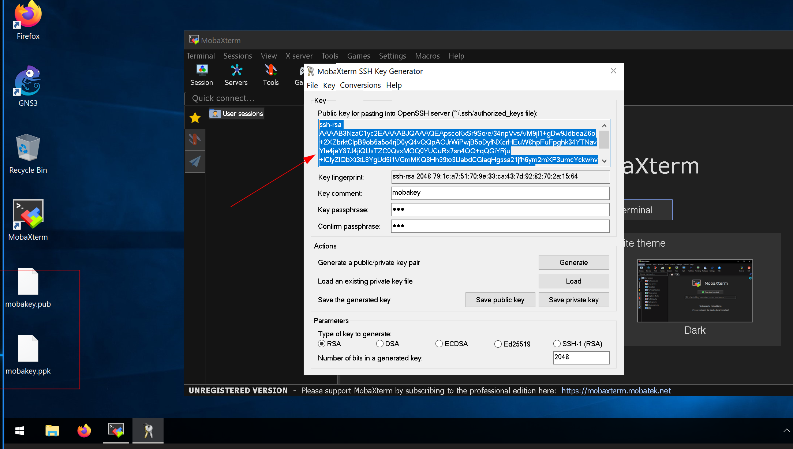

Я сохранил на рабочем столе, вам же рекомендую держать ключи так, чтобы их не могли легко найти и украсть. Затем выделите и скопируйте публичный ключ из окна генератора.

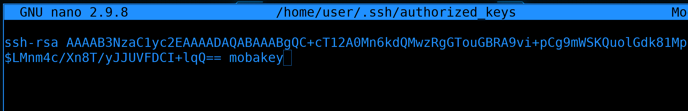

После чего вставьте ключ на сервере в домашней директории пользователя в файле ``` ~/.ssh/authorized_keys ``` в новой строке. Причём убедитесь, чтобы один ключ был в одну строку. На первой строке у меня ключ, сгенерированный на Linux, а на второй - то что в mobaxterm. После чего сохраните файл и выйдите.

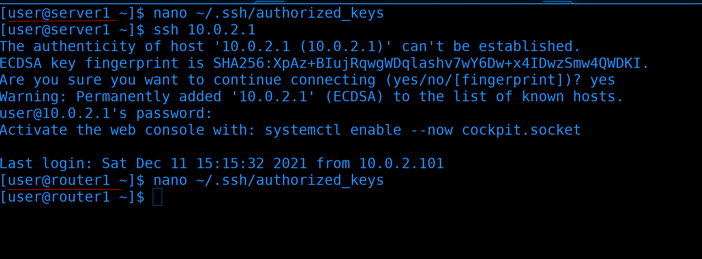

Таким же образом скопируйте ключ в файл authorized_keys на роутере. В идеале надо было сделать второй ключ, но я думаю вы с этим справитесь.


Дальше закрываем окно генератора, в mobaxterm выбираем Session - SSH и заполняем поля:

- remote host: внешний адрес роутера
- username: user
- port: 17777

И внизу, во вкладке Advanced SSH settings ставим галочку на "Use private key" и выбираем приватный ключ, который мы сохранили до этого. После чего нажимаем OK.

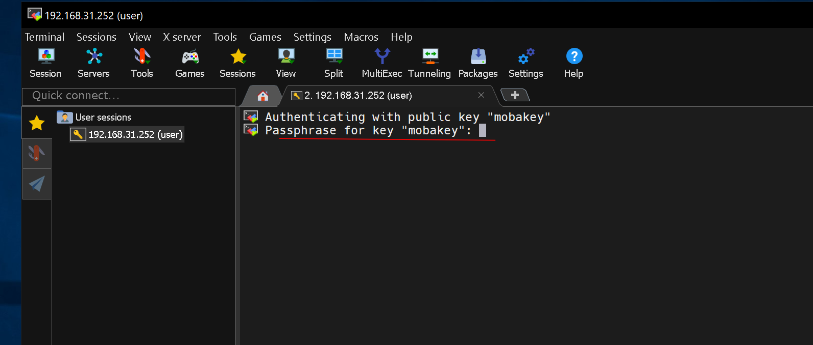

При подключении mobaxterm попросит пароль для ключа. Вводим его.


После чего вы попадёте на сервер.

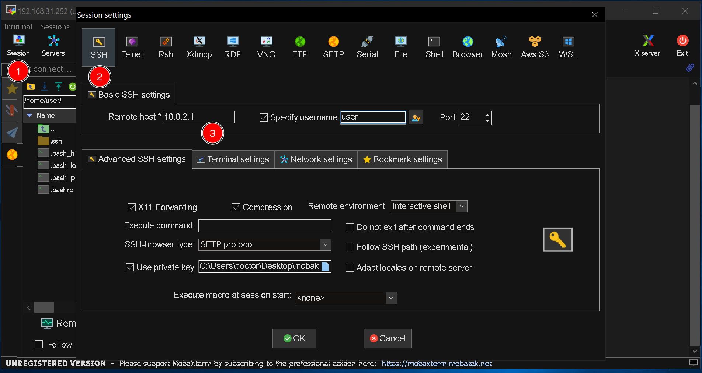

Теперь попробуем подключиться к роутеру, используя сервер1 как джампхост. Начинаем также - Session - SSH и заполняем поля:

- remote host: внутренний адрес роутера
- username: user
- port: 22
- Advanced ssh settings - private key - выбираете приватный ключ.

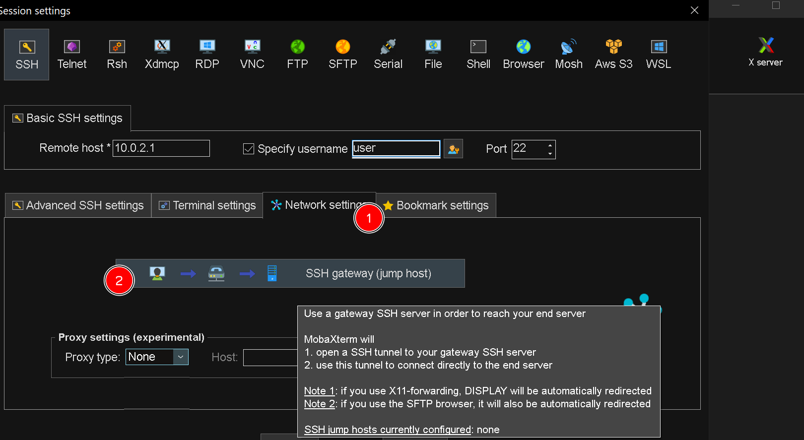

Дальше открываете Network Settings и нажимаете на SSH Gateway. 


В появившемся окне заполняете точно как заполняли сервер1, т.е. внешний адрес, порт 17777 и приватный ключ от сервера. Кстати, тут есть кнопка - add another jump host. Теоретически, ваши целевые сервера могут находиться за несколькими джамп хостами. Но суть та же. Нажимаем ОК, а потом ещё раз ОК.


И вы сразу попадёте на роутер. Mobaxterm сохранил пароль от ключа и пока вы не закроете его, вам не нужно будет вводить пароли от ключей, как мы это делали с ssh агентом.

Небольшая задачка для вас - переименуйте server1 в jumphost, организуйте отдельные ключи для хоста user1, поднимите ещё один сервер, закиньте на него соответствующие ключи и подключитесь на все хосты через jumphost.

Давайте подведём итоги. Теперь у нас есть доступ в нашу инфраструктуру извне по ssh с помощью джамп хоста и проброса портов. Мы также разобрали как немного обезопасить наше подключение запретив логин по руту и без ключей. 