


Прежде чем начнём, стоит упомянуть, что я решил вместо VirtualBox-а использовать Qemu. Не потому что Virtualbox чем-то плох, просто у GNS-а есть функционал снапшотов, когда он может сохранить состояние всей топологии, в том числе виртуалок. Но это работает только с Qemu. Мне этот функционал нужен для записи курса, а вам он в принципе не обязателен, поэтому можете продолжать использовать виртуалбокс. Установку Qemu я не буду разбирать, сами справитесь.


Сами виртуалки нужно создавать в GNS. Это делается примерно там же, где мы связывали VirtualBox и GNS: Edit - Preferences - Qemu VMs.

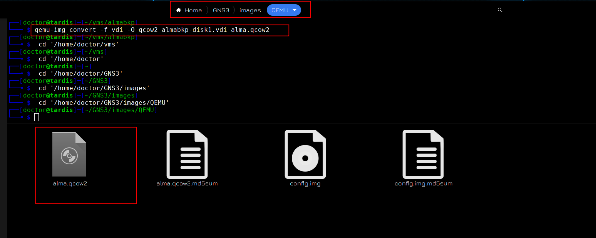

Я предварительно преобразовал образ дисков VDI от VirtualBox в qcow2, который нужен для Qemu и положил в нужную директорию. 


По настройкам виртуалки, я опять же ей выделил всего 512 мегабайт оперативки. Для подключения к консоли буду использовать vnc, это всё делается через GNS, без необходимости что-то менять в самой виртуалке.

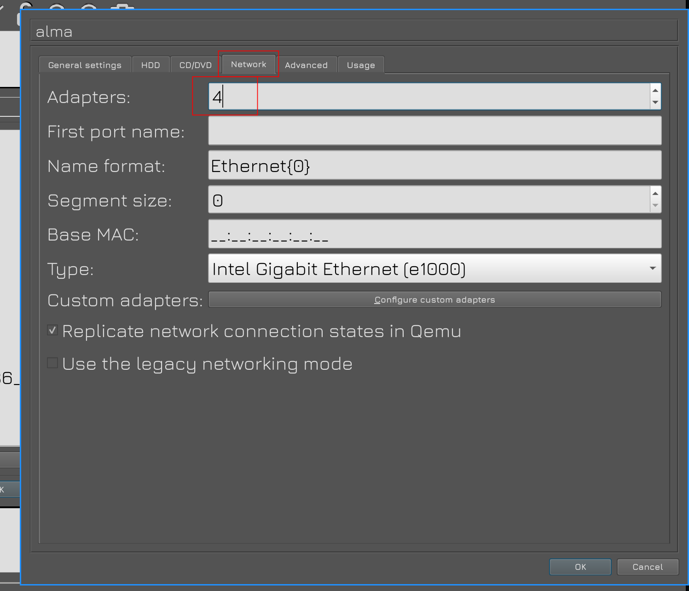

Во вкладке Network всё также выделил виртуалке 4 сетевых адаптера.

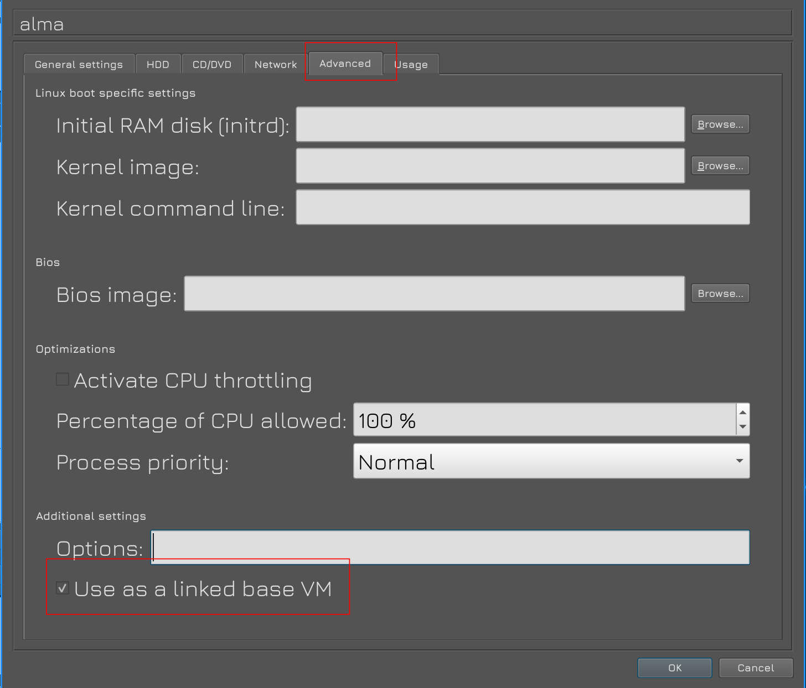

Ну и во вкладке Advanced нужно убедиться, что стоит галочка "Use as a linked base VM", чтобы мы простым перетягиванием создавали новые виртуалки.

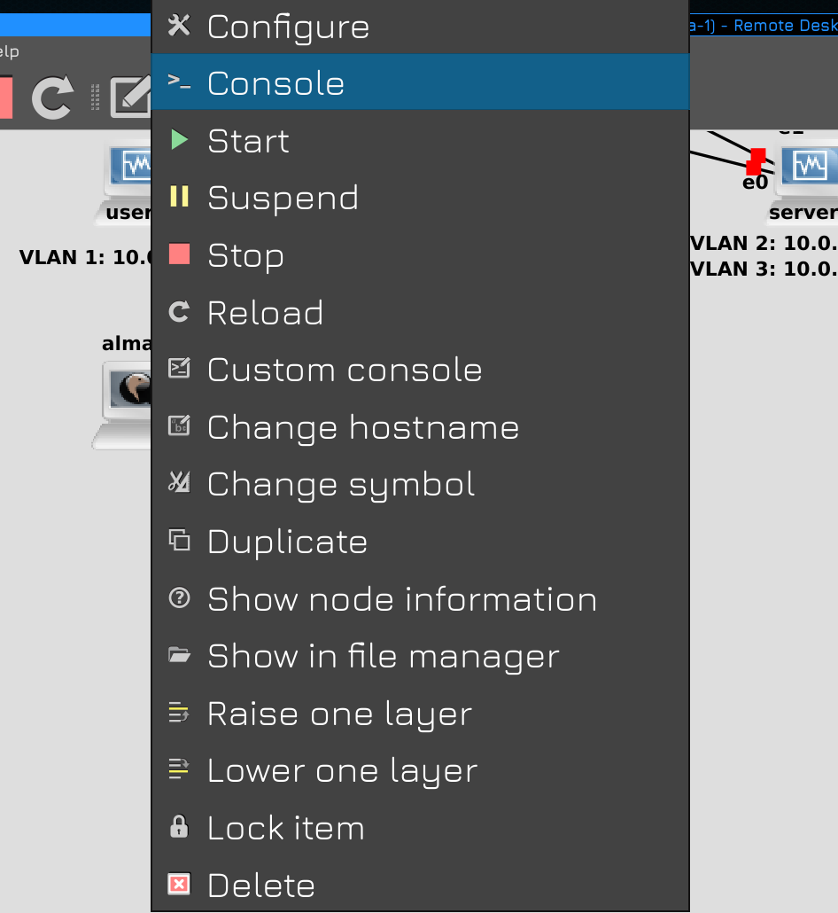

Для подключения к консоли виртуалки надо нажать на ней правой кнопкой мыши и выбрать Console. Для этого в системе должен быть какой-нибудь VNC клиент. 


Ну и учтите, что тут имена сетевых интерфейсов будут отличаться, но вы всегда можете их узнать по выводу команды:

```
ip a
```

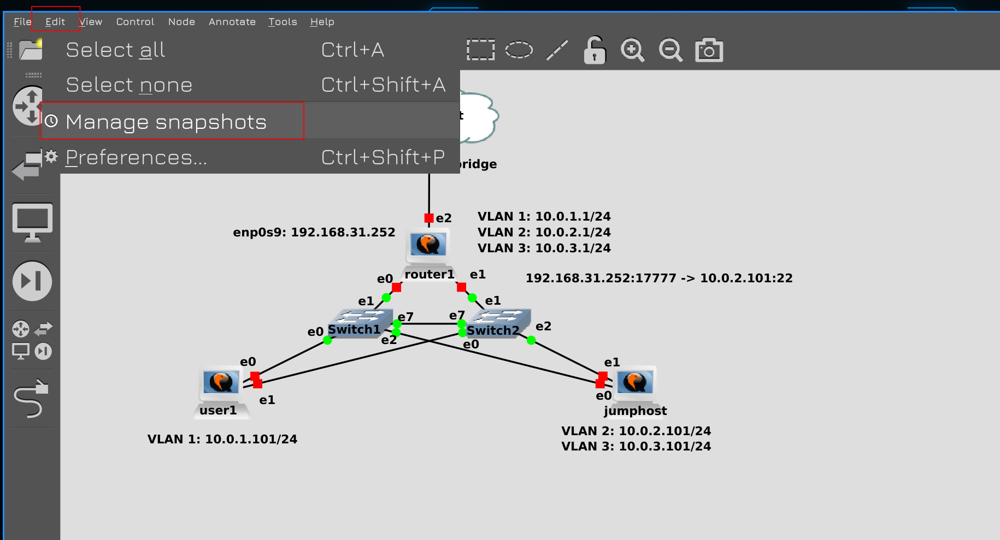

В общем, я настроил всё как было. И при выключенных виртуалках теперь можно делать снапшоты всей топологии. Если вы по какой-то причине тоже решили перейти на Qemu и у вас что-то не получилось, напишите, разберёмся. Это было небольшое вступление, теперь перейдём к самой теме.

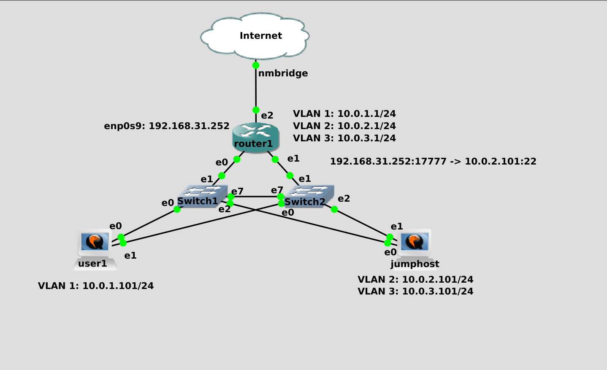

И так, в прошлый раз мы создали jumphost, через который мы можем логиниться на внутренние машинки из интернета. На сам jumphost мы можем попасть напрямую из интернета, так как на роутере мы пробросили порт. Из-за того что это не очень безопасно, мы приняли какие-то меры безопасности - использовали нестандартный порт, отключили аутентификацию по паролям и запретили руту логиниться. Но представьте, что у SSH есть какая-то уязвимость, о которой пока никто не знает - уязвимость нулевого дня. Условно, она позволяет зайти на сервер даже не зная логина и пароля. И вот какие-то взломщики нашли её и попытались взломать наш jumphost, через который они смогут попасть на другие наши сервера. При определённых условиях нас мог бы спасти selinux, но вот по каким-то причинам это не произошло. И вот взломщики получили доступ на джамп хост, просканировали сеть и увидели все наши сервера, которые они дальше будут ломать.

И вот из этой идеи - "нас уже взломали" - должна строиться система информационной безопасности. Невозможно построить систему, которая будет безопасной на все 100% - всё можно взломать, вопрос только в том, сколько времени, сил и денег на этой уйдёт. Системы информационной безопасности стоят не малых денег и всё упирается в принцип - система защиты не должна стоить дороже того, что она охраняет. Тоже самое касается взлома. Т.е. грубо говоря нет смысла покупать сейф за миллион долларов и хранить в нём 100 рублей. И нет смысла нанимать команду из профессионалов, у которых супер инструменты для взлома такого сейфа, чтобы в итоге достать 100 рублей.

Поэтому, строя систему защиты, с одной стороны нужно стараться сделать её неуязвимой, с другой - понимать, что это невозможно. А значит думать о следующем шаге - "нас уже взломали". Что дальше? Нужно смягчить урон. В инфобезе это называется "mitigation". Если кто-то попал на один сервер - сделайте так, чтоб он с этого сервера не мог попасть на другие. Если взломают одну систему - сделайте так, чтобы это не распространилось на другие. Попал в вашу сеть шифровальщик, зашифровал какие-то сервера - нужно сделать так, чтобы это не затронуло другие, чтобы не перекинулось в другие сети.

Чем сильнее вы усложните хакерам работу, чем больше всяких препятствий вы им поставите - тем сложнее им будет добраться до важных данных. А пока они будут со всем этим возиться, возможно, вы успеете что-то заметить и среагировать. 

В общем, возвращаясь к джамп хосту. Он у нас доступен из интернета и один из первых претендентов на взлом. А значит его надо как-то отделить от других систем. Мы говорили об изоляции на уровне вланов и подсетей, а с точки зрения информационной безопасности вводится ещё одно понятие - зоны. Мы уже знакомы с этим понятием благодаря файрволу - firewalld у нас zone-based firewall. Так вот, зона - это больше логическое деление, одна зона может состоять как из одного влана с одной подсетью, так и из множества вланов и подсетей. 


Например, мы можем для каждой аудитории в универе выделить отдельный влан с отдельной подсетью. Но с точки зрения зон - все аудитории находятся в одной зоне, так как по уровню доступа студенты одной зоны аудитории ничем не отличаются от студентов другой аудитории. Т.е. деление по зонам - это в основном про доступы. Скажем, студентам можно на такие-то сервера - значит все студенты в одной зоне, сервера в другой - и мы пишем правила, что зоне "студенты" разрешён доступ к зоне "сервера для студентов" по порту 80. На самом деле обычно настраивается более гранулярный доступ, мол, на эти сервера по 80 порту, а на эти по 443, на эти вообще нельзя и т.п. В общем-то всё начинается с зон, но ими не ограничивается.  

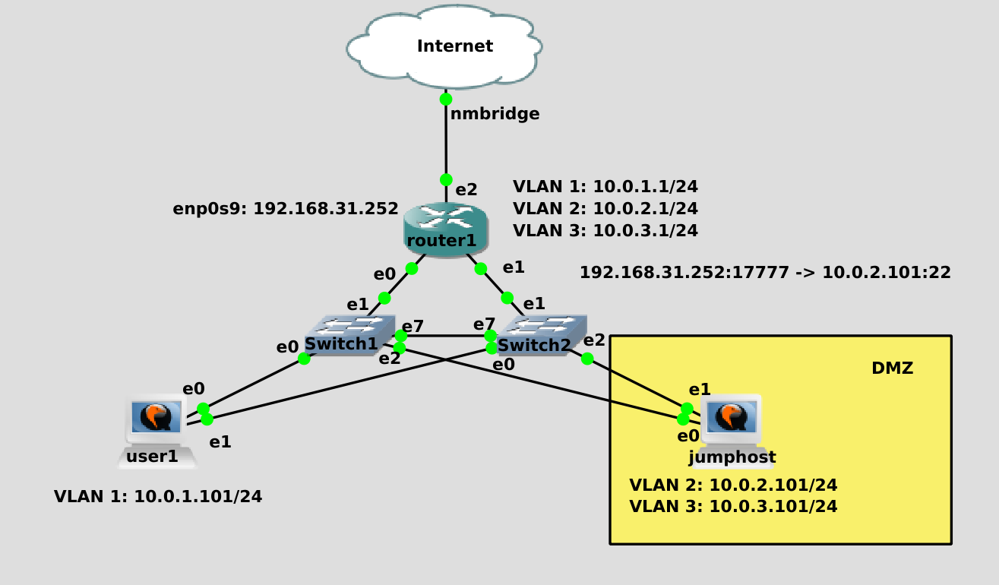

Так вот, системы, которые доступны из интернета, с точки зрения безопасности отделяют в одну зону, называемую DMZ - демилитаризованная зона. Обычно здесь находятся вебсервера, джамп хосты и прочие системы, к которым меньше всего доверия. Чем сильнее мы изолируем эту зону, чем меньше доступов мы дадим из этой зоны - тем лучше. Понятное дело, что джамп хост на то и джамп хост, что мы с него должны иметь возможность попасть на другие сервера. 


Но, допустим, мы можем разрешить джампхосту подключаться только к одному серверу во внутренней зоне. И использовать этот сервер в качестве второго джампхоста, у которого уже будет доступ к другим системам. Это сократит площадь атак.

В нашей схеме помимо джампхоста в интернет смотрит ещё одно устройство - роутер1. Да, мы его обезопасили, туда нельзя попасть из интернета, мы даже можем запретить доступ с джампхоста и запретить пинги. Но тем не менее, он подключен в интернет, как минимум, его могут вывести из строя DDOS атакой. Да и шанс взлома, хоть и мизерный, никогда не стоит исключать. И если наш роутер выйдет из строя, либо начнёт тормозить - ляжет вся наша сеть, юзеры не смогут заходить на сервера, а сервера не смогут обмениваться данными для работы. Пофиг на интернет, но нарушение внутренней работы сети - в средней или крупной компании большая проблема.


Поэтому внутренняя сеть располагается на другом роутере. Давайте немного преобразим нашу сеть. router1 у нас будет внешним роутером, который смотрит в интернет. С него будет проброс портов на различные сервисы, которые должны быть доступны в интернете, например, на джампхост. Пока что для DMZ отделим второй влан. Роутеру1 также нужен другой влан, например, влан1, чтобы он мог общаться с внутренним роутером. Его мы назовём router3. Он уже будет связывать внутреннюю сеть - пользователей, внутренние сервера и прочее. На нём нам нужен первый влан, чтобы общаться с роутером1, а также 3 и 4 вланы для юзеров и серверов соответственно. В дальнейшем возможно будут дополнительные зоны, но на пока этого достаточно.


Так как теперь наши роутеры будут не только связывать подсети, но и разделять сеть на зоны, т.е. выступать сетевыми файрволами, для аутентичности поменяем иконку у роутеров. Так как теперь на джампхост и юзер1 приходит только один влан, на свитчах в их сторону настроим нетегированные вланы, и только к роутерам и серверу1 будем использовать транки. Я пропущу этап настройки адресов и вланов, так как мы это делали раньше, а для вас это будет небольшим заданием на повторение. Однако с маршрутизацией начинающим может быть сложно, поэтому это покажу. 


Для начала подключимся во внутреннюю сеть. Запускаем ssh agent:

```
eval $(ssh-agent)
```

И добавляем ключи:

```
ssh-add .ssh/jumphost .ssh/servers
```

Дальше подключаемся к роутеру:

```
ssh router1
```

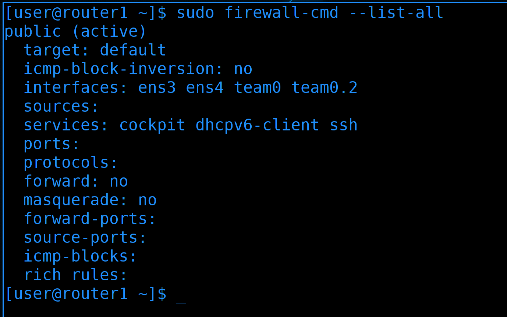

Для начала посмотрим дефолтную зону на файрволе:

```
sudo firewall-cmd --list-all
```

Сейчас у нас интерфейсы, которые смотрят в разные вланы - team0 и team0.2 - находятся в одной зоне. 


team0.2 - это интерфейс, который смотрит во второй влан - а он у нас для DMZ. Поэтому стоит перенести этот интерфейс в другую зону. На файрволе уже есть зона с таким названием, поэтому сразу переместим в эту зону:

```
sudo firewall-cmd --change-interface=team0.2 --zone=dmz --permanent
sudo firewall-cmd --reload
sudo firewall-cmd --list-all --zone=dmz
```

Интерфейс переместился в эту зону, но, как видите, в ней есть сервис ssh.


Это значит, что из DMZ зоны можно будет подключиться по ssh к роутеру. А так как мы не очень доверяем DMZ, то лучше убрать эту возможность:

```
sudo firewall-cmd --remove-service=ssh --zone=dmz --permanent
sudo firewall-cmd --reload
sudo firewall-cmd --list-all --zone=dmz
```

Это не отразиться на текущем подключении, но больше с джампхоста мы не сможем зайти на роутер.

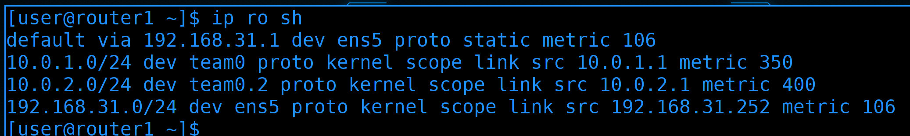

Теперь посмотрим маршруты:

```
ip ro sh
```

Роутер 1 знает о сетях 1.0 и 2.0. И всё неизвестное он посылает в интернет через провайдера. Но за роутером 3 у нас есть ещё 3 сети - 3.0, 4.0 и 5.0. Если какой-нибудь пакет придёт с сети 3.0 на роутер1, то роутер 1 ответ будет посылать на свой default gateway. 

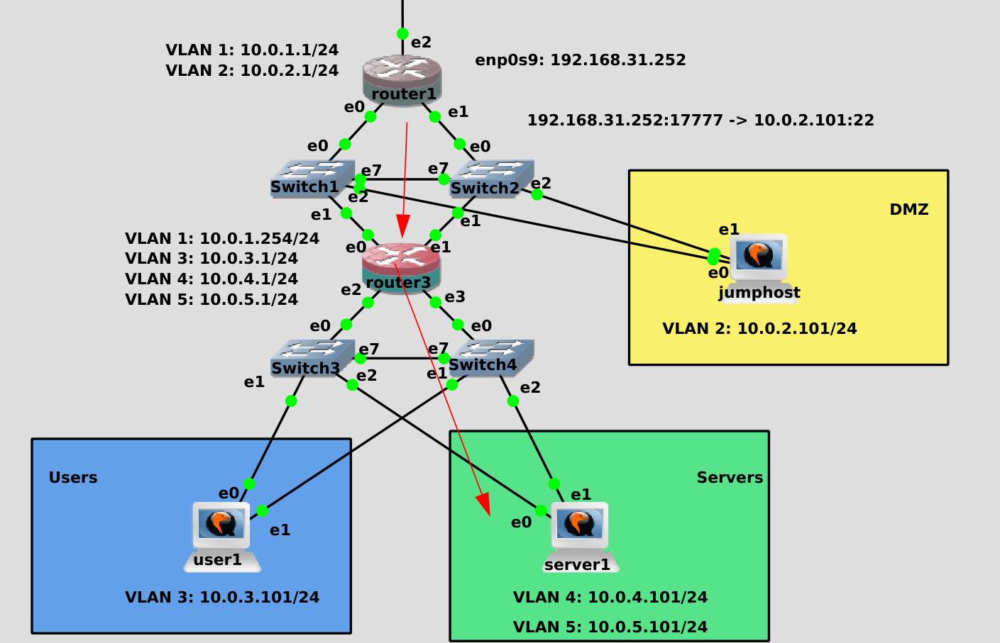

Нас это не устраивает, мы хотим, чтобы для ответа в 3, 4 и 5 сети роутер1 обращался к роутеру 3. И вот для этого нам нужны статичные маршруты. Условно, мы должны сказать роутеру1, что сеть 10.0.4.0 находится за роутером3. Адрес роутера3 для первого роутера - 10.0.1.254.


Поэтому на роутере1 прописываем статичные маршруты:

```
sudo nmcli connection modify team +ipv4.routes "10.0.3.0/24 10.0.1.254"
sudo nmcli connection modify team +ipv4.routes "10.0.4.0/24 10.0.1.254"
sudo nmcli connection modify team +ipv4.routes "10.0.5.0/24 10.0.1.254"
```

Мы через nmcli добавляем статичный маршрут, в котором пишем, что сети 3.0, 4.0 и 5.0 находятся за адресом 10.0.1.254.

После изменений поднимаем интерфейс, чтобы он применил настройки:

```
nmcli con up team
```

Ну и проверим таблицу маршрутизации:

```
ip ro sh
```

Теперь у нас в списке есть дополнительные маршруты. Без них роутер1 не смог бы ответить серверам в этих вланах, а значит, как минимум, у них не было бы интернета.


Что касается роутера3:

```
ssh 10.0.1.254
```

То тут у нас два тиминг интерфейса по 2 слейва:

```
nmcli con sh
```

Один интерфейс - team0 - смотрим в сторону первого роутера, второй - team1 - смотрит во внутреннюю сеть, там где пользователи и сервера. На втором тиминг интерфейсе мы создаём вланы 3, 4 и 5. 

Что касается маршрутов:

```
ip ro sh
```

То тут всё гораздо проще. Здесь default gateway является роутер1. И так вся внутренняя сеть подключена к этому роутеру, а если он что-то не знает - скажем, интернет адреса, то он пошлёт на первый роутер, а тот уже в интернет.


Что касается деления на зоны, то тут у нас 4 зоны:

```
sudo firewall-cmd --list-all
```

- Во-первых - team0 - он у нас смотрит в сторону первого роутера.
- Во-вторых - вланы 3, 4 и 5 - для каждого из них мы выделим отдельную зону.


Можно было бы использовать шаблонные зоны, но лучше создать свои с более подходящими названиями:

```
sudo firewall-cmd --permanent --new-zone=routers
sudo firewall-cmd --permanent --new-zone=users
sudo firewall-cmd --permanent --new-zone=servers
sudo firewall-cmd --permanent --new-zone=management
```

- routers - зона между первым и третьим роутером
- users - зона для локальных пользователей
- servers - зона для серверов
- management - зона для управления серверами. О ней мы поговорим чуть позже.

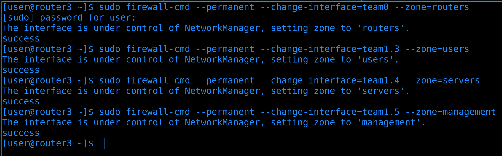

Дальше переместим интерфейсы в соответствующие зоны:

```
sudo firewall-cmd --permanent --change-interface=team0 --zone=routers
sudo firewall-cmd --permanent --change-interface=team1.3 --zone=users
sudo firewall-cmd --permanent --change-interface=team1.4 --zone=servers
sudo firewall-cmd --permanent --change-interface=team1.5 --zone=management
```

team0 в зону routers, team1.3 в зону users, team1.4 в зону servers и team1.5 в зону management.


Затем перезапустим файрвол, чтобы применились настройки:

```
sudo firewall-cmd --reload
```

Ну и можем проверить настройки:

```
sudo firewall-cmd --list-all --zone=routers
```

Вроде зона есть, интерфейс в зоне и, по-умолчанию, никаких настроек, никаких сервисов в зоне. А значит никто из зоны не сможет подрубиться к самому роутеру.

Вы спросите - а как же нам тогда управлять роутерами, если к ним ниоткуда подрубиться нельзя? Тут уже в дело вступает management vlan.


Как мы говорили, в локальной сети бывает большое количество различного оборудования - свитчи, роутеры, сервера, стораджи и т.п. У большинства этого оборудования есть отдельный выделенный физический порт для управления - management port. Эти порты предназначены для администраторов - с помощью них можно подключаться по веб-интерфейсу, либо по ssh и делать всякие административные задачи. Это позволяет отделить управляющую часть от данных. Условно, если кто-то получит доступ к виртуалке, он не сможет по сети достучаться до самого сервера, через который можно получить доступ над всеми виртуалками. С одной стороны весь административный доступ к различным системам выносится в один влан - management vlan - что немного сомнительно с точки зрения безопасности. Но с другой стороны мы знаем, что это единственный путь к админке - а значит в эту зону мы не пускаем никого лишнего, кроме администраторов.

В большинстве случаев на оборудовании только 1 административный порт, а значит его не подключишь к двум свитчам. Но обычно это не проблема - даже если выйдет из строя свитч, это не отразится на пользователях - максимум админы потеряют доступ к управлению. Плюс нередко все эти подключения держат на отдельном свитче - management switch. По хорошему на схеме я должен был роутер3 отдельно подключить к этому свитчу, свитчи отдельно, сервера отдельно - но, свитчи у нас тупые, а на роутере у меня не осталось портов. Поэтому роутер3 я буду подключать через 5 влан, а сервер1 подключу через отдельный адаптер, как и положено. Роутер1 и джампхост не будем подключать к менеджмент свитчу, так как к ним у нас меньше всего доверия.


К примеру, у нас на роутер3 целых 4 адреса в 4 сетях. А мы хотим, чтобы управлять им можно было только из менеджмент сети. Для этого в настройках sshd - ```/etc/ssh/sshd_config ``` - выставим в качестве ListenAddress только адрес из Management влана:

```
...
ListenAddress 10.0.5.1
...
```

И перезапустим sshd:

```
sudo systemctl restart sshd
```


Для проверки можем подрубиться к себе же. По адресу 4.1:

```
ssh 10.0.4.1
```

сразу видим ошибку. А по адресу 5.1:

```
ssh 10.0.5.1
```

можно понять, что подключение работает.


Не забудем в зоне management разрешить сервис ssh: 

```
sudo firewall-cmd --zone=management --add-servic=ssh --permanent
sudo firewall-cmd --reload
sudo firewall-cmd --list-all --zone=management
```

Ну и перезапустить файрвол. По хорошему стоит убрать из других зон ssh, но всё равно в других зонах нет активных интерфейсов с айпи адресом. А там где есть - не разрешён ssh.

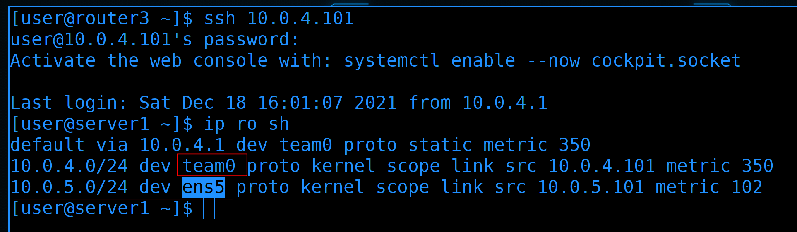

Теперь подрубимся к серверу1:

```
ssh 10.0.4.101
```

Тут у нас есть тиминг интерфейс для 4 влана:

```
ip ro sh
```

А также 5 влан, подключенный отдельно через интерфейс ens5.

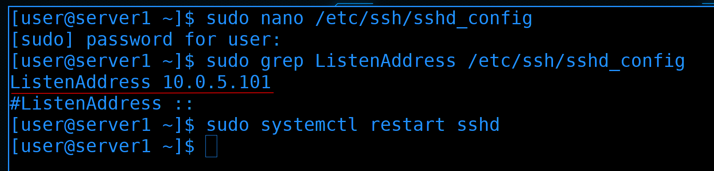

Давайте и здесь в sshd заменим ListenAddress на адрес из влана5:

```
...
ListenAddress 10.0.5.101
...
```

и перезапустим sshd:

```
sudo systemctl restart sshd
```


Ну и сделаем изменения на файрволе.

Во-первых, создадим новую зону management, переместим туда интерфейс и разрешим там ssh:

```
sudo firewall-cmd --new-zone=management --permanent
sudo firewall-cmd --change-interface=ens5 --zone=management --permanent
sudo firewall-cmd --add-service=ssh --zone=management --permanent
```

При этом, из дефолтной зоны, т.е. из public, уберём ssh и перезапустим firewall:

```
sudo firewall-cmd --remove-service=ssh --permanent
sudo firewall-cmd --reload
sudo firewall-cmd --list-services
sudo firewall-cmd --list-interfaces
sudo firewall-cmd --list-services --zone=management
sudo firewall-cmd --list-interfaces --zone=management
```

То что мы сейчас делаем на уровне виртуалки - не имеет смысла. Но просто представьте, что это физический сервер, у него на одних физических портах ходят данные, а через выделенный - management - мы управляем. И то что мы вынесли ssh на отдельный интерфейс и по файрволу настроили к нему доступ - это лишь условность. Но и из этой условности можно вынести что-то полезное - по крайней мере мы учимся работать с зонами.

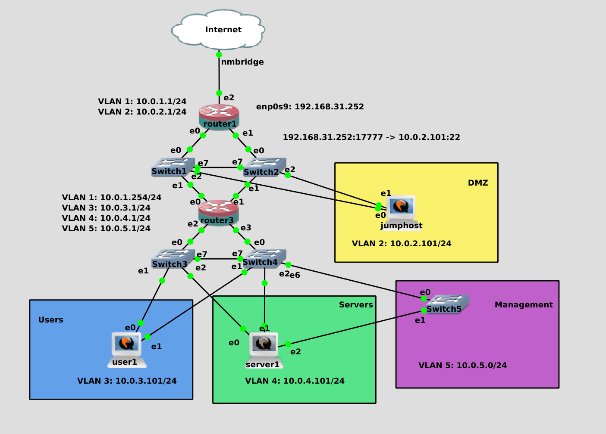

И так, мы разделили нашу сеть на зоны. Где-то остались мелочи, условно, убрать лишние сервисы и интерфейсы с зон на роутерах и конечных устройствах. 

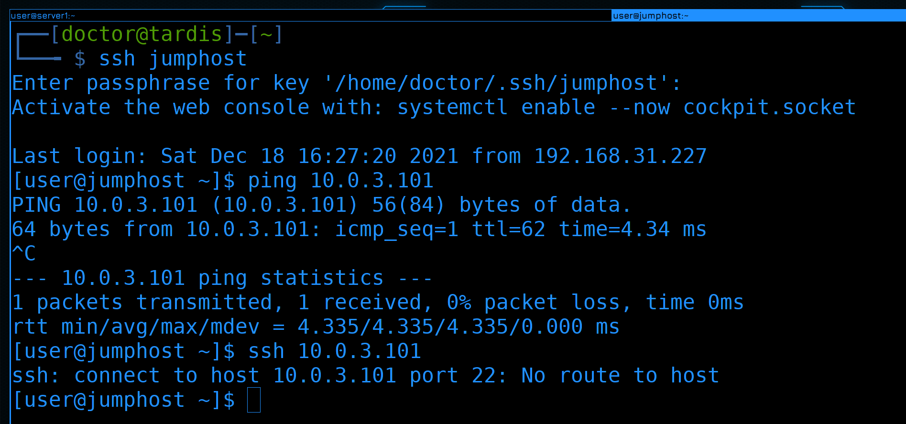

Все наши соединения сейчас держатся благодаря тому, что изменения на файрволе не влияют на текущие ssh сессии. Если мы попытаемся заново подключиться:

```
ssh jumphost
```

хоть пинг и будет работать:

```
ping 10.0.3.101
```

но ssh и любые другие соединения работать не будут:

```
ssh 10.0.3.101
```

Просто потому что сетевой файрвол блокирует трафик между зонами.


А вот как гранулярно разрешить трафик между зонами и как с джампхоста попасть на сервер1 по ssh - поговорим в следующий раз. Информации и так получилось много, схема стала комплекснее, но ничего страшного в ней нет. Постарайтесь построить такую же сеть, всё должно пинговать друг друга, за исключением адреса 5.101. Почему так - разберём в следующий раз.

Давайте подведём итоги. Сегодня мы с вами поговорили про безопасность, затронули необходимость внутреннего и внешнего файрволов, разделили нашу сеть на зоны, создали DMZ и добавили несколько вланов и подсетей.