


И так, сеть у нас вроде готова. Теперь давайте зададимся вопросом - а что будет, если что-то выйдет из строя? Ну, если выйдет из строя свитч - у нас есть второй, у нас есть NIC teaming - а значит всё продолжит работать. А если выйдет из строя роутер? Если роутер1, то перестанет работать интернет и не будет доступа извне, мы не сможем подключиться к джампхосту. А если роутер3 - то ляжет вся внутренняя сеть. Второе, конечно, более критично, но и того, и другого мы хотели бы избежать.

Казалось бы, ничего сложного, можно сделать как со свитчами - поставить по два роутера, если выйдет из строя один - продолжит работать другой. На деле же есть один нюанс.

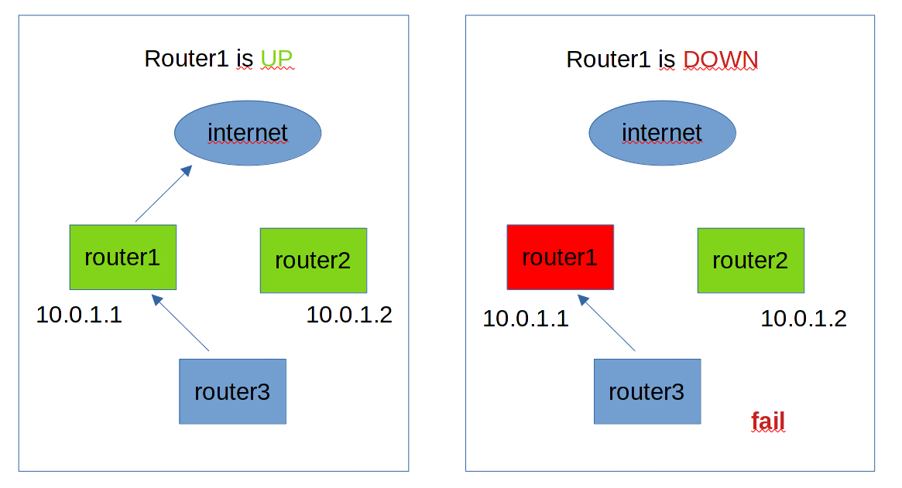

Если мы поставим другой роутер, то нам надо будет дать ему другой IP адрес, так как в одной сети у двух систем не может быть одного IP адреса. Но если у второго роутера будет другой IP адрес, то хосты не будут к нему обращаться. Потому что в качестве gateway у них стоит адрес первого роутера. А два гейтвея прописать нельзя, да и смысла нет - всё равно будет использоваться только один, даже если он недоступен.


Т.е. нам нужно сделать так. Когда роутер1 работает, то IP адрес 10.0.1.1 будет у него. Если вдруг что-то с ним случится и роутер1 перестанет быть доступным, то этот же IP адрес 10.0.1.1 должен перейти на роутер2. И тогда этот IP адрес опять будет доступен для хостов и интернет продолжит работать. Такой IP, который переходит от одного хоста к другому часто называют "плавающим IP" или виртуальным ip. Этот механизм, когда IP адрес переходит с одной системы на другую работает через протокол VRRP - virtual router redundancy protocol. Он был придуман для сети, в частности для роутеров, как раз для той ситуации, которую мы сейчас симулируем. Но такой простой и полезный механизм обрёл большую популярность и в линуксах.


Тут стоит познакомиться с двумя терминами - высокая доступность и отказостойчивость. Простым языком - высокая доступность - это когда почти всегда работает, но если возникнет проблема - что-то не будет работать буквально пару секунд или максимум минут. Отказоустойчивость - это когда что-бы там не поломалось, пользователи ничего не заметят и всё будет работать идеально. Но эти понятия можно применять на разных уровнях. Скажем, lacp - это про отказоустойчивость, так как не будет никаких обрывов, а activebackup - это высокая доступность - могут потеряться пару пакетов, но потом всё продолжит работать. Или, скажем, у нас сайт отказоустойчивый, так как работает на нескольких серверах с несколькими виртуалками. И даже если один сервер ляжет, пользователи ничего не заметят. Но при этом сама виртуалка не отказоустойчивая, пока она запустится на другом сервере будет небольшой даунтайм. Но опять же, с точки зрения пользователя - сайт всё это время будет работать. Реальная инфраструктура в компаниях - это смесь отказоустойчивости и высокой доступности. Полную отказоустойчивость сделать нереально и очень дорого. И даже у крупнейших IT гигантов за год суммарно набирается пару часов downtime-а.

Так вот, VRRP - это про высокую доступность. Пока второй роутер заметит проблему, пока IP адрес переедет - пройдёт пару секунд. Но зачастую это вполне терпимо, поэтому в каких-то ситуациях можно использовать.


И так, возьмём router1. На нём мы настраивали NIC-teaming, firewall, ssh-ключи и другие вещи. И чтобы с нуля всё это не делать, просто склонируем виртуалку. Для начала выключаем router1, затем правой кнопкой мыши нажимаем на нём и выбираем duplicate.


Подключаем его к нижним свитчам точно как router1 и на свитчах также делаем trunk порт. Так как у нас провайдер всего один и от него всего один кабель, добавляем ещё один свитч и подключаем оба роутера и провайдера к нему. Теоретически можно было бы через свитч1 или свитч2, но чтобы не было каши в схеме, сделаем через отдельный свитч.

VRRP это сетевой протокол. При нём роутер1 и роутер2 будут обмениваться пакетами, чтобы понять состояние друг друга. Пакеты в сети можно подделать и таким образом какой-нибудь взломщик сможет выдать себя за один из роутеров, тем самым сделав атаку "man in the middle". Поэтому обмен информацией о VRRP стоит организовать через прямое подключение между двумя роутерами, а не через свитч.

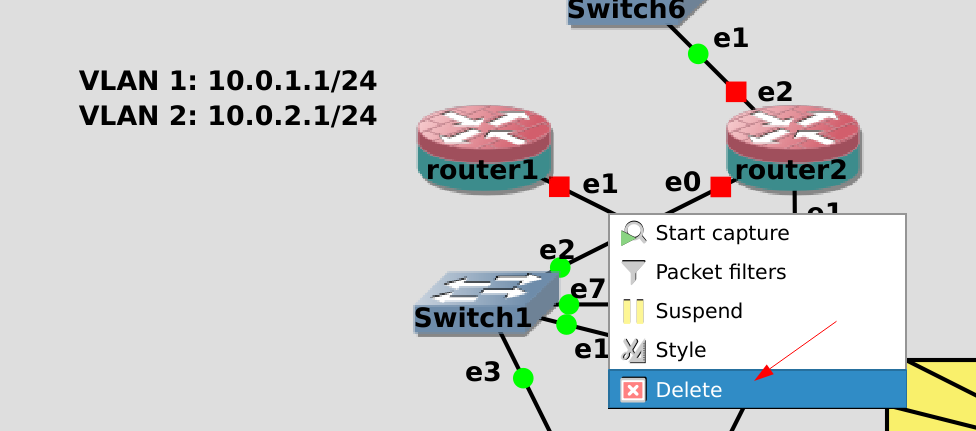

Поэтому давайте добавим ещё портов на роутеры. Но из-за особенностей GNS перед этим надо отсоединить все кабели, идущие от роутера1 и роутера2. Нажимаем правой кнопкой мыши на кабели и выбираем delete. 


Затем нажимаем правой кнопкой на роутере1 и выбираем Configure.


Во вкладке Network меняем количество адаптеров на 6, нажимаем Apply и OK. Затем тоже самое проделываем для роутера 2.


После чего возвращаем все провода как было.

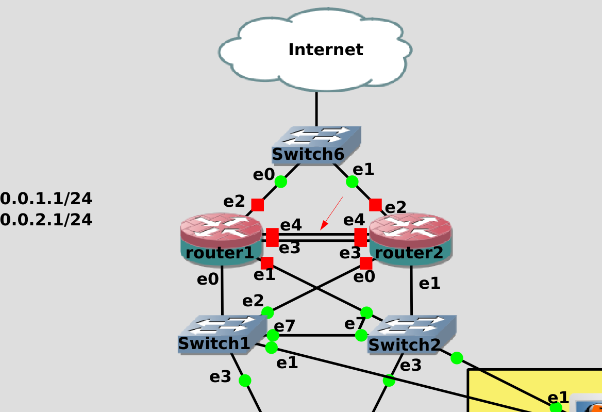

И теперь подключим роутер1 к роутеру2 двумя проводами напрямую. Теоретически, можно было бы одним, но тогда при выходе из строя адаптера или провода каждый роутер начнёт считать, что другой роутер недоступен, в итоге IP адрес пропишется на обоих роутерах и это приведёт к проблемам в сети. Такая проблема, когда системы перестают видеть друг друга, думают, что другой хост не доступен и поэтому считают себя за главного, называется split brain. Поэтому мы для надёжности подключили роутеры друг к другу двумя проводами и сделаем lacp. 


Теперь касательно настройки. Для начала включим только роутер1, запустим ssh agent, добавим ключи и подключимся:

```
eval $(ssh-agent)
ssh-add .ssh/servers .ssh/jumphost
ssh router1
```


Посмотрим список интерфейсов:

```
ip --brief a
```

Здесь мы видим, что добавились два новых интерфейса. Интерфейсы ens6 и ens7 сейчас в UP-е. На них раньше ничего не было, т.е. это те новые интерфейсы, которые смотрят на роутер2. 

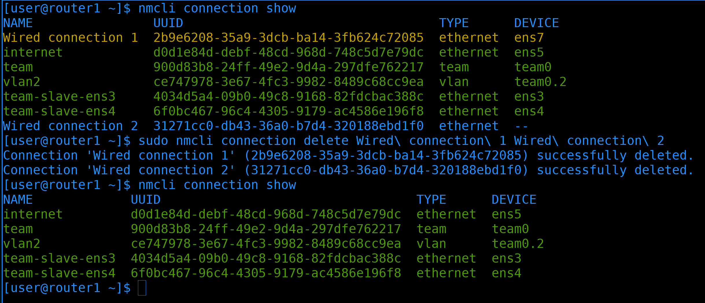

Так как мы подключили новые интерфейсы, network manager автоматом для них создал профили - Wired connection 1, Wired connection 2:

```
nmcli con sh
```

Начнём с их удаления:

```
sudo nmcli connection delete Wired\ connection\ 1 Wired\ connection\ 2
nmcli con sh
```

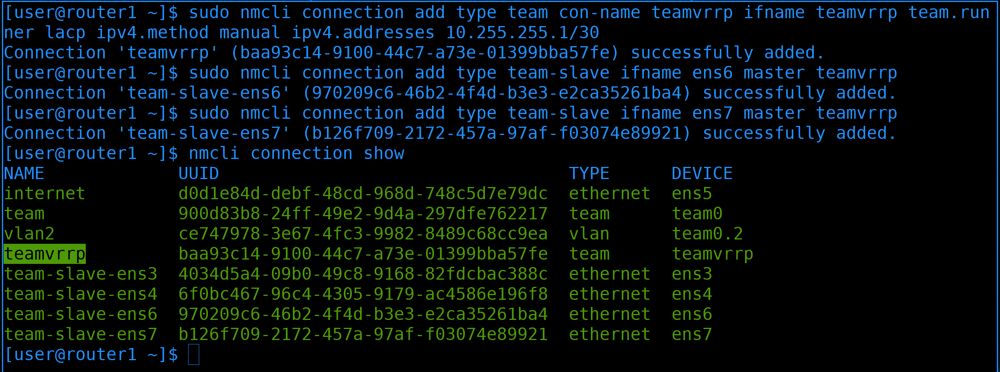

Теперь добавим новый тиминг интерфейс:

```
sudo nmcli connection add type team con-name teamvrrp ifname teamvrrp team.runner lacp ipv4.method manual ipv4.addresses 10.255.255.1/30
```

Назовём профиль и интерфейс teamvrrp, в качестве runner-а - lacp, а IP адрес выдадим 10.255.255.1/30. Во-первых, такой адрес визуально отличается от нашей сети и нам будет легче понять, что он для чего-то особенного - общения между первым и вторым роутером. А маска /30 говорит о том, что в этой сети всего 4 адреса - 0,1,2,3. При этом использовать можно только 1 и 2, а у нас в сети как раз два адреса. 

```
sudo nmcli connection add type team-slave ifname ens6 master teamvrrp
sudo nmcli connection add type team-slave ifname ens7 master teamvrrp
```

Также добавим интерфейсы ens6 и ens7 в качестве слейвов. После чего проверим список профилей в NetworkManager-е:

```
nmcli con show
```

Вроде всё верно.


Теперь нам нужно установить пакет keepalived - он содержит функционал для работы VRRP:

```
sudo dnf install keepalived
```


Основной файл настроек - ``` /etc/keepalived/keepalived.conf ```:

```
sudo nano /etc/keepalived/keepalived.conf
```

keepalived много чего может помимо vrrp и здесь примеры различных настроек. Даже в рамках vrrp функционал довольно широкий, вплоть до того, что keepalived может сам настраивать firewall, приоритет процесса vrrp, возможность попадания в swap и т.д. и т.п. В мане keepalived.conf можно очень много всего найти, но большинство из этого довольно специфично. 

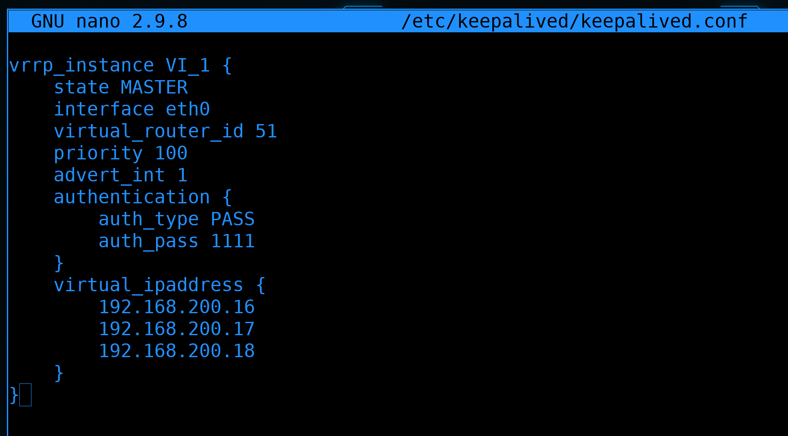

Нам это пока не нужно, поэтому мы стираем всё помимо секции vrrp_instance. Теперь давайте разбираться и поправлять.

- ``` vrrp_instance VI_1 ``` - секция, в которой указаны настройки для одного интерфейса VRRP. Под интерфейсом в данном случае имеется ввиду тот интерфейс, который смотрит на другой роутер. Хотя нередко общение между хостами оставляют на том же интерфейсе, на котором меняются адреса, но мы говорили об этом, что это не очень безопасно. По сути может быть, что у нас несколько разных систем, с разными задачами и адресами, и чтобы отделять одни системы от других можно создать несколько секций. Хотя у нас будут плавать адреса на 3 интерфейсах - на интернет, влан1 и влан2, но всё равно всё это относится к одной задаче - все эти адреса будут переходить от роутера1 к роутеру2. VI_1 - название секции, можно поменять, но смысла нет.

- ``` state MASTER ``` - определяет, кем будет считать себя хост изначально - MASTER или BACKUP. У кого будет плавающий IP определяет приоритет, но обычно у MASTER приоритет выше, у BACKUP ниже и если всё нормально - адрес остаётся у MASTER. Но представим себе ситуацию, когда MASTER перестал работать и IP перешёл на BACKUP. Во время проблемы был небольшой даунтайм, пока всё переходило на BACKUP. И по настройкам по-умолчанию, при возвращении MASTER в нормальное состояние, IP адрес вернётся на MASTER, что опять вызовет обрыв соединений. Что не очень хорошо. 

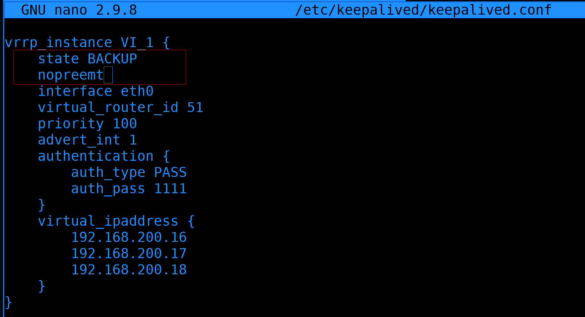

Если оба сервера одинаковы и мы не отдаём никому предпочтения, то можно оба сервера сделать BACKUP и добавить опцию ``` nopreempt ```. В таком случае после возвращения нерабочей системы в нормальное состояние, IP к нему не вернётся и это не вызовет повторной потери пакетов. Т.е. IP будет меняться только когда одна из систем, будем называть их нодами - пока одна из нод не выйдет из строя. При этом учтите, что даже если прописали здесь BACKUP, на самом деле та нода, у которой сейчас адрес, считается MASTER. 

- ``` interface eth0 ``` - собственно, интерфейс, по которому будет проходить общение между хостами. VRRP может работать через multicast, и поэтому можно обходиться указанием интерфейса вместо IP адреса роутера2. Но, с другой стороны, мы точно знаем адрес второго роутера, а значит можем вместо всего интерфейса указать адрес второй ноды.


Для этого уберём строчку ``` interface ``` и добавим ``` unicast_peer ``` с адресом второго роутера:

```
unicast_peer { 10.255.255.2 }
```

Соответственно, настраивая это на втором роутере, надо будет указывать адрес первого роутера. 

- ``` virtual_router_id 51 ``` - идентификатор vrrp_instance-а. Условно, если у нас несколько разных vrrp запущено, один для этого роутера, другой для другой системы с другими адресами - то у каждого должен быть свой уникальный id. А там где совпадают - id должен быть одинаковым. Значения могут быть от 0 до 255. И на этом роутере и на втором мы оставим один номер - 51.

- ``` priority 100 ``` - приоритет. Определяет, у кого будет IP адрес. Чем выше значение - максимум 255 - тем больше приоритет. Соответственно, если у этой ноды будет приоритет 100, а у второй 50 - то адрес будет на этом сервере. Пока не возникнут проблемы и тогда адрес перейдёт на вторую ноду. А благодаря опции ``` nopreempt ``` адрес останется там, даже если первый сервер восстановится. Но в реальной среде может быть ситуация, что у вас первый сервер производительнее второго, а второй вы поставили временно, чтобы совсем всё не ломалось. Тут вам приоритет пригодится.

- ``` advert_int 1 ``` - 1 - это секунда. Т.е. каждую секунду мастер нода уведомляет другую - или других, если их несколько - что всё окей. Если вдруг мастер замолчал - вторая нода по приоритету становится мастером. Происходит это после 3 раза. Т.е. если у нас тут значение 1 секунда и от мастера нет сообщения на протяжении 3-ёх - то нода считает, что мастер недоступен. Если тут поставить значение 2 - то это произойдёт через 6 секунд.

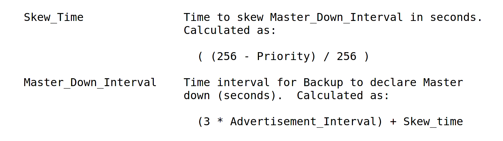

На самом деле в формуле помимо этого есть ещё небольшая задержка, но это нюансы. Можно ещё поставить миллисекунды, но сильно перебарщивать не надо, а то из-за какой-то небольшой задержки поменяется мастер нода. Поэтому оставим как есть.

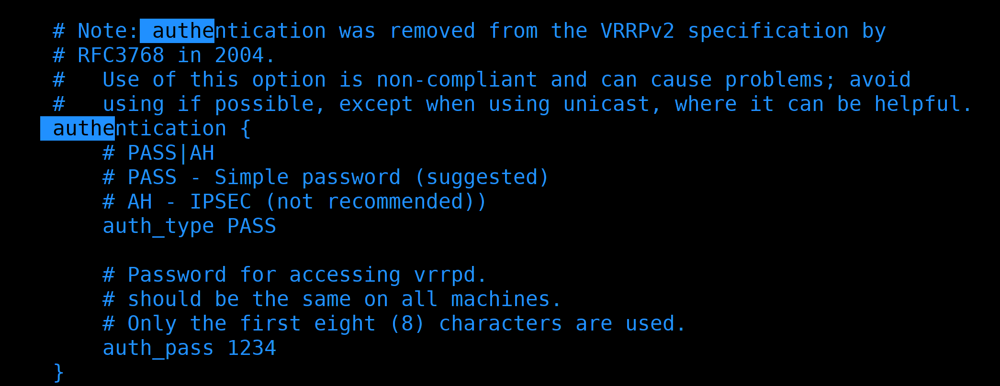

- ``` authentication ``` - для того, чтобы ноды могли убедиться, что перед ними нужный хост. Но на самом деле с этим большие проблемы - при простом PASS пароль в сети ходит в открытом виде, а при AH он хоть и шифруется, но всё равно есть способы обхода.


Поэтому в новом стандарте vrrp убрана аутентификация. Именно поэтому мы обмен информацией между роутерами сделали напрямую. 


Особого смысла нам менять значение нет, но для вас, для наглядности, мол если вы захотите через общую сеть пускать VRRP и не хотите, чтобы пароль был в открытом виде, выставим значение AH и зададим пароль. Максимальная длина пароля - 8 символов.

- ``` virtual_ipaddress ``` - собственно, сами плавающие адреса. У нас их будет 3 и все они на разных интерфейсах. Поэтому нам надо при указании адреса также указывать интерфейс. 

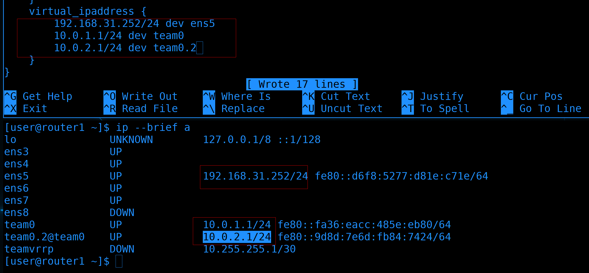

И так, предположим, провайдер даёт нам один внешний адрес - 31.252:

```
ip --brief a
```

Если роутер1 перестанет работать, нам нужно, чтобы на роутере2 был этот же адрес. Он у наc на интерфейсе ens5. Также роутер1 является гейтвеем для первого и второго влана с адресами 1.1 и 2.1. Соответственно, эти адреса мы также должны переносить на второй роутер. 

На этом с конфиг файлом роутера1 закончим. Сохраняем и выходим.


Давайте проверим конфиг на ошибки, для этого можно использовать утилиту keepalived с опцией config-test:

```
keepalived --config-test
```

Как видите, у меня две ошибки. Во-первых, я опечатался в слове nopreempt. Во-вторых, при использовании unicast_peer мне нужно указывать либо unicast_src_ip, либо интерфейс. Давайте исправим:

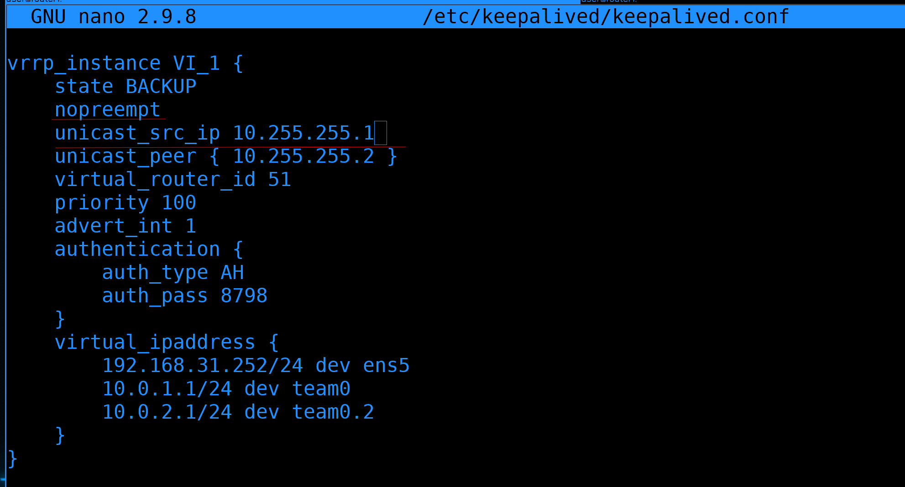

Заново открываем конфиг и исправляем ошибки. ``` unicast_src_ip ``` - это айпи, с котого будут отправляться запросы. Т.е. IP адрес интерфейса teamvrrp.


Ещё раз запускаем проверку:

```
keepalived --config-test
```

На этот раз никаких ошибок.


Чтобы роутер1 и роутер2 могли обмениваться информацией о vrrp, нам надо кое-что разрешить на файрволе. У нас есть зона routers, но отношения между роутером1 и 2 несколько иные, чем между роутером1 и 3. Можно было бы использовать зону trusted, так как соединение напрямую, но для наглядности создадим новую зону и переместим в неё новый интерфейс:

```
sudo firewall-cmd --new-zone=router2 --permanent
sudo firewall-cmd --change-interface=teamvrrp --zone=router2 --permanent
```

В этой зоне добавим протоколы vrrp и ah. Да, это не просто сервисы, а именно протоколы:

```
sudo firewall-cmd --add-protocol={vrrp,ah} --zone=router2 --permanent
```

После изменений перезагрузим и проверим зону:

```
sudo firewall-cmd --reload
sudo firewall-cmd --list-all --zone=router2
```

Теперь самое главное. Чтобы vrrp работал, нам надо, чтобы эти адреса не были прописаны статично. Их будет прописывать keepalived, поэтому в NetworkManager-е их надо убрать. Но так как помимо адреса у нас в профиле прописаны dns, gateway и прочие настройки, нам лучше не полностью убирать адреса, а заменить их на соседние. Условно, в первом влане у роутера1 выставить ip 10.0.1.2, у роутера2 выставить ip 10.0.1.3, а 10.0.1.1 будет плавать между хостами.  

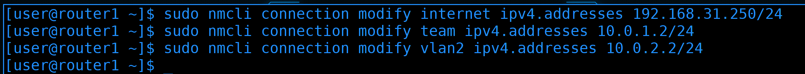

Поэтому поменяем IP адреса на всёх трёх профилях:

```
sudo nmcli connection modify internet ipv4.addresses 192.168.31.250/24
sudo nmcli connection modify team ipv4.addresses 10.0.1.2/24
sudo nmcli connection modify vlan2 ipv4.addresses 10.0.2.2/24
```

Пока мы заново не поднимем интерфейсы, настройки не применятся.


И чтобы нас не выкинуло из-за того, что мы меняем IP адреса, сделаем так. Объединим команду поднятия интерфейсов с командой запуска keepalived:

```
sudo nmcli con up internet && sudo nmcli con up team && sudo nmcli con up vlan2 && sudo systemctl enable --now keepalived
```

Так я поднимаю все 3 интерфейса и сразу же поднимаю keepalived, который видит, что второй роутер недоступен, а значит прописывает у себя эти адреса. Так как я всё ещё подключен, всё сработало. Но всё же проверим адреса:

```
ip --brief a
```

Как видите, теперь на наших интерфейсах по два адреса. Второй прописывается сервисом keepalived, и, если его отключить, адрес пропадёт. 


Теперь надо настроить router2. Вкратце - надо поменять хостнейм, адреса на интерфейсах на 10.0.1.3, 10.0.2.3, 192.168.31.251, а также создать новый тиминг интерфейс для vrrp, создать зону на файрволе, установить keepalived. Короче, всё что мы делали для первого роутера. Наверное, будет легче просто заново скопировать router1, чтобы меньше возиться с настройками. Это вы и сами можете сделать, поэтому пропустим этот шаг и сразу перейдём к настройке keepalived.


На втором роутере, в конфиге ``` keepalived.conf ``` надо поправить unicast_src_ip и unicast_peer, поменяв значения местами. Так как у нас оба сервера в режиме ``` BACKUP ``` и стоит опция ``` nopreempt ```, от различий приоритета большого смысла нет. Так как IP не будет переходить просто из-за приоритета. Лично для нас никакой разницы между первым и вторым роутером нет, поэтому приоритет можем оставить одинаковым. 


После изменений рестартнём keepalived на router2 и запустим router1:

```
sudo systemctl restart keepalived
```


И давайте проверим. Посмотрим ip адреса на роутере2:

```
ip --brief a
```

Тут видно, что на нём и его адреса, и плавающие адреса.


А вот на роутере1:

```
ip --brief a
```

нет вторых адресов. Т.е. мастером сейчас является роутер2, а роутер1 пока что просто ждёт, пока роутер2 не выйдет из строя.


Если посмотреть логи на роутере1:

```
journalctl -eu keepalived --no-pager
```

можно увидеть, что роутер1 увидел Gratuitous ARP через общий канал и перешёл в режим BACKUP. 

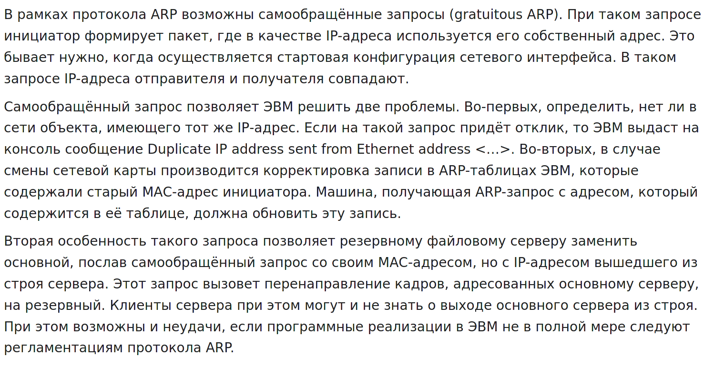

Помните что такое ARP запрос? Когда один хост знает IP адрес другого, но не знает мак адреса, он посылает ARP запрос. Так вот, представьте, что все хосты в сети запомнили, что IP адрес 1.1 находится за мак адресом первого роутера. Но вот внезапно первый роутер умирает и IP 1.1 переезжает на второй роутер. Но на нём-то другой мак адрес, а значит хосты будут пытаться обращаться к старому мак адресу, пока сами не обновят свою arp таблицу. И чтобы избежать этой проблемы и задержки, роутер2 сразу же сам отправляет всем arp запрос, в котором говорит, что теперь у адреса 1.1 такой-то мак адрес. Это такой самообращённый ARP запрос. Он также позволяет компьютерам понять, а нет ли такого же IP адреса на других компьютерах в этой сети.

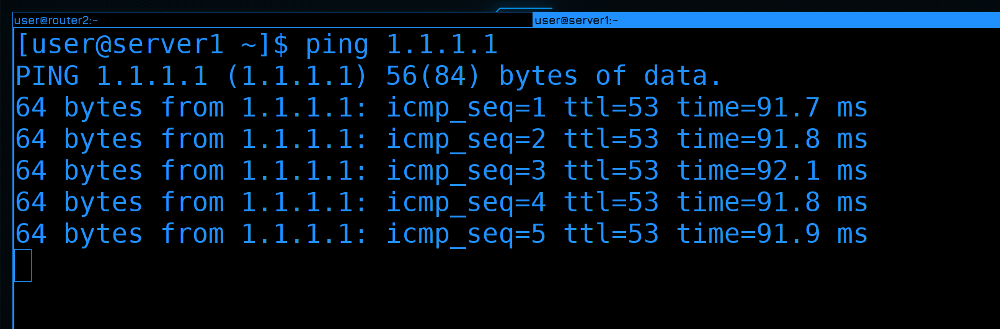

Ладно, вроде всё настроили, давайте тестировать. По задумке, если что-то случится с роутером2, IP адрес перейдёт на роутер1. Идём на сервер1:

```
ssh server1
```

И запускаем пинг в интернет:

```
ping 1.1.1.1
```

Дальше идём в GNS и отрубаем роутер2.

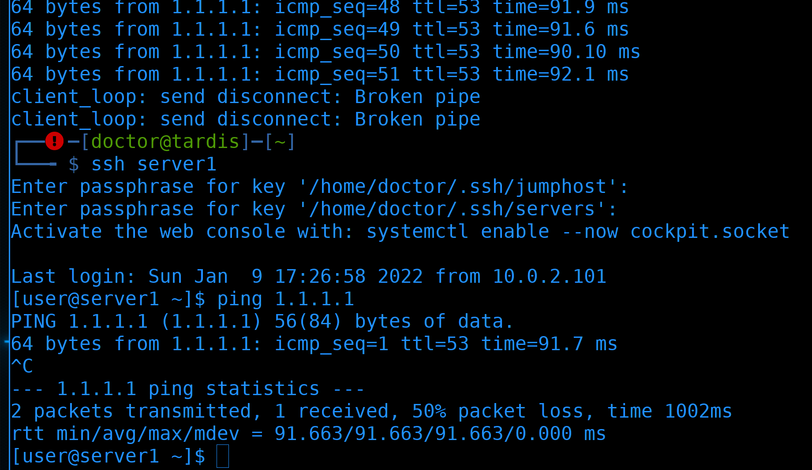

При этом соединение по ssh к серверу1 прервалось. Но я могу повторно подключиться и проверить пинг:

```
ssh server1
ping 1.1.1.1
```

И всё работает. Как я говорил, vrrp - это про высокую доступность, а не про отказоустойчивость. Если вырубится один роутер - то все соединения прервутся. Но через пару секунд можно будет подключиться заново, так как теперь все нужные адреса на другом роутере.

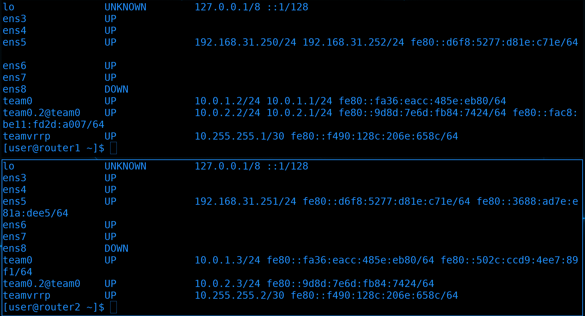

Посмотрим адреса на обоих системах:

```
ip --brief a
```

Как видите, сейчас адреса на первом хосте. 


Чтобы увидеть, сколько пакетов мы теряем, давайте пустим пинг в интернет через консоль сервера1 и вырубим первый роутер. Как видите, потерялись всего несколько пингов, что в принципе не критично. У нас целый роутер отвалился, а сеть заработала почти моментально. Можно, конечно, немного уменьшить параметр ``` advert_int ``` до миллисекунд, но особой необходимости в этом я не вижу.


И так, теперь у нас любые проблемы с роутером1 не так страшны и буквально через пару секунд всё продолжит работать на втором. Это не только делает нашу сеть высокодоступной, но и позволит в будущем обновлять роутеры, выключать, менять и проделывать любые операции с ними, при этом это не сильно будет влиять на пользователей. Скажем, раньше при обновлении роутера у вас интернет был недоступен 5 минут, а если ещё проблема какая возникла бы - то это могло затянуться на пару часов. Сейчас же интернет недоступен буквально пару секунд.

Ваша домашняя работа будет добавить роутер4, связать его с 3 роутером и настроить VRRP для всех 5 адресов. Ну и ещё посмотрите вывод tcpdump по интерфейсу teamvrrp во время, когда всё нормально, а также во время, когда один из хостов выходит из строя, а потом возвращается. Ничего суперважного там нет, но эта практика будет полезна для работы с tcpdump.

Давайте подведём итоги. Сегодня мы разобрали, чем отличается высокая доступность от отказоустойчивости, разобрали VRRP - протокол, который позволяет одному IP плавать между хостами, настроили keepalived и всё протестировали. Как я говорил, функционал keepalived довольно большой и мы к нему ещё будем возвращаться. Но на сегодня этого хватит.