

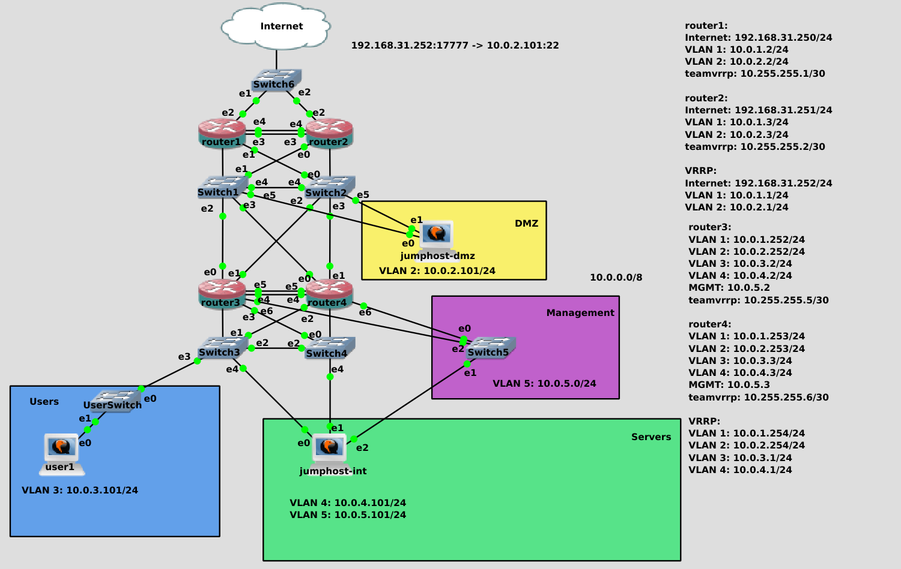

Чтобы какой-то компьютер мог быть частью сети и полноценно в ней работать, ему нужна информация о сети: свой IP адрес и маска, адрес gateway, адреса dns серверов, возможно, какая-то дополнительная информация. Когда в сети 1-2 компьютера, всю эту информацию можно и вручную прописать, задав статичные IP адреса. Если устройств становится много, это начинает отнимать много времени. Поэтому практически в любой сети есть DHCP сервера, благодаря которым достаточно подключить устройство к свитчу - и оно получит всю необходимую информацию о сети. Само название DHCP (Dynamic Host Configuration Protocol) говорит за себя - протокол динамической настройки хоста.

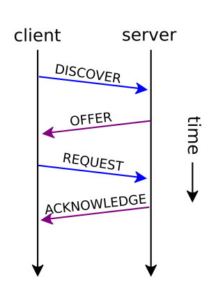

Неплохо бы иметь представление, как происходит этот процесс. Он состоит из 4 шагов и вкратце его называют DORA - DISCOVER, OFFER, REQUEST и ACKNOWLEDGE.

Представим, вы подключили какое-то новое устройство к сети. Практически в любом устройстве, которое поддерживает сеть, есть так называемый DHCP клиент - программа, которая позволяет динамически настроить сеть. Допустим, мы подключили какой-то Linux, NetworkManager увидел, что поднялся интерфейс, у этого интерфейса в профиле стоит ``` ipv4.method auto ``` - а значит NetworkManager запускает DHCP клиент. Так как в этот момент у компьютера нет никакой информации о сети, нет IP адреса или адреса DHCP сервера - dhcp клиент отправляет broadcast поиск - DISCOVER. Этот запрос придёт всем устройствам в этом broadcast домене. Если в этом влане есть DHCP сервер - то он увидит этот запрос. В зависимости от настроек и свободных адресов DHCP сервер подготовит предложение - OFFER - и пошлёт на мак адрес DHCP клиента. Теоретически, в сети может быть несколько DHCP серверов, соответственно, клиенту может прийти несколько предложений, из которых он должен выбрать одно. Но это просто техническая возможность, на деле в одном broadcast домене не размещают несколько разных dhcp серверов. Клиент, после получения предложения, посылает самообращённый ARP запрос, чтобы понять, есть ли в сети другое устройство с таким IP? И когда видит, что другого устройства нет - клиент посылает серверу запрос - REQUEST - дай мне этот адрес. Клиент, в зависимости от настроек, может также запросить дополнительную информацию. Сервер, получив такой запрос, посылает подтверждение - ACKNOWLEDGE - добавляя к ответу дополнительную информацию, в зависимости от настроек, а также время - lease time - на какое время был выдан этот IP адрес. В течении этого времени сервер не будет отдавать этот адрес другому устройству. К этому мы ещё вернёмся.

У всяких роутеров и современных свитчей есть функционал DHCP сервера. Да те же домашние роутеры - пользователи не знают ничего ни про IP адреса, ни про днс сервера, ни про маршруты. Они просто подключают компьютер к сети проводом или по WiFi - и всё работает благодаря DHCP серверу. Но функционал DHCP сервера на сетевом оборудовании зачастую довольно ограничен, неудобен и подойдёт разве что для небольших сетей. Ну и сетевое оборудование администрирует сетевик, а DHCP сервер в основном раздаёт адреса компьютерам пользователей, серверам и т.п. - то есть на то оборудование, которое администрирует сисадмин. И если DHCP сервер будет на роутере - сисадмину придётся вечно обращаться к сетевику - настрой мне то, настрой мне это. Поэтому в средних и больших сетях DHCP сервера - это отдельные виртуалки, которые админит системный администратор. Для начала мы разместим его на роутере, чтобы познакомиться с функционалом, а дальше вынесем на отдельные сервера. Логичнее будет расположить его на роутере 3 или 4, так как у них есть доступ ко всем вланам, где есть компьютеры.  


Сперва подключимся к роутеру 3:

```
eval $(ssh-agent )
ssh-add .ssh/servers .ssh/jumphost
ssh router3
```


Затем установим пакет dhcp-server:

```
sudo dnf install dhcp-server
```

На разных дистрибутивах пакет может называться по разному, но всё это одна и та же реализация функционала DHCP от организации ISC - Internet Systems Consortium. Они также разрабатывают DNS сервер, который в будущем мы будем разбирать.


Настройки лежат в директории ``` /etc/dhcp ``` :

```
sudo ls /etc/dhcp
```

Основной файл настроек DHCP сервера это dhcpd.conf, также есть версия dhcpd6.conf для ipv6 сетей, ну и директория dhclient.d:

```
sudo ls /etc/dhcp/dhclient.d
```

Где лежат настройки dhcp клиента. Например, здесь есть скрипт chrony.sh:

```
sudo cat /etc/dhcp/dhclient.d/chrony.sh
```

который настраивает демон ntp chrony по адресам ntp серверов, полученных по dhcp. Т.е. мы подключимся к сети, получим адрес и прочую информацию о сети, в том числе адреса NTP серверов, и этот скрипт настраивает chrony, чтобы пользователям не приходилось вручную прописывать их.

В директории /etc/dhcp мог быть ещё файл ``` dhclient.conf ```, который связан с пакетом dhclient. В нём можно было бы прописывать недостающие настройки сети, которые не выдаст DHCP сервер, либо как-то перезаписать, что выдали, либо указать, что нужно послать DHCP серверу при запросе. Но это можно сделать в профиле NetworkManager, оставив ``` ipv4.method auto ```, но при этом добавив нужную информацию. 

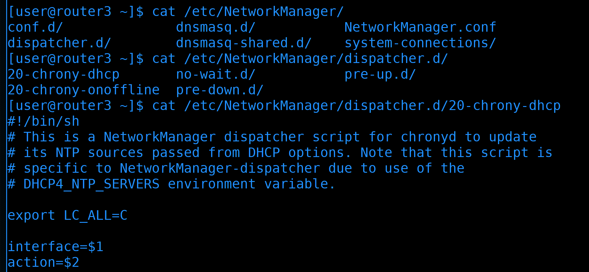

Например, тот же скрипт настройки chrony реализован через сам NetworkManager. У него основная директория настроек - ``` /etc/NetworkManager ```:

```
ls /etc/NetworkManager/
```

И здесь в директории dispatcher.d можно найти скрипт для chrony:

```
cat /etc/NetworkManager/dispatcher.d/20-chrony-dhcp 
```

Я всё это к тому, что в dhcp можно настраивать не только сервер, но и клиент. Если у вас NetworkManager, то настройки dhcp клиента нужно делать через него. На каких-то системах может не быть NetworkManager-а, и там, скорее всего, настройки клиента нужно будет делать через конфиг ``` /etc/dhcp/dhclient.conf ```.  

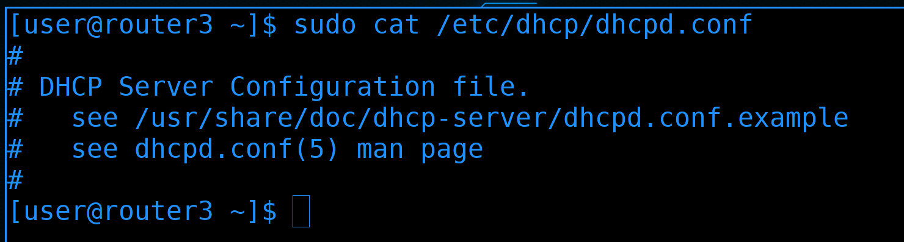

Теперь перейдём к настройкам сервера. Посмотрим файл настроек:

```
sudo cat /etc/dhcp/dhcpd.conf
```

Тут настроек нет, но есть подсказка, что примеры настроек можно взять из файла dhcpd.conf.example.


Давайте скопируем пример настроек и заменим основной файл:

```
sudo cp /usr/share/doc/dhcp-server/dhcpd.conf.example /etc/dhcp/dhcpd.conf
```

После чего зайдём и уберём лишнее:

```
sudo nano /etc/dhcp/dhcpd.conf
```


Обратите внимание, что здесь все строчки с параметрами заканчиваются на точку с запятой. Будете что-то менять - не забывайте ставить её. Также учтите, что конфигурация состоит из общих настроек, которые мы сейчас видим, а чуть ниже для каждой сети будут свои локальные секции. То что мы будем указывать здесь - можно будет перезаписывать для каждой сети.

Некоторые опции я пока разбирать не буду, например, ``` option domain-name ``` - она связана с темой DNS. Когда будем проходить DNS - вернёмся сюда и донастроим всё необходимое, а пока уберём. 

Опцию ``` domain-name-servers ``` оставим. Здесь указаны адреса DNS серверов, и, обратите внимание - несколько значений разделяются запятыми. Хотя в примере они указаны по именам, на деле DHCP сервер сначала сам обращается к DNS серверам, превращает эти имена в IP адреса и клиентам отдаёт их в виде IP адресов.

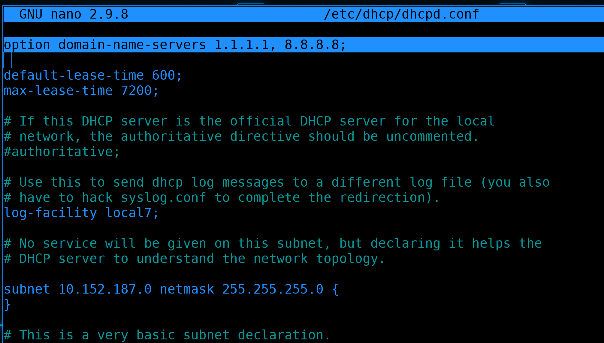

Так как у нас пока своих DNS серверов нет, заменим эти адреса на публичные - единички и восьмёрки:

```
option domain-name-servers 1.1.1.1, 8.8.8.8;
```

Теперь касательно lease time.

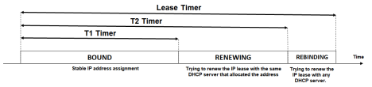

IP адрес выдаётся не навсегда, а на какое-то время, в зависимости от настроек сервера. Представьте, что у вас есть гостевая сеть, в которой каждый день кто-то подключается телефоном или ноутбуком. Если всем устройствам выдавать адреса навсегда, то адреса быстро закончатся. Поэтому логичнее, чтобы адрес был привязан к устройству на какое-то время, пока устройство активно. Но при этом мы не хотели бы, чтобы в рабочей сети IP адрес менялся каждый раз, когда мы выключаем устройство или перезагружаем сеть. Вот это время, на которое выдаётся IP адрес, называется lease time - время аренды. В гостевой сети, где постоянно подключаются новые устройства, логичнее делать небольшой lease time - скажем, 2 часа. Но это не значит, что через 2 часа на устройстве сменится адрес. Пока устройство подключено к сети, оно будет периодически просить у DHCP сервера продлить это время. Но если устройство отключить от сети на два часа, то DHCP сервер освободит этот адрес и может его выдать кому-то другому.


В рабочей сети устройства меняются реже и чтобы лишний раз не менять адреса - lease time делают большим - скажем, месяц. Чтобы, пока устройство было выключено, никто его IP не взял. Вот примерная табличка из интернета, где и какой lease time выставлять. На деле каждая компания сама определяет свои значения. Хотя обычно там, где настроен DHCP, администратор должен выстроить сеть таким образом, чтобы смена IP адреса не вызывала каких-то проблем. Т.е. сразу надо иметь ввиду, что у устройств может смениться IP адрес. Но это не обязательно, DHCP сервер позволяет сделать так, чтобы конкретное устройство всегда получало один и тот же IP адрес. Но мы к этому ещё вернёмся. 


Так вот, мы тут видим два значения:

```
default-lease-time 600;
max-lease-time 7200;
```

На самом деле их 3 - есть ещё min-lease-time, просто в примере он не указан. Т.е. максимальное, минимальное и дефолтное значение времени аренды. Значения в секундах, т.е. 600 - это 10 минут, а 7200 - 2 часа. При нормальных обстоятельствах будет выдаваться дефолтное значение. Если вдруг dhcp клиент сам попросит определённый lease time, то максимальное и минимальное значение это будут ограничивать. 

Допустим, у нас есть гостевая сеть, для которой вы выделили 10 адресов и выставили lease time 2 часа. Придёт какой-нибудь человек с 10 устройствами и от dhcp клиента запросит lease time не на 2 часа, а на 3 месяца. И больше никто к этой сети не сможет подключиться, потому что в ближайшие 3 месяца все 10 адресов будут заняты этим нехорошим человеком. Да, конечно, это можно исправить, но лучше просто избежать этой проблемы.

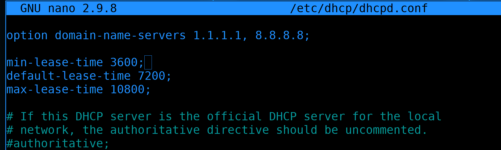

Поэтому и нужны эти ограничения - пусть адрес по умолчанию выдаётся на 2 часа, если клиент захочет сразу много, то максимум 3 часа, а минимум 1:

```
min-lease-time 3600;
default-lease-time 7200;
max-lease-time 10800;
```

Но, как я сказал, в разных сетях lease time может отличаться. То что мы указываем в начале файла - это шаблонные настройки, а чуть ниже мы для каждой подсети определим более подходящие сроки.


Опция ``` authoritative ``` - определяет, является ли DHCP сервер авторитативным. Что это вообще значит? В каждой сети должен быть один главный DHCP сервер, который отвечает за эту сеть. Да, технически может быть несколько несвязанных серверов, но никто так не делает. Так вот, особенность авторитативного DHCP сервера в том, что он может отказывать в IP адресе и заставлять клиента запрашивать другой адрес. Это связано с тем, что иногда клиенты запоминают адрес из другой сети и пытаются принести его в эту сеть. 

Условно, ноутбук был подключен к домашней сети, потом его принесли на работу и он пытается сказать рабочему DHCP серверу, что я хочу продолжить использовать домашний адрес. Авторитативный DHCP сервер имеет право посылать DHCPNAK запрос, тем самым отказывая клиенту в этом адресе и заставляя запросить новый адрес - рабочий. Если бы у нас в сети не было авторитативного сервера, то клиент послал бы запрос, его просто проигнорировали бы и клиент остался бы с домашним адресом, пока lease time домашнего адреса не закончится. И только тогда ноутбук запросил бы новый адрес. А это может занять час и в это время пользователь будет доставать администратора, мол, у меня ничего не работает.

У нас есть DHCP сервер, он у нас единственный, поэтому мы делаем его авторитативным. 


Следующая опция - ``` log-facility ```. Помните тему про логи и syslog? Он позволяет фильтровать логи по facility, там есть шаблонные и кастомные - local0, local1 и т.п. И, допустим, в rsyslog можно настроить, чтобы разные facility писались в разные файлы. Так вот, мы для dhcp можем задать какой-то facility или оставить local7. А потом настроить в rsyslog, чтобы логи dhcp сервера писались в определённый файл. Оставим эту опцию как есть:

```
log-facility local7;
```


Дальше у нас дан пример пустой секции. DHCP сервер ничего не раздаёт в этой сети. Это больше нужно для общего понимания сети. 

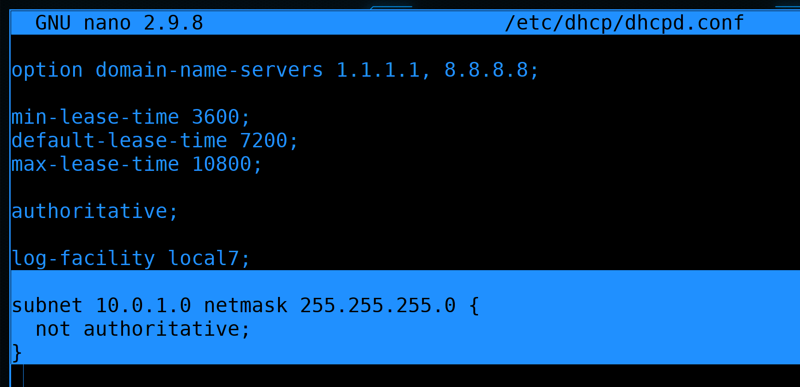

У нас есть сеть, в которой не будет DHCP - это влан 1, между внешними и внутренними роутерами. Давайте пропишем эту подсеть. Ну и так как мы в общих настройках включили authoritative, а в этой подсети мы не являемся авторитативным сервером, здесь мы эту опцию уберём:

```
subnet 10.0.1.0 netmask 255.255.255.0 {
  not authoritative;	
}
```


Чуть ниже дан пример подсети, в которой dhcp сервер работает. Самое главное - для неё указан промежуток адресов в опции ``` range ```. Как видите, там адреса от 10 до 20 - т.е. dhcp сервер раздаёт всего 10 адресов. Всегда стоит брать промежуток с запасом. Без него в какой-то момент выйдет проблема - закончатся адреса, компьютеры не смогут получить ip адрес и попасть в сеть. 
 
Дальше идёт опция ``` routers ``` - в ней указывается адрес gateway, который получат компьютеры. Хотя тут приведены в примере два гейтвея и компьютеры получат два default gateway-а, всё равно будет использоваться только один. И, как и в случае с адресами DNS, хоть тут и указаны имена, DHCP сервер перед выдачей адреса превратит их в IP адреса.

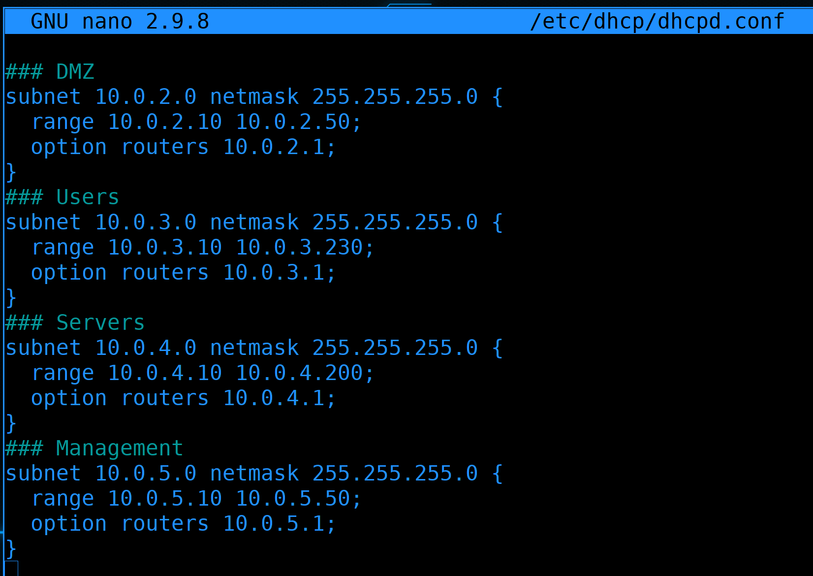

Давайте пропишем здесь свои подсети. У нас их пока 4, не считая первого влана. В каких-то сетях у нас будет больше хостов, в каких-то меньше - от этого зависит ``` range ```. И адрес роутера для каждой подсети свой.

```
### DMZ
subnet 10.0.2.0 netmask 255.255.255.0 {
  range 10.0.2.10 10.0.2.50;
  option routers 10.0.2.1;
}
### Users
subnet 10.0.3.0 netmask 255.255.255.0 {
  range 10.0.3.10 10.0.3.230;
  option routers 10.0.3.1;
}
### Servers
subnet 10.0.4.0 netmask 255.255.255.0 {
  range 10.0.4.10 10.0.4.200;
  option routers 10.0.4.1;
}
### Management
subnet 10.0.5.0 netmask 255.255.255.0 {
  range 10.0.5.10 10.0.5.50;
  option routers 10.0.5.1;
}
```

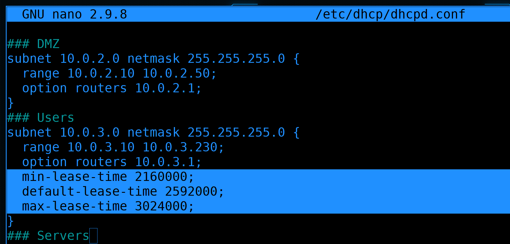

Теперь давайте поправлять. Начнём с lease-time. Из этих 4-ёх сетей 3 относятся к серверам и только одна к пользователям. Поэтому для пользователей пропишем внутри subnet lease-time на 25, 30 и 35  дней:

```
### Users
subnet 10.0.3.0 netmask 255.255.255.0 {
  range 10.0.3.10 10.0.3.230;
  option routers 10.0.3.1;
  min-lease-time 2160000;
  default-lease-time 2592000;
  max-lease-time 3024000;
}
```


А сверху, где глобальные настройки, поправим lease-time на 80, 90 и 100 дней:

```
min-lease-time 6912000;
default-lease-time 7776000;
max-lease-time 8640000;
```

Просто интересный факт: самое большое значение - примерно 135 лет.

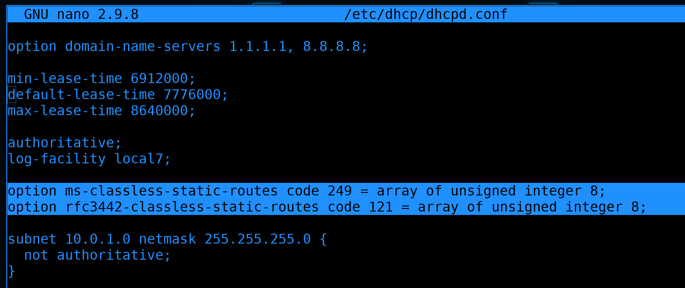

Теперь касательно DMZ. Как вы возможно помните, чтобы хост из DMZ мог достучаться до внутренней сети, мы прописали на нём статичный маршрут, мол 10.0.0.0/8 находится за роутером 3. И мы хотели бы раздать этот статический маршрут по DHCP. Будет не очень банально, но копипаста вам поможет. И так, в общей секции прописываем две опции:

```
option ms-classless-static-routes code 249 = array of unsigned integer 8;
option rfc3442-classless-static-routes code 121 = array of unsigned integer 8;
```

Они не изменчивы, просто пишем или копируем как есть.


Дальше в секции DMZ прописываем ещё две опции:

```
option ms-classless-static-routes 8, 10, 10,0,2,254;
option rfc3442-classless-static-routes 8, 10, 10,0,2,254;
```

Здесь уже цифры имеют значение. Вспомните маршрут:

```
10.0.0.0/8 via 10.0.2.254
```

- 8 - это маска подсети
- 10 - это адрес целевой сети, просто мы убрали нули
- 10,0,2,254 - это адрес роутера - просто вместо точек запятые.

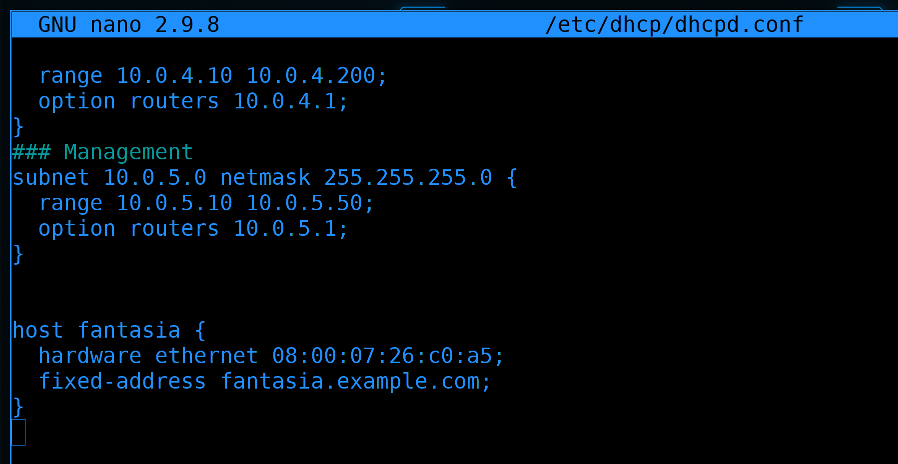

У DHCP есть множество различных опций, всё за раз мы не разберём, да и без необходимости просто так их прописывать смысла нет. Будем проходить соответствующие темы - будем добавлять на DHCP. А пока давайте сотрём всё что ниже и оставим только секцию ``` host fantasia ```. К ней мы ещё вернёмся. А пока сохраним и выйдем из файла.

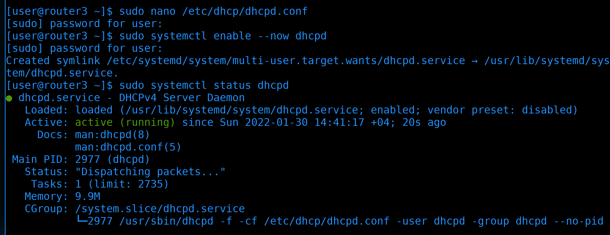

Демон dhcp сервера называется ``` dhcpd ```. Давайте добавим его в автозагрузку и запустим:

```
sudo systemctl enable --now dhcpd
```

А также посмотрим статус:

```
sudo systemctl status dhcpd
```

Как видите, он запущен.


Давайте ещё посмотрим логи:

```
sudo journalctl -eu dhcpd
```

Здесь есть предупреждения, что для таких-то интерфейсов не заданы настройки в dhcpd, но ничего критичного в этом нет. Это наши slave интерфейсы для тиминга, естественно, на них нет адресов и ничего плохого в этом нет.

Стоит отметить, что на файрволе ничего открывать не надо, так как процесс DORA работает на втором уровне сети, всё общение происходит по мак адресам. И хотя в пакетах содержится информация об IP адресах, сами они не прописаны ни как source, ни как destination.


Давайте тестировать. Подключим новый компьютер к DMZ сети и включим. Так как по-умолчанию хосты берут IP по DHCP, он должен сразу взять IP адрес.


Поэтому можем глянуть логи dhcp сервера:

```
sudo journalctl -eu dhcpd --no-pager
```

И, как видно, появилось 4 сообщения DORA - DISCOVER, OFFER, REQUEST и ACK. Здесь же виден мак адрес нового устройства и выданный IP адрес. 

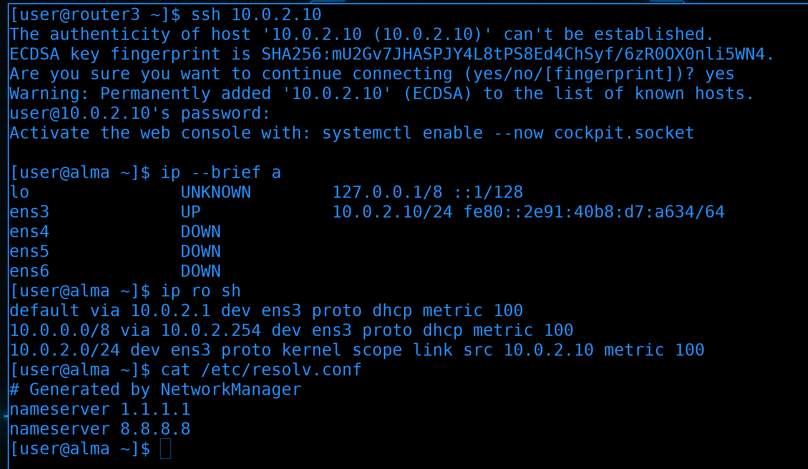

Попробуем подключиться к нему:

```
ssh 10.0.2.10
```

Подключение прошло успешно. Давайте посмотрим ip адрес, маршруты и днс сервера:

```
ip --brief a
ip ro sh
cat /etc/resolv.conf
```

У нас всё автоматом прописалось - и IP адрес, и гейтвей, и статичный маршрут, и dns сервера.


Если посмотрим детальнее интерфейс:

```
ip a show ens3
```

то увидим, что мы получили IP по DHCP - потому что написано dynamic - и видим когда у нас заканчивается lease time - столько-то секунд.

```
ip a show ens3
```

Если ещё раз проверить - времени осталось меньше. Но, если помните, это время будет автоматом продлеваться, пока мы подключены к сети и видим dhcp сервер.


Чуть больше информации о полученных опциях можно увидеть через сам NetworkManager, если посмотреть профиль:

```
nmcli connection show Wired\ connection\ 1 | grep DHCP4
```

Тут у нас и адрес DHCP сервера, и время аренды, всякие маршруты и прочая информация. То есть всё работает как надо. 

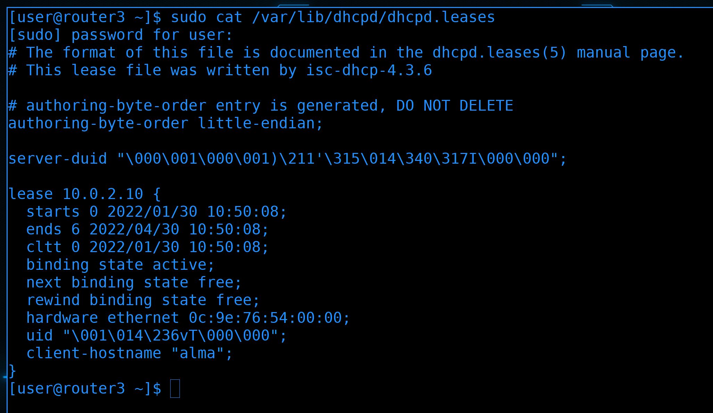

Вернёмся на DHCP сервер. Он хранит информацию о текущих выданных адресах в файле ``` /var/lib/dhcpd/dhcpd.leases ```:

```
sudo cat /var/lib/dhcpd/dhcpd.leases
```

Тут у нас видно кто когда запросил адрес и когда заканчивается время.

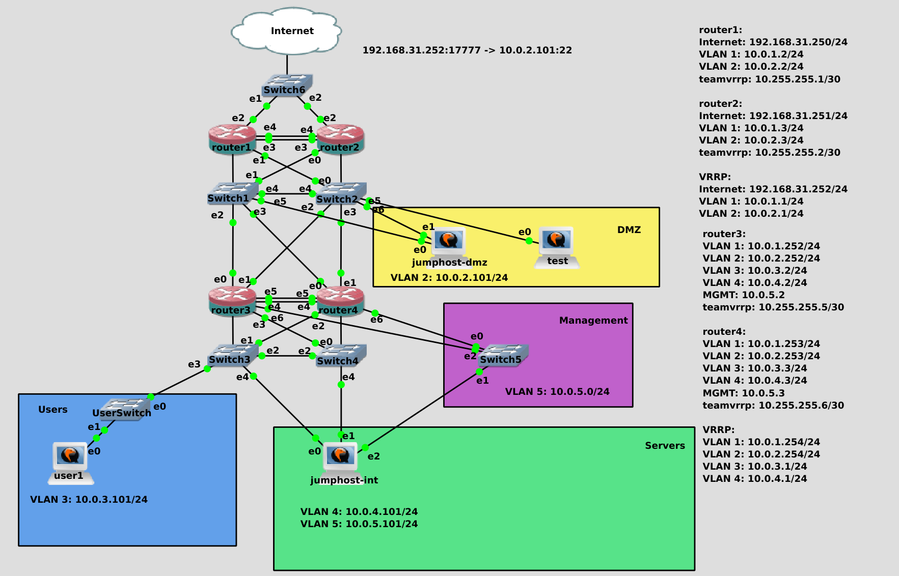

На пока этого хватит. В следующий раз мы продолжим тему DHCP - посмотрим ещё пару опций, вынесем DHCP на отдельные сервера, настроим отказоустойчивость и поговорим про безопасность. Вашим заданием будет настроить ntp сервер chrony на роутерах 3 и 4, чтобы мы в следующий раз их раздали по dhcp. Если забыли как это делать - посмотрите [54 урок](https://basis.gnulinux.pro/ru/latest/basis/54/54._%D0%9D%D0%B0%D1%81%D1%82%D1%80%D0%BE%D0%B9%D0%BA%D0%B0_%D0%B2%D1%80%D0%B5%D0%BC%D0%B5%D0%BD%D0%B8.html#chronyd) из курса basis. А также поиграйтесь в одной из сетей - выставите lease time в пару минут, посмотрите через tcpdump как проходит процесс DORA, как идёт запрос о продлении lease. Ну и рекомендую прочитать [статью на википедии](https://ru.wikipedia.org/wiki/DHCP), чтобы узнать чуть больше технических деталей. 