

## Резервирование IP адреса


Продолжаем тему DHCP сервера. В прошлый раз мы его развернули, настроили и он уже раздаёт IP адреса. Мне хочется хосты из нашей сети перевести на него - т.е. убрать статику и получать IP по DHCP. Компьютер user1 у нас пока для красоты, никакого толку от него нет, поэтому на нём сделать это будет просто. А что будет, если я на джампхостах уберу статичный адрес и получу по DHCP? DHCP сервер их не знает, он получит запрос и выдаст первый свободный адрес из той сети, в которой они находятся. Это приведёт к тому, что на джампхостах поменяются IP адреса. А я этого совсем не хотел бы, потому что эти адреса прописаны в пробросе портов, в политиках файрвола и ssh конфигах.

Говоря про реальную инфраструктуру, есть всякие сервера и компьютеры, на которых не должны меняться IP адреса, иначе это вызовет кучу проблем. Одни сервера по IP адресам связываются с другими, есть политики на файрволах, есть какие-нибудь юзеры, которым нужны доступы к каким-нибудь серверам и всё такое. Да, большой lease time отчасти решает проблему, но это не самое надёжное решение. Некоторые из-за этого на важных хостах прописывают статику. Мы же это решим через DHCP. 

Ну и наш случай, когда джампхосты адреса не получали по DHCP, а значит их в lease-ах нет. Переключим на DHCP - поменяются адреса. Чтобы этого избежать, нужно познакомить DHCP сервер с этими хостами, а для этого нужны мак адреса серверов.

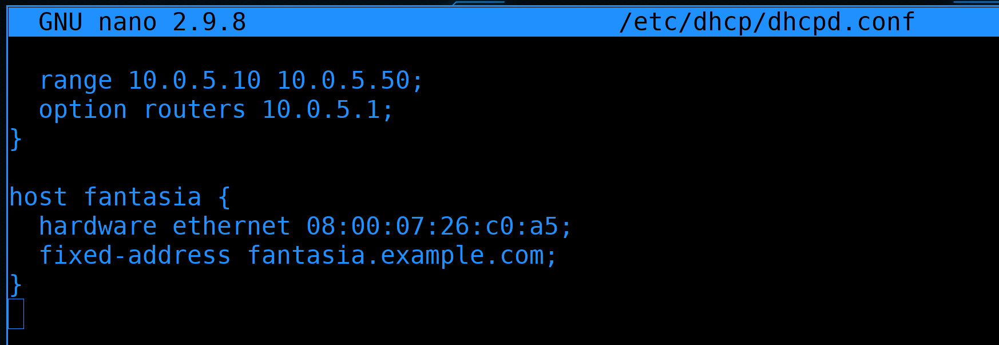

Для начала подключимся к DHCP серверу - т.е. к роутеру3 - и зайдём в настройки dhcpd.conf:

```
sudo nano /etc/dhcp/dhcpd.conf
```

Спустимся в самый низ, где мы оставили секцию host. 


Теперь подключимся к jumphost-dmz и посмотрим мак адрес:

```
ip -c a
```

Мы могли бы узнать мак адрес и через арп таблицу роутера3, но мы подключились не просто так. Наши сервера подключены к сети двумя портами. Мы знаем, что у каждого порта свой MAC адрес. Но обратите внимание на мак адреса ens3, ens4 и team0 - они одинаковые. Всё дело в тиминг интерфейсе - он назначает единый мак адрес на оба интерфейса - так называемый "виртуальный мак адрес". Нас это полностью устраивает, но следует знать, что, технически, для activebackup можно настроить разные мак адреса на разных интерфейсах. У нас же мак адреса одинаковые, поэтому скопируем общий мак адрес и вернёмся на DHCP сервер.

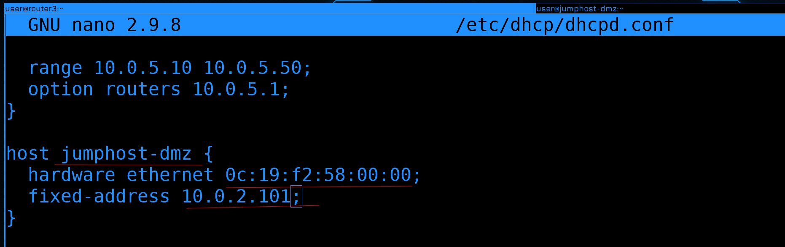

Заменим название хоста на jumphost-dmz, после hardware ethernet вставим скопированный мак адрес, а fixed-address заменим на IP адрес джампхоста:

```
host jumphost-dmz {
  hardware ethernet 0c:19:f2:58:00:00;
  fixed-address 10.0.2.101;
}
```

Теперь DHCP сервер при виде этого мак адреса всегда будет выдавать ему указанный IP адрес. Это называется резервирование IP адреса - мы этот IP адрес зарезервировали для хоста с таким-то мак адресом.

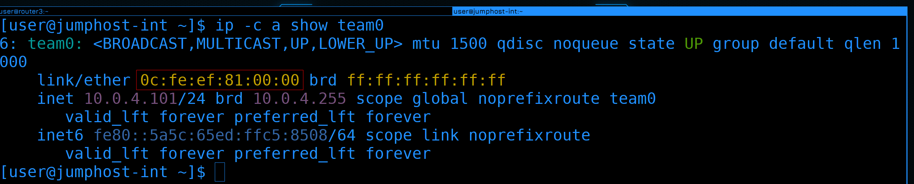

Повторим тоже самое для jumphost-int. Подключимся ко второму джампхосту и посмотрим тиминг интерфейс:

```
ip -c a show team0
```

Скопируем мак адрес.


Затем вернёмся на DHCP сервер, скопируем секцию host и поменяем значения - имя на jumphost-int, нужный мак адрес и IP адрес 4.101:

```
host jumphost-int {
  hardware ethernet 0c:fe:ef:81:00:00;
  fixed-address 10.0.4.101;
}
```

У этого jump-хоста есть ещё один интерфейс в пятом влане.

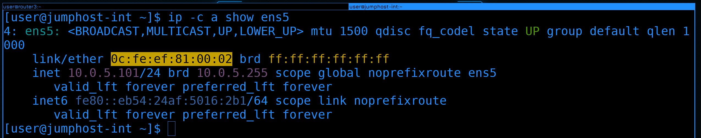

Вернёмся к нему и посмотрим интерфейс ens5:

```
ip -c a show ens5
```

Скопируем мак адрес.

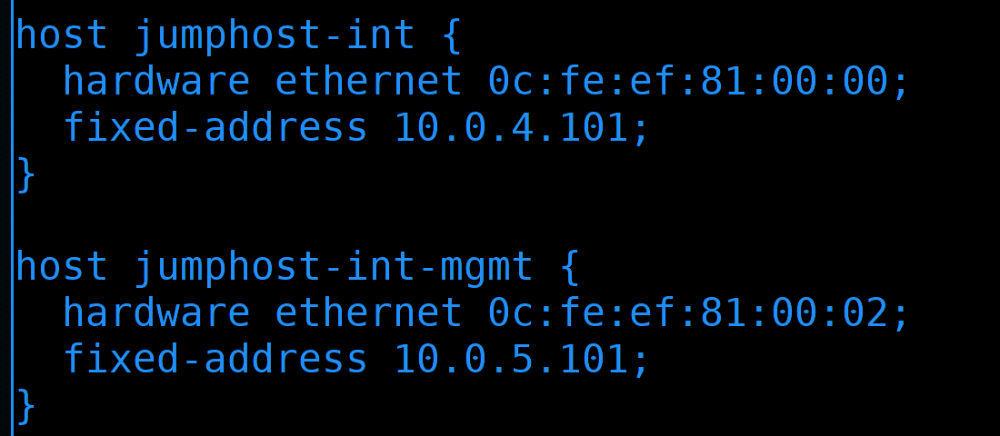

В настройках dhcp сервера добавим ещё одну секцию host. Имя зададим jumphost-int-mgmt, ну и вставим нужный мак адрес и пропишем IP - 5.101:

```
host jumphost-int-mgmt {
  hardware ethernet 0c:fe:ef:81:00:02;
  fixed-address 10.0.5.101;
}
```

Тут есть один нюанс. Сервер получит настройки DHCP по двум интерфейсам - влан4 и влан5. И если в плане адресов DNS серверов никаких проблем, то вот получить два разных gateway - это проблема. 


Но так как у нас в менеджмент влане gateway не нужен, мы можем просто убрать option routers в сабнете management.


И так, оба джампхоста мы прописали, давайте сохраним, выйдем и перезапустим dhcpd:

```
sudo systemctl restart dhcpd
```

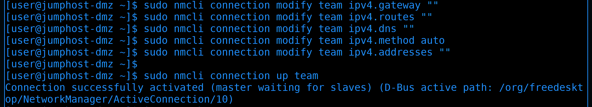

Теперь пойдём на первый джампхост. Для начала нам надо затереть то, что мы прописали статично - а именно gateway, маршруты, dns:

```
sudo nmcli connection modify team ipv4.gateway ""
sudo nmcli connection modify team ipv4.routes ""
sudo nmcli connection modify team ipv4.dns ""
```

Нужно поменять ipv4.method на auto и удалить статично прописанный адрес:

```
sudo nmcli connection modify team ipv4.method auto
sudo nmcli connection modify team ipv4.addresses ""
```

После изменений поднимем интерфейс, чтобы применить настройки:

```
sudo nmcli connection up team
```


То что нас не выкинуло уже говорит о том, что всё сработало. Но давайте в этом убедимся - посмотрим интерфейс:

```
ip -c a show team0
```

Как видите, адрес 2.101 прописался по DHCP. Также посмотрим маршруты:

```
ip ro sh
```

gateway и статичный маршрут также прописались. Значит всё сработало.

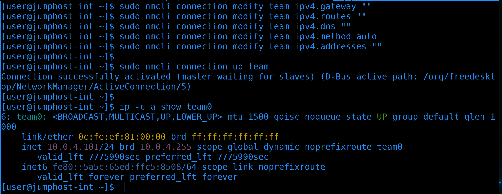

Теперь перейдём на второй джампхост. Делаем тоже самое - удаляем гейтвей, маршруты, днс, меняем метод на auto и удаляем адрес:

```
sudo nmcli connection modify team ipv4.gateway ""
sudo nmcli connection modify team ipv4.routes ""
sudo nmcli connection modify team ipv4.dns ""
sudo nmcli connection modify team ipv4.method auto
sudo nmcli connection modify team ipv4.addresses ""
```

Затем поднимаем интерфейс, чтобы применить настройки и смотрим результат:

```
sudo nmcli connection up team
ip -c a show team0
```

Всё работает - прописался нужный IP адрес. Остался интерфейс влана 5 - и для него мы делаем тоже самое:

```
sudo nmcli connection modify management ipv4.gateway ""
sudo nmcli connection modify management ipv4.routes ""
sudo nmcli connection modify management ipv4.dns ""
sudo nmcli connection modify management ipv4.method auto
sudo nmcli connection modify management ipv4.addresses ""
sudo nmcli connection up management
ip -c a show ens5
```

Ну и в конце убедимся, что с маршрутами всё в порядке:

```
ip ro sh
```


Для полной уверенности попробуем подключиться с компа к роутеру 3, чтобы проверить соединение через оба джампхоста:

```
ssh router3
```

И всё работает.


Остался юзерский комп, но на него сейчас я не буду тратить время, его адрес резервировать смысла нет, а поменять статику на dhcp - вы и сами теперь можете.

## Отказоустойчивость

Теперь что касается отказоустойчивости. Представим, что DHCP сервер перестал работать. Новые компьютеры не смогут получить IP адрес, а значит у них сеть не будет работать. Если dhcp сервер не будет работать очень долго, то на компьютерах, получивших адрес до проблемы, lease time закончится и на них также перестанет работать сеть. Ну или если компьютер перезагрузить - при подключении к сети DHCP клиент попробует связаться с сервером и тут всё зависит от DHCP клиента. Некоторые клиенты при недоступности DHCP сервера будут использовать старый адрес, а некоторые просто его потеряют. Да, вы, скорее всего, сможете восстановить DHCP сервер до того как истечёт lease time, но вот в гостевой сети или там где компы переодически выключаются или переподключаются к сети - проблема будет ощутима. Решение - второй DHCP сервер. Ну и заодно вынесем функционал DHCP на отдельные сервера.

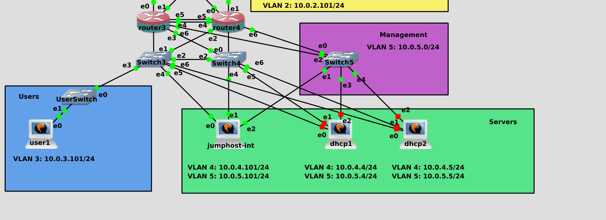

Для этого добавим две новые виртуалки в серверную сеть. Чтобы не заморачиваться, я просто склонирую jumphost-int и назову новые виртуалки dhcp1 и dhcp2. Также подключу двумя проводами к свитчам 3 и 4, и по одному кабелю на менеджмент свитч. Адреса дадим следующие - на dhcp1 адреса 10.0.4.4, 10.0.5.4, а на dhcp2 - 10.0.4.5, 10.0.5.5. Так как это DHCP сервера, тут нам нужно будет прописать статику. Gateway прописываем только в 4 влане. Этап настройки имён и адресов я пропущу, вы и сами справитесь. И не забудьте в sshd_config поправить ListenAddress.

Чтобы мы могли скачать и установить DHCP сервер на новые сервера, нужно будет разрешить интернет в политиках файрвола. Вообще, давать серверам интернет не очень безопасно, но мы только поставили систему, у нас не хватает пакетов, своего репозитория пока нет, прокси сервера нет - поэтому временно, для удобства, разрешим интернет.

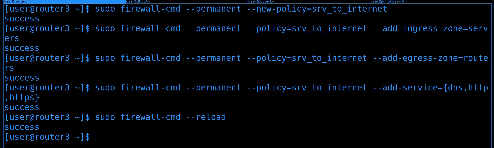

Для этого идём на роутер3 и создаём новую политику:

```
sudo firewall-cmd --permanent --new-policy=srv_to_internet
```

В этой политике мы разрешим серверам подключаться в интернет. Поэтому входящей зоной будет "сервера", а исходящей - "роутеры", так как за ней находится роутер1, который смотрит в интернет.

```
sudo firewall-cmd --permanent --policy=srv_to_internet --add-ingress-zone=servers
sudo firewall-cmd --permanent --policy=srv_to_internet --add-egress-zone=routers
```

Чтобы сервера могли достучаться до репозиториев, они сначала должны узнать их адреса - это DNS, а также подключиться к репозиториям - это http и https. Добавим такие сервисы:

```
sudo firewall-cmd --permanent --policy=srv_to_internet --add-service={dns,http,https}
```

После чего перезагрузим файрвол:

```
sudo firewall-cmd --reload
```


Посмотрим политику:

```
sudo firewall-cmd --info-policy=srv_to_internet
```

Зоны есть, сервисы есть - вроде всё нормально.


Установим DHCP сервер на dhcp1 и dhcp2:

```
sudo dnf install dhcp-server
```

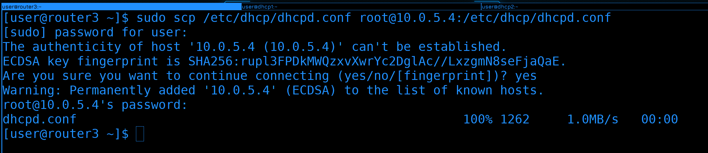

Чтобы заново конфиг не писать, скопируем его с роутера3 на dhcp1:

```
sudo scp /etc/dhcp/dhcpd.conf root@10.0.5.4:/etc/dhcp/dhcpd.conf
```

Ещё один момент. У нас сейчас конфиг разрастается. Тут у нас и сабнеты, и резервация, и всякие настройки. Плюс нам нужно будет для отказоустойчивости добавить ещё несколько строк. При этом, всё кроме настроек отказоустойчивости на обоих серверах будет одинаковое. Поэтому я предлагаю сделать следующее - вынести конфиги в отдельную директорию и дальше в ней делить. Затем эту директорию можно будет спокойно копировать на второй сервер. А в самом dhcpd.conf держать только настройки отказоустойчивости, потому что они уникальны для каждого сервера.


На сервере dhcp1 создадим директорию /etc/dhcp/dhcpd.conf.d/:

```
sudo mkdir /etc/dhcp/dhcpd.conf.d/
```


Определим, с какой строчки начинается описание хостов:

```
sudo cat -n /etc/dhcp/dhcpd.conf | grep host
```

С 42 строчки. Перенесём всё что ниже 42 строчки в файл dhcpd.conf.d/reservation.conf:

```
sudo tail -n +42 /etc/dhcp/dhcpd.conf | sudo tee /etc/dhcp/dhcpd.conf.d/reservation.conf
```

В этом файле мы будем указывать те адреса, которые зарезервировали.


А то что выше 41 строки вынесем в файл subnets.conf:

```
sudo head -41 /etc/dhcp/dhcpd.conf | sudo tee /etc/dhcp/dhcpd.conf.d/subnets.conf
```

там мы будем держать всё, что касается подсетей.

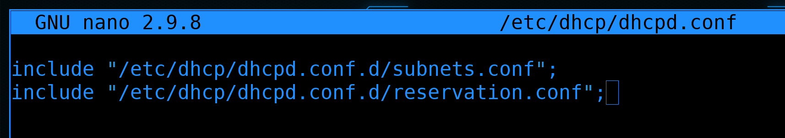

И чтобы основной конфиг файл ссылался на то, что лежит в этих директориях, сотрём всё в основном файле dhcpd.conf и пропишем в нём опции include, указывающие на все конфиг файлы в этой директории:

```
include	"/etc/dhcp/dhcpd.conf.d/subnets.conf";
include	"/etc/dhcp/dhcpd.conf.d/reservation.conf";
```


Теперь мы должны прописать опции касательно отказоустойчивости. Легче всего зайти в man:

```
man dhcpd.conf
```

И поискать failover peer "foo":

```
/failover peer "foo"
```


Так вы найдёте пример секции с настройками. Скопируйте всю секцию.


Затем вернёмся в dhcpd.conf и вставим скопированное перед опциями include.

Давайте разбираться, что здесь написано. 

- failover peer "foo" - здесь определяется второй DHCP сервер, с которым этот будет обмениваться данными. Может быть несколько различных DHCP серверов, с которыми этот будет обмениваться подсетями. Скажем, для отказоустойчивости DHCP в рамках одной подсети он будет обмениваться с одним сервером, а для другой подсети - с другим. "foo" - просто название, чтобы различать одни сервера от других. Поменяем его на dhcp12.
- primary - говорит о том, что это основной сервер. На втором сервере прописывается secondary. Некоторые опции настраиваются только на primary, есть какие-то нюансы на уровне соединений, но в основном между primary и secondary разница небольшая.
- address - здесь указывается адрес текущего сервера, который будет использоваться для обмена информацией между dhcp серверами. В нашем случае это 10.0.4.4.
- port 647 - тот порт, на котором будет слушать этот сервер. По-умолчанию это 647 tcp порт. Эту настройку можно убрать, чтобы оставить только необходимое, давайте так и сделаем.
- peer address - адрес другого сервера. В нашем случае - 10.0.4.5.
- peer port 847 - порт второго сервера. Вообще, в стандартах написано, что оба сервера должны слушать на 647 порту. Теоретически, можно использовать другие порты. IANA говорит, что 847 порт тоже относится к dhcp failover, но никакого объяснения, для чего на secondary сервере использовать другой порт я не нашёл. Это один из вопросов, на которые я не могу найти ответ.  Если уберём эту опцию - будет использоваться 647 порт. Давайте уберём эту опцию.


- max-response-delay 60 - сколько секунд прождать, прежде чем посчитать второй сервер недоступным. Через 60 секунд, не получив ответа от primary сервера, второй сервер возьмёт на себя роль primary, а по возвращению primary в строй передаст ему информацию о всех выданных адресах и обновлённых lease time.

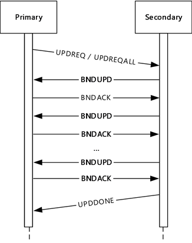

- max-unacked-updates 10 - говорит о том, сколько максимум пакетов BNDUPD может отправить второй сервер, не получив BNDACK. То есть, если какое-то время один из серверов не работал, а потом включился, у него информация о текущих выданных адресах может быть неактуальной. И вот он должен запросить у рабочего сервера свежую информацию. Рабочий сервер отправляет BNDUPD запросы, восстановленный обновляет у себя нужные записи и отправляет BNDACK. Т.е. сейчас рабочий сервер пошлёт максимум 10 запросов и будет ждать подтверждения. На самом деле в такие дебри зачастую лезть не надо, но эта опция является обязательной, поэтому я не мог не рассмотреть.


- mclt 3600 - Maximum Client Lead Time - максимальное время, на которое одному серверу разрешено продлевать время lease-а не сказав об этом второму серверу. Опять же, необязательные дебри, но постараюсь объяснить. Представьте - оба сервера работали. К одному из них пришёл запрос от клиента, мол продли, пожалуйста. Этот сервер продлил и у себя, и у клиента, но не успев сказать о продлении второму DHCP серверу, вдруг вышел из строя. Второй сервер не будет знать, что у клиента продлили время. Клиент из-за продлённого времени не будет обращаться к серверу, а оставшийся сервер, не видя запросов о продлении, посчитает, что время аренды этого адреса истекло. И, теоретически, может отдать этот адрес другому хосту. Поэтому рабочий сервер, прежде чем начать обслуживать клиентов нерабочего сервера, обязательно ждёт указанное время. Этот параметр указывается только на primary сервере, а primary при связи с secondary передаёт ему это значение.

- split 128 - говорит о распределении адресов. При 128 половину хостов обслуживает primary сервер, другую половину - secondary. Если значение 0 - все хосты обслуживает secondary, если 256 - все хосты обслуживает primary. Ну и всякие вариации - кто больше адресов выдаёт. Это значение указывается только на primary.

- load balance max seconds 3 - если пришёл DHCP Discover или Request и в течении 3 секунд второй хост не ответил, хотя очередь была его, то балансировка игнорируется и этому клиенту отвечает этот сервер. Это имеет смысл, когда сервера вроде считают друг друга доступными, но другой сервер почему-то игнорирует запросы.

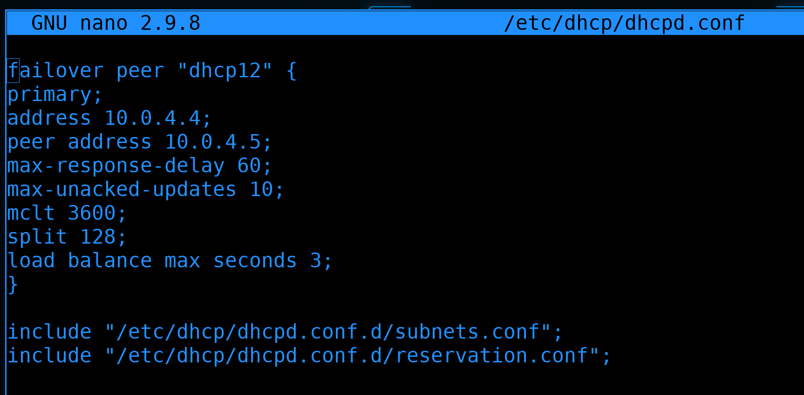

В итоге у нас получается такой конфиг. Общая часть, которая должна быть и на этом сервере, и на том, вынесена в различные файлы в директории. То что будет отличаться в зависимости от primary и secondary прописано здесь. Но мало прописать failover peer, его ещё надо указать для сабнетов.


Поэтому заходим в файл dhcpd.conf.d/subnets.conf, каждый range берём в pool и в нём же прописываем failover peer: 

```
...
  pool {
          range 10.0.2.10 10.0.2.50;
          failover peer "dhcp12";
       }
...
```

Т.е. для разных адресов могут быть различные группы dhcp серверов. После того, как везде пропишем pool и failover peer, сохраним настройки и выйдем.


Скопируем настройки dhcpd.conf и директорию на второй dhcp сервер:

```
sudo scp -r /etc/dhcp/dhcpd.conf /etc/dhcp/dhcpd.conf.d root@10.0.5.5:/etc/dhcp/
```

Да, если мы будем делать какие-то изменения на DHCP, то постоянно нужно будет копировать файлы на второй сервер. Т.е. lease-ы между серверами синхронизируются, а вот конфиги нет. Можно, конечно, через какой-нибудь rsync и cron настроить синхронизацию директорий или каким-нибудь другим способом. Я ничего изобретать не буду, так как планирую в будущем применить подход "Инфраструктура как код", и он решит данную проблему.

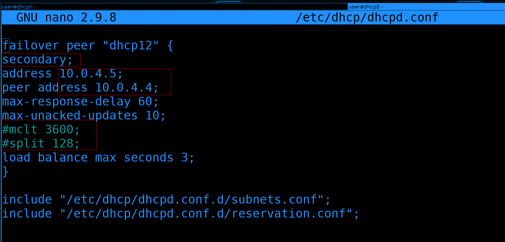

А пока перейдём на второй сервер и откроем dhcpd.conf:

```
sudo nano /etc/dhcp/dhcpd.conf
```

Здесь мы поменяем primary на secondary, значения address и peer address поменяем местами, а также закомментируем mclt и split.

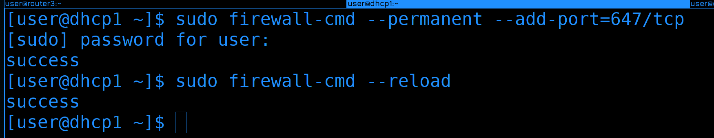

Кроме того, на обоих серверах в файрволах добавим порт 647/tcp, чтобы dhcp сервера могли обмениваться данными.

```
sudo firewall-cmd --permanent --add-port=647/tcp
sudo firewall-cmd --reload
```

## DHCP Relay


Но прежде чем включать dhcp сервера, давайте вернёмся к схеме. Когда у нас DHCP сервером был router3 было легко - на него приходят все вланы, а значит все broadcast запросы доходили до dhcp сервера. Но сейчас DHCP сервера работают в 4 влане, а значит они не смогут обслуживать другие подсети. Теоретически, можно было бы выдать на DHCP сервера транком все вланы, но выдавать все вланы на одно устройство считается плохой практикой. Потому что в случае уязвимости, с любого влана можно будет попасть на DHCP сервер, а с него на все остальные хосты во всей сети. 

То есть, нам нужно, чтобы DHCP сервер обслуживал все подсети, но делал это не напрямую. Для этого есть так называемый DHCP relay. Это функционал, который зачастую есть на всяких роутерах и свитчах, и он позволяет пересылать DHCP запросы на DHCP сервера. Вкратце - на роутере мы настраиваем DHCP relay, при виде DHCP запросов он пересылает их на DHCP сервера. DHCP сервера отвечают DHCP-relay, а он пересылает клиентам. Нам нужно поставить relay на router3 и router4.

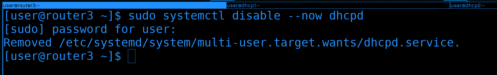

Для начала подключаемся к роутер3, сразу же отключаем и убираем из автозапуска DHCP сервер, так как здесь он больше не нужен:

```
sudo systemctl disable --now dhcpd
```


Затем ставим пакет dhcp-relay:

```
sudo dnf install dhcp-relay
```

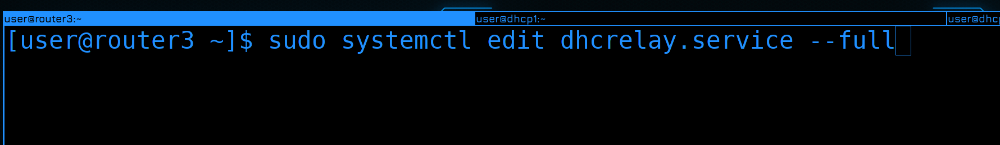

У этой программы нет файла настроек и все опции передаются через командную строку. И вроде у неё есть свой сервис, но в нём не указаны адреса dhcp серверов. Поэтому этот сервис нужно редактировать, можно сразу через systemctl:

```
sudo systemctl edit dhcrelay.service --full
```


Здесь, в конце строки ExecStart прописываем адреса DHCP серверов через пробел:

```
ExecStart=/usr/sbin/dhcrelay -d --no-pid 10.0.4.4 10.0.4.5
```

Сохраняем и выходим. 


Затем запускаем сервис и добавляем в автозапуск:

```
sudo systemctl enable --now dhcrelay
sudo systemctl status dhcrelay
```

На этом с настройкой DHCP Relay на router3 мы закончили. Также нужно поднять его на router4, так как в случае, если адрес будет на нём, у нас DHCP relay перестанет работать полноценно.

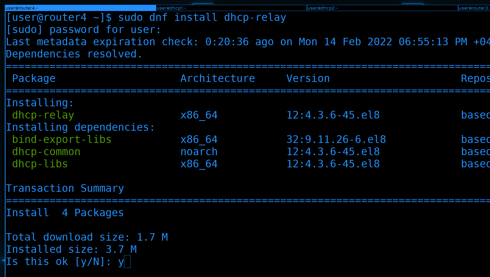

Подключаемся на 4 роутер, устанавливаем пакет dhcp-relay:

```
sudo dnf install dhcp-relay
```

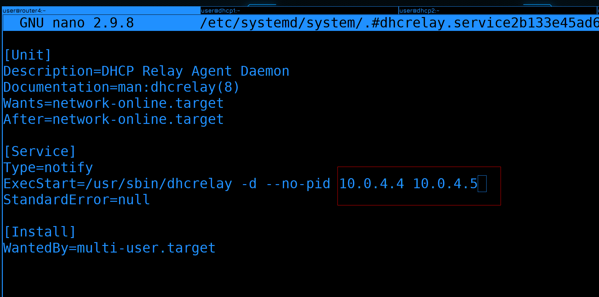

Затем редактируем сервис:

```
sudo systemctl edit dhcrelay.service --full
```

Прописывая в нём адреса DHCP серверов.

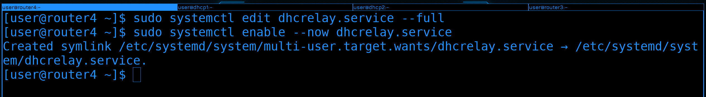

Запускаем сервис и добавляем в автозапуск:

```
sudo systemctl enable --now dhcrelay
```

С релеями закончили.

## Тестирование

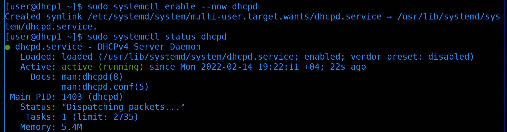

Возвращаемся на dhcp1 и запускаем сервис:

```
sudo systemctl enable --now dhcpd
```

В автозапуск добавилось. Заодно проверим статус:

```
sudo systemctl status dhcpd
```

Всё запущено, всё работает. Также сразу запускаем на dhcp2.


Затем идём в логи dhcp сервера:

```
sudo journalctl -eu dhcpd --no-pager
```

В логах мы должны увидеть сообщение "Both servers normal". Именно оно говорит нам о том, что сервера видят друг друга.

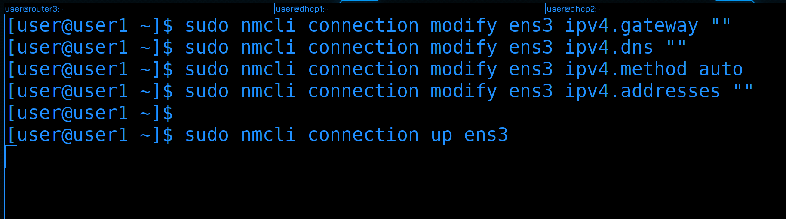

Давайте тестировать. Возьмём, к примеру, компьютер user1. Уберём здесь статику и пропишем получение адреса по DHCP:

```
sudo nmcli connection modify ens3 ipv4.gateway ""
sudo nmcli connection modify ens3 ipv4.dns ""
sudo nmcli connection modify ens3 ipv4.method auto
sudo nmcli connection modify ens3 ipv4.addresses ""
```

Когда поднимем интерфейс:

```
sudo nmcli connection up ens3
```

Нас выкинет. Скорее всего поменялся IP адрес.


Пойдём на dhcp1 и посмотрим логи:

```
sudo journalctl -eu dhcpd --no-pager
```

Здесь мы видим, что пришёл запрос DHCPDISCOVER, но написано - loadbalancing to peer - т.е. запрос будет обслуживать второй сервер. Мы видим по два запроса, потому что оба DHCP relay перенаправили запросы.


Посмотрим логи второго сервера:

```
sudo journalctl -eu dhcpd --no-pager
```

И здесь мы видим полноценный DORA процесс. Пришёл запрос через адрес 10.0.3.2 - это адрес router3, т.е. DHCP relay. На него же был послан ответ. И теперь у user1 адрес 10.0.3.10.

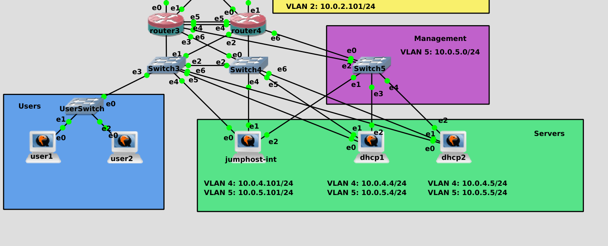

Для теста подключим ещё один компьютер user2 и включим.


Теперь начнём с логов dhcp2:

```
sudo journalctl -eu dhcpd --no-pager
```

На этот раз опять IP выдал второй DHCP сервер, поэтому я удалил и заново добавил виртуалку user2. И теперь мы видим такое же сообщение - loadbalancing to peer. Т.е. запрос обслуживает другой сервер - dhcp1. 

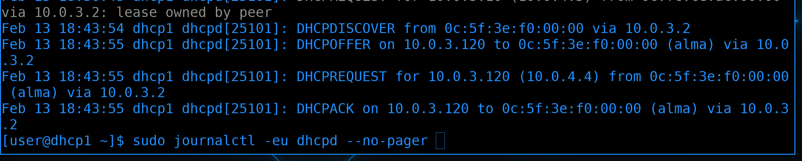

Посмотрим его логи:

```
sudo journalctl -eu dhcpd --no-pager
```

А на этот запрос ответил dhcp1 и выдал адрес 3.120. Т.е. первый адрес выдал dhcp2, второй тоже dhcp2, а третий - dhcp1. Порядок, в общем-то, не важен, главное что оба сервера выдают адреса.

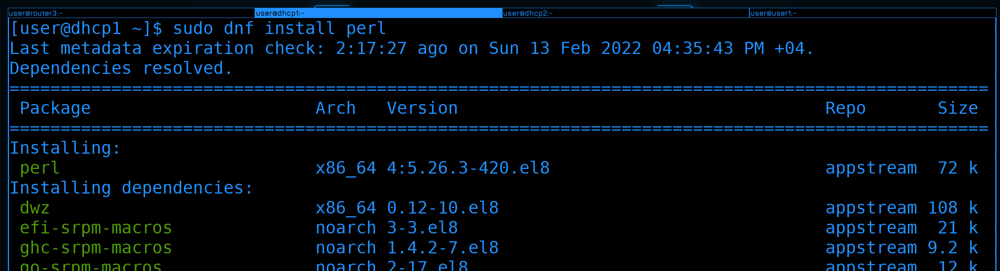

Кстати, есть относительно удобный способ смотреть выданные IP адреса, но для этого нужно установить пакет perl:

```
sudo dnf install perl
```


В директории /usr/share/doc/dhcp-server лежит скрипт, который может в удобном виде показать текущие lease:

```
perl /usr/share/doc/dhcp-server/dhcp-lease-list.pl
```

От того, что оба dhcp relay перенаправляют запросы особой проблемы нет, но логи загрязняются одинаковыми сообщениями. Чтобы это решить, можем сделать так, чтобы DHCP relay работал только на роутере, у которой плавающий адрес. Т.е. чтобы при vrrp переезжал не только IP адрес, но и сервис dhcrelay. Но это будет вашим домашним заданием.

## Безопасность 


Под конец стоит упомянуть про безопасность. DHCP, как и многие другие базовые сетевые протоколы, был придуман давно и действует низкоуровнево - на уровне мак и IP адресов. На этих уровнях очень легко выдать себя за кого-то другого, потому что и мак адрес, и IP адрес можно подделать. Есть конечно механизмы защиты, но нужно понимать, что в сам протокол такую защиту не встроить и на уровне самого DHCP сервера не всё можно исправить. 

Например, подключается кто-то левый к сети и генерирует DHCP запросы на огромное количество рандомных MAC адресов. DHCP сервер резервирует все адреса под несуществующие компьютеры - у больше у него адресов не остаётся. Это называется DHCP starvation.

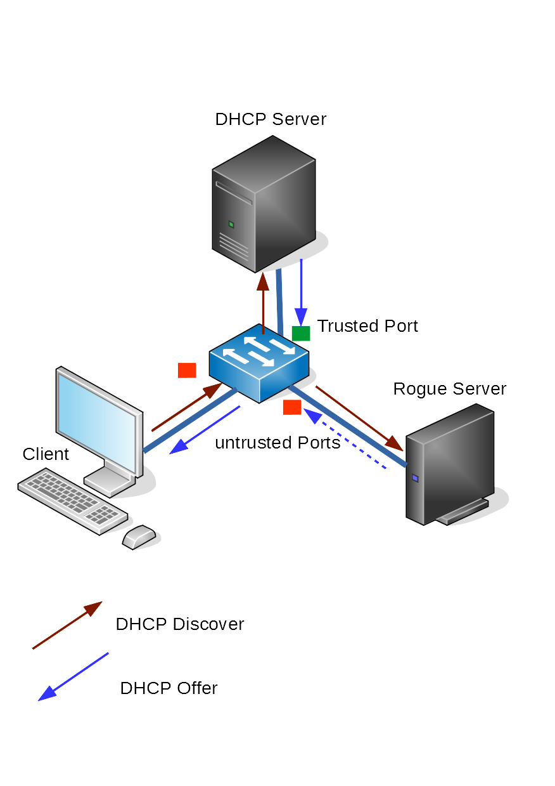

Дальше, скажем, можно поднять левый DHCP сервер - обычно его называют rogue, который будет выдавать те настройки сети, которые нужны взломщику. Скажем, вместо рабочего роутера указать компьютер взломщика. Тогда, компьютеры, получившие адрес от плохого DHCP будут выходить через плохой роутер - и получится MiTM атака.

И от первого, и от второго защищает DHCP snooping, который настраивается на умных свитчах. За этим обычно следит сетевой администратор или отдел информационной безопасности. Но советую почитать про DHCP snooping, чтобы иметь представление.

Давайте подведём итоги. Мы подняли 2 dhcp сервера, раскидали конфиги по нескольким файлам, настроили отказоустойчивость, подняли DHCP relay, убедились, что всё работает и немного поговорили про безопасность. Если говорить в рамках небольшой сети, DHCP довольно простой и понятный. Чем больше сеть - тем больше нюансов появляется и тем больше нужно знать. Так или иначе к DHCP мы ещё будем возвращаться, но слишком углубляться я не планирую.  