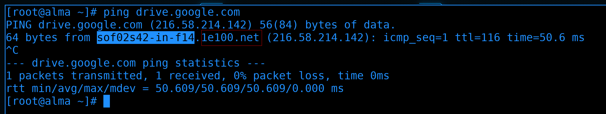
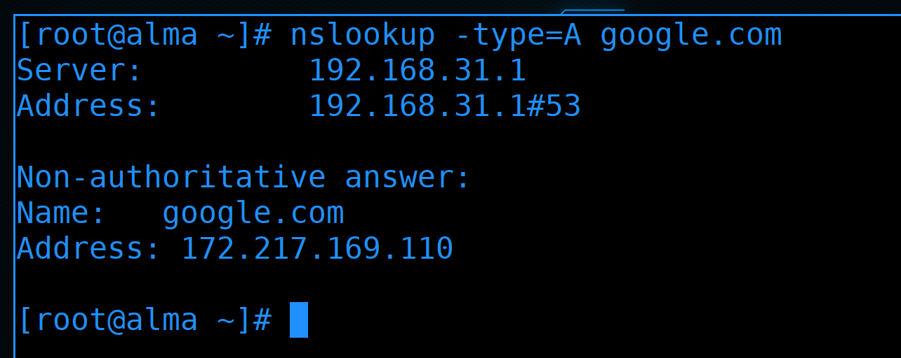
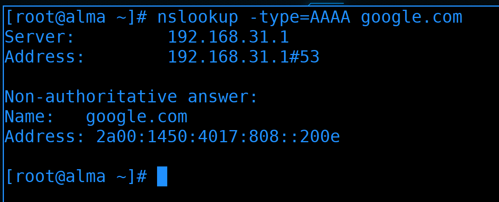
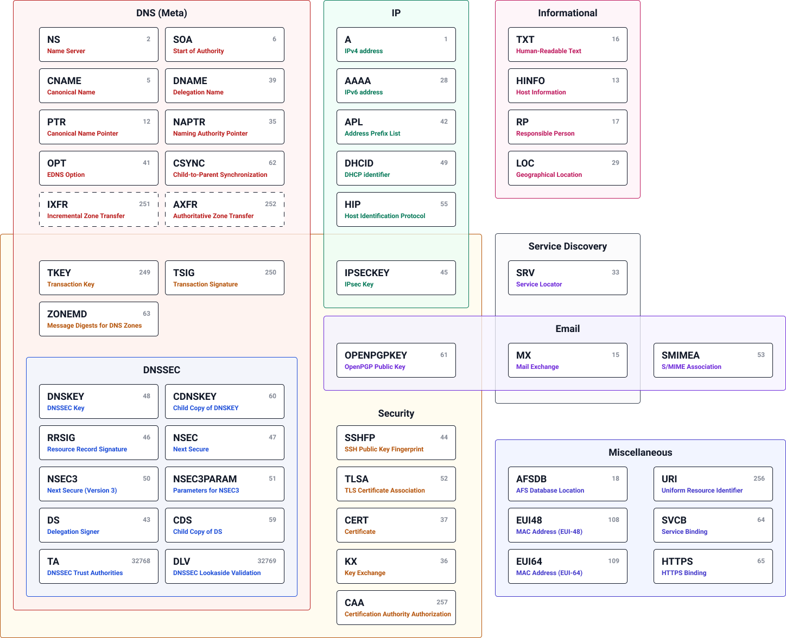
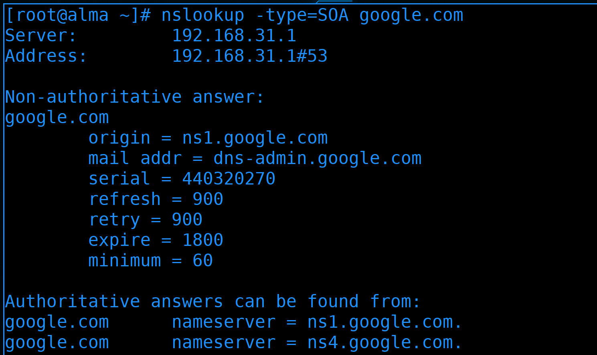
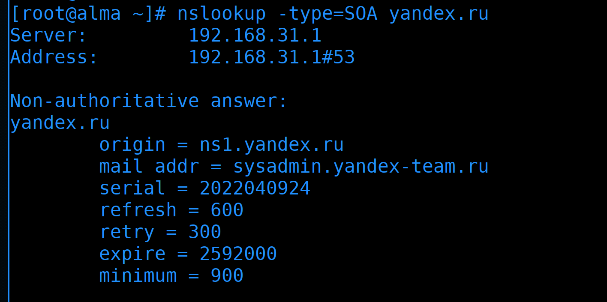
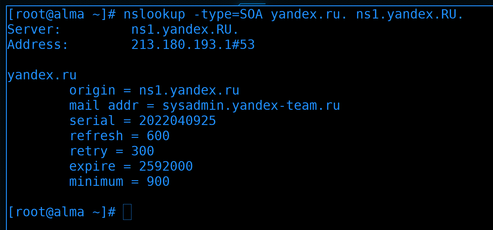
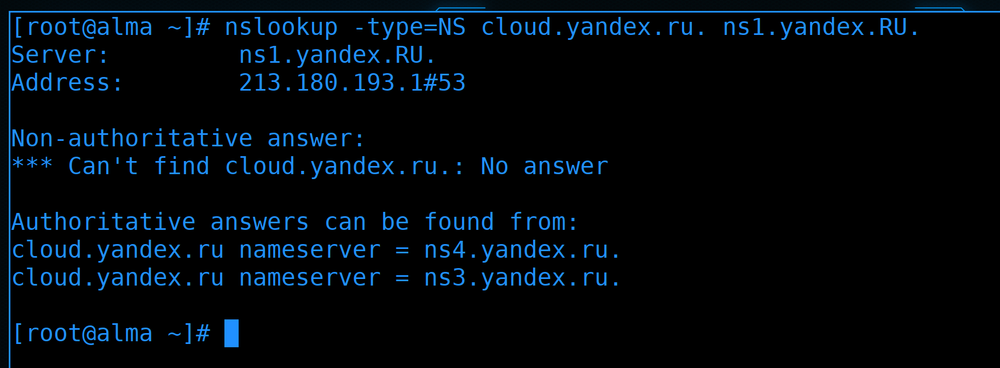
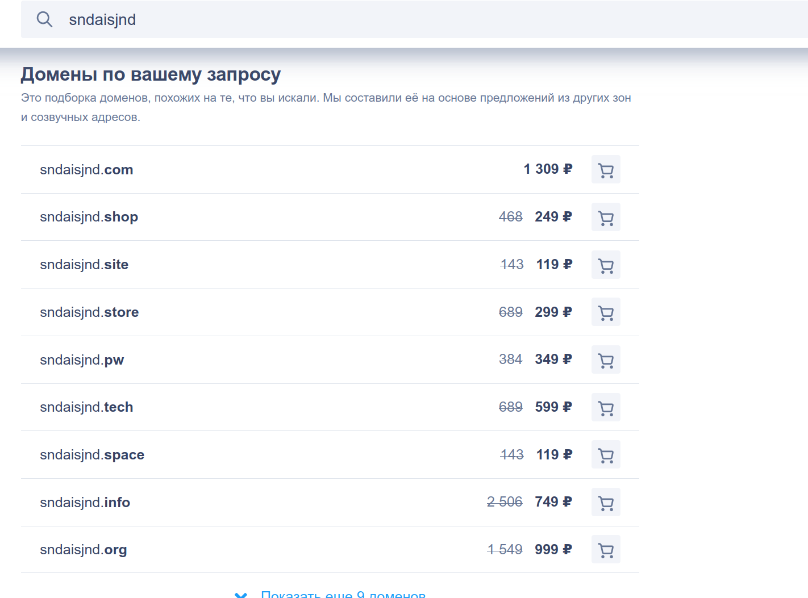
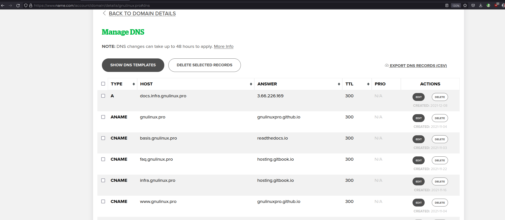




Прежде чем начать разбирать DNS - систему доменных имён - следует понять, что такое "домен". В целом, под доменом можно понимать область, в частности - область имён. И всё это завязано под иерархию. 

Всё как с директориями в линуксе. Есть корневая директория. Аналог - корневой домен:

```
/
.
```

В корневой директории есть другие директории, например, home, bin, usr и т.д.. В корневом домене есть другие домены, например, com, ru, org и т.п. - они называются доменами первого уровня:

```
/home
.com
```

В директории /home есть другие директории, например, user1. В домене com есть другие домены, к примеру, google. Это домены второго уровня:

```
/home/user1
.com.google
```

В директории user1 есть файлы, например, file1. В домене google есть имена, например, drive:

```
/home/user1/file1
.com.google.drive
```

Вместо file1 могла быть другая директория с другими поддиректориями, а внутри drive могли быть домены четвёртого уровня и так далее по той же логике.

Правда доменные имена принято писать наоборот, т.е. сначала домены третьего уровня, потом второго, потом первого. Ну а корневой домен практически нигде не пишут, кроме как в настройках dns серверов:

```
drive.google.com
```

В этом адресе, условно, drive - имя хоста, google.com - домен. А drive.google.com называется полным доменным именем или fqdn. Правда за этим адресом стоит огромное количество серверов и поэтому не совсем верно говорить, что drive - это имя хоста. 



Если попробуем пингануть этот адрес:

```
ping drive.google.com
```

мы увидим, что он ссылается на другой. И даже это не факт что адрес хоста, но не будем пока лезть в такие дебри. 

И чтобы все эти области имён были не только на словах, а действительно работали, существует система доменных имён - DNS. То что DNS используется для превращения имён в IP адреса вы уже знаете. Вы знаете имя, вы знаете адрес DNS сервера, DNS сервер знает какой адрес стоит за этим именем и используя таблицу маршрутизации вы можете добраться до целевого сервера. 

Но функции DNS этим не ограничиваются. Чтобы разобраться, чем же занимается эта система доменных имён нам нужно поговорить с ней на её языке. И в этом нам поможет утилита nslookup. Но прежде чем начнём, немного вспомним про саму утилиту.


В самом простом варианте, если просто передать ей имя:

```
nslookup google.com
```

мы увидим адрес сервера, который нам ответил, а также адрес, которые мы запросили. В данном ответе их два: первый - IPv4 адрес, второй - IPv6.


В моей домашней сети DNS сервером выступил мой роутер. Большинство домашних роутеров имеют в себе и DNS сервер, и DHCP сервер. Который при выдаче адресов среди dhcp опций указывает DNS сервером себя. Естественно, DNS сервер на вашем роутере не знает все адреса в мире, он лишь перенаправляет ваши запросы на другие DNS сервера (рекурсивный DNS сервер). Иногда у молодых специалистов формируется ошибочное мнение, что можно указать в качестве DNS сервера любой gateway в любом месте. Но это заблуждение из-за многофункциональности домашних роутеров, где просто на роутере есть DNS сервер. 


Можем запросить адрес у другого DNS сервера, просто указав его в команде nslookup:

```
nslookup google.com 1.1.1.1
```

Как видите, теперь адрес DNS сервера другой и ответ по адресам тоже отличается. То что ответ другой - ничего удивительного, так как за гуглом стоит множество адресов.

Так вот, чтобы понять DNS, нужно поговорить с ним на его языке. Этот язык состоит из записей и их типов. 



То что DNS сервер нам отвечал до этого - т.е. выдавал IP адрес google.com - это был тип записи А - адрес. Добавим в команду nslookup опцию type=A:

```
nslookup -type=A google.com
```

Ответ, который мы видим - это DNS запись.



Помните, мы ещё видели IPv6 адрес? У неё другой тип - 4А (АААА):

```
nslookup -type=AAAA google.com
```



Т.е. у DNS есть разные типы записей и выполняют они разные задачи, тем самым координально расширяют задачи DNS сервера. К примеру, А запись позволяет найти, какой IP адрес стоит за таким-то именем. В тоже время MX запись позволяет найти адрес почтового сервера не зная ни имени, ни адреса. 



И чтобы понять, как это всё связано и в чём основная суть DNS нам нужен один тип записи - SOA - start of authority:

```
nslookup -type=SOA google.com
```

На русский это переводят как "начальная запись зоны", но мне этот перевод не нравится, так как он не передаёт главную идею - авторитет. Под авторитетом я подразумеваю кого-то, у кого есть полномочия и к кому есть доверие. 


Представим себе банковскую организацию. Условно, вы приходите в банк, хотите открыть счёт и положить деньги. По сути, вы передаёте свои деньги какому-то человеку, которого вы видите впервые в жизни. Но вы понимаете, что это работник банка, а у вас есть некое доверие к банку. Если в целом проследить цепочку, есть некая высшая точка, условно, центробанк. Центробанк доверяет высшему руководству какого-то банка, высшее руководство доверяет своим подчинённым менеджерам, менеджеры доверяют своим работникам. А вы, в свою очередь, доверяете работникам банка. Эти работники могут абсолютно разными задачами заниматься - кто-то денежные переводы делает, кто-то кредиты выдаёт и т.п. Т.е. услуги могут быть разные и всё завязано на том, что есть некий авторитет, который подтверждается цепочкой полномочий и доверия.

В этом же и суть DNS. Типы записей - это типы услуг. Да, конечные пользователи обращаются к DNS серверу за этими услугами, но все эти услуги так или иначе завязаны на авторитете. Эти полномочия и доверие распространяются не на всё вокруг, а только на ограниченную область, которая называется зоной. Т.е. есть авторитет, который отвечает за какую-то зону. К примеру, вы не знаете IP адреса гугла - но доверяете его DNS серверам, которые и сообщают вам нужный адрес. Или, скажем, вы не знаете, какой почтовый сервер у такого-то домена - DNS сервер вам подскажет и вы этому доверитесь. Обратный пример - google не знает, действительно ли вы владелец какого-то домена. Он просит вас создать DNS запись в своей зоне. И затем google проверяет наличие этой записи. И только потому, что google доверяет всей этой цепочке DNS, он доверяет и записи, которую увидел в вашей зоне.  


Вернёмся к SOA записи:

```
nslookup -type=SOA google.com
```

В данном запросе мы спрашиваем, кто является авторитетным лицом зоны google.com. В ответе мы видим, что главным DNS сервером этой зоны является ns1.google.com. А связаться с администратором этой зоны можно по адресу dns-admin@google.com. Да, в самой записи вместо собачки - точка, но на самом деле это собачка, просто так сложилось, что пишут точку. Дальше идёт немного технической информации для других DNS серверов, к ней мы ещё вернёмся, а пока опустим такие детали. 

Ещё стоит обратить внимание на запись "Non-authoritative answer" - т.е. ответ, который мы получили, не является авторитетным. В чём суть - одно дело прийти в банк и там получить какую-то услугу от сотрудника банка - тем самым и вы доверяете сотруднику, и банк. Другое дело вы просите кого-то пойти в банк вместо вас. Тут уж вы сами доверились этому человеку и если он вас кинет, банк здесь не при чём. И google.com здесь не при чём, поэтому вы видите, что этот ответ не от авторитетного источника, а от кого-то третьего. А авторитетные источники - те кто отвечают за зону google.com - указаны ниже: ns1.google.com, ns2.google.com и т.д.


Т.е. если запросить информацию напрямую у авторитетного источника:

```
nslookup -type=SOA google.com ns1.google.com
```

такого предупреждения не будет.


Зачастую авторитетные сервера не отвечают за других и не перенаправляют на другие зоны:

```
nslookup -type=SOA pikabu.ru ns1.google.com
```

Как видите, здесь пишется refused. Т.е. сервер ns1.google.com отказался направлять мой запрос на другие сервера, чтобы выдать мне ответ, т.е. он не рекурсивный. Хотя рекурсивные и авторитетные DNS сервера можно совмещать, когда это касается публичных адресов и интернета - их разделяют.

Условно, у вас есть домен и вы хотите поднять авторитетный днс сервер для пользователей из интернета, чтобы указывал на ваш вебсайт и почтовый сервер. Не стоит этот сервер использовать как рекурсивный. Так как ваш днс сервер всякие боты начнут использовать для DDOS атак на другие сервера, т.е. будут использовать ваш сервер для запросов на другие сервера, чтобы нагрузить их и сделать недоступными. DNS сервера - один из самых популярных векторов атак. Также у публичных серверов всегда есть риск взлома и всякими атаками могут навредить вашим локальным пользователям, которые используют этот сервер в качестве рекурсивного.

На этом месте я бы хотел показать разницу между доменами и зонами. Грубо говоря, домены - это про области имён, а зоны - это про то, кто отвечает и как это технически реализовано.



К примеру, есть домен yandex.ru:

```
nslookup -type=SOA yandex.ru
```

У него авторитетным DNS сервером является ns1.yandex.ru, а адресом администратора - sysadmin@yandex-team.ru. 


А есть домен cloud.yandex.ru:

```
nslookup -type=SOA cloud.yandex.ru
```

У него главным DNS сервером является ns3.yandex.ru и адрес администратора другой - sysadmin@yandex.ru. cloud.yandex.ru находится в домене yandex.ru, но вот зона - другая. Т.е. условно есть некая организация, у неё есть какие-то подразделения. Разные подразделения администрируют разные люди. И чтобы они могли добавлять любые записи в рамках своего поддомена можно наделить их авторитетом этой зоны. Это называется делегированием домена. Делегирование домена работает через NS записи, которые указывают на DNS сервера.


В качестве примера давайте посмотрим цепочку, кто отвечает за зону и кому делегирует следующую. Начнём с корневой зоны:

```
nslookup -type=SOA .
```

За корневую зону отвечают корневые DNS сервера. Про них можно почитать в интернете, советую в свободное время ознакомиться.


А мы берём любой из корневых DNS серверов и ищем там запись NS, ведущую на домен первого уровня ru:

```
nslookup -type=NS ru. c.root-servers.net
```

Так мы находим DNS сервера, которые содержат информацию об этой зоне.


Затем спросим у любого из них, кто отвечает за зону ru:

```
nslookup -type=SOA ru. f.dns.ripn.net
```

Другие сервера тоже отвечают, но главным считается сервер с буквой а.


Пойдёмте дальше и спросим у этих серверов, кто содержит информацию о домене yandex.ru:

```
nslookup -type=NS yandex.ru. a.dns.ripn.net
```

К примеру, сервер ns1.yandex.RU.



Посмотрим, кто отвечает за зону yandex.ru:

```
nslookup -type=SOA yandex.ru. ns1.yandex.RU.
```

Ну это мы уже видели, когда смотрели про cloud.yandex.ru.



Ну и с сервера ns1.yandex.ru посмотрим, на какой NS сервер делегирован cloud.yandex.ru:

```
nslookup -type=NS cloud.yandex.ru. ns1.yandex.RU.
```

На ns3 и ns4. 

Так устроена структура DNS. Помимо SOA, NS и A записей есть и другие, но их мы разберём в следующий раз. 


Вопрос - а где достать домены? Для внутренней сети можно использовать один из выделенных доменов первого уровня, допустим, lan. Так как dns сервера свои, можно использовать любые домены, хоть google.com. Единственное что, для локальных пользователей такая идея будет создавать проблемы, так как на настоящий гугл уже не получится зайти по этому имени. Но зато подобным образом можно запрещать доступ к каким-то доменам - создавать зоны на локальных серверах, которые ведут вникуда.

Но локальные записи работают только в локальной инфраструктуре, там, где вы контролируете, какой DNS сервер прописан у пользователей. Если же у вас сайт, почта или другие сервисы, которые должны быть доступны всем в интернете, для них нужно отдельное публичное имя, которое надо покупать. Их продают регистраторы доменных имён. По крайней мере почти все имена второго уровня продаются. Есть какие-то сервисы, которые могут дать домен третьего уровня бесплатно, но с такими доменами будут определённые проблемы. К примеру, бесплатными или очень дешёвыми доменами зачастую пользуются спамеры, из-за чего в целом падает репутация домена, в следствии чего многие спам-фильтры предвзято относятся к таким доменам. И есть большой шанс, что ваша почта на таком домене почти всегда будет попадать в спам.


Что касается покупки нормального домена, то всё не так плохо, но и не то чтобы супер. Есть сайты, которые продают домены, к примеру - reg.ru. В целом домены продаются на год или несколько лет. 


Короткое красивое доменное имя больше привлекает пользователей, поэтому на них всегда есть конкуренция. Некоторые покупают такие имена сотнями и перепродают по огромным ценам.
  


В целом можно найти имена, которые стоят не так дорого. Но всегда обращайте внимание на цену продления. Потому что нередко можно купить неплохие имена по скидке за очень дёшево, а через год или три сумма продления будет стоить в несколько раз дороже. 



После покупки домена вы можете настроить NS записи на свои сервера, либо использовать публичные DNS сервера. Зачастую, публичные DNS записи можно выставить у регистраторов доменных имён, то есть вам не нужно будет иметь свой DNS сервер, который смотрит в интернет. 


Нередко вместо DNS серверов регистратора люди предпочитают использовать DNS сервера облачных провайдеров. У них могут быть свои преимущества, особенно когда вы используете их облака для других сервисов, например, для почты.

Но если вы купили публичный домен, не стоит его использовать в локальной инфраструктуре. Иначе у вас получится каша с локальными и публичными днс записями. Вам либо придётся все локальные записи выставлять в интернет, либо делать копию зоны на локальном сервере с другими записями. Ну и от этого всякие проблемы будут, например, одна из самых частых проблем - многие используют адрес домена как адрес сайта, допустим, google.com. Но в сети, где есть домен контроллер, адрес домена должен быть на нём. Можно конечно эту проблему решить граблями, но лучше так не делать.

Но если прям хочется публичный домен использовать с локальной инфраструктуре, можно делегировать домен третьего уровня. Скажем, публичный домен - google.com, а в локальной сети использовать домен corp.google.com, указывающий на DNS сервера, доступные только в локальной сети.

На пока это всё, но в теме DNS ещё многое предстоит изучить. Сегодня мы разобрали, что такое домен, что такое зона, поговорили о делегировании, обсудили локальные и публичные домены.