# 08. Политики Firewall

<iframe width="560" height="315" src="https://www.youtube.com/embed/e57jx15yZmU" title="YouTube video player" frameborder="0" allow="accelerometer; autoplay; clipboard-write; encrypted-media; gyroscope; picture-in-picture" allowfullscreen></iframe>


В прошлый раз мы поделили нашу сеть на зоны, тем самым перекрыв все доступы. Сегодня же мы разберёмся, как точечно выдавать эти доступы. В реальной инфраструктуре этим обычно занимается отдел информационной безопасности, но мы тоже неспроста это разбираем. Обычно, когда администратор настраивает и связывает какие-то сервера в разных зонах, он должен обратиться к отделу безопасности и сообщить, что ему нужно. Мол, у меня есть джампхост во втором влане с IP 10.0.2.101 и нужно, чтобы он мог подключаться к серверу1 по адресу 10.0.5.101 и по порту 22. Т.е. выпрашивать доступы на файрволе - это стандартная процедура для администратора. И чтобы закрепить это у себя в голове и понимать, когда это нужно, а когда нет - мы сами будем по необходимости прописывать эти правила. Да, в реальной инфраструктуре никто это не делает через firewalld, но нам главное понять саму идею, зачем и как это делать. А этот инструмент или другой - абсолютно неважно.

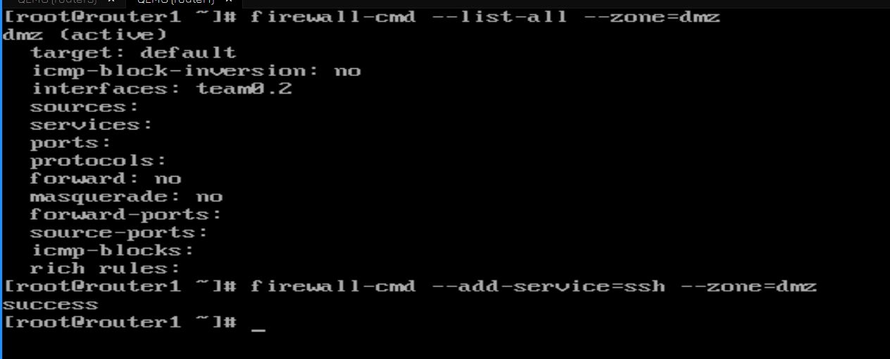

Сегодня мы будем работать с роутером 1 и 3. В прошлый раз мы запретили с jumphost-а подключаться к роутеру1:

```
firewall-cmd --list-all --zone=dmz
```

И чтобы не настраивать всё через консоль, временно разрешим ssh:

```
firewall-cmd --add-service=ssh --zone=dmz
```

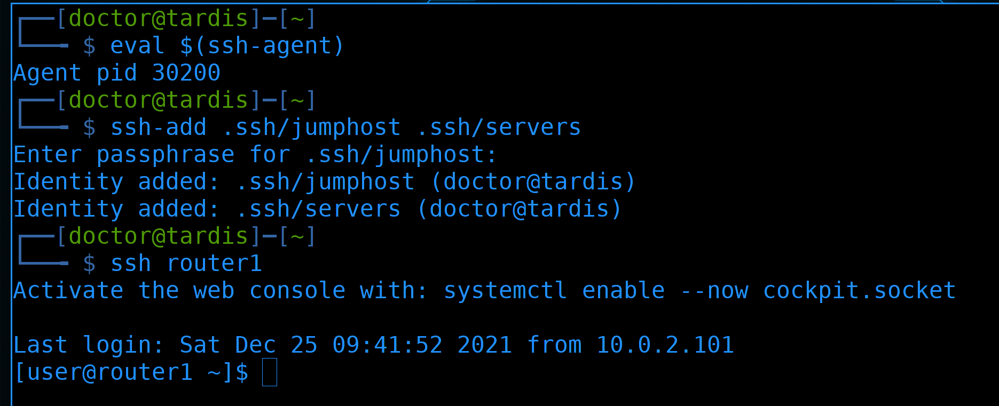

Стартанём ssh-агент:

```
eval $(ssh-agent)
```

добавим ключи:

```
ssh-add .ssh/jumphost .ssh/servers
```

И подрубимся к роутеру:

```
ssh router1
```

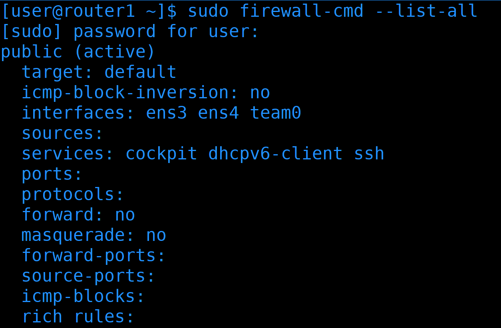

В прошлый раз на роутере 3 мы создали зону routers, а на роутере 1 всё осталось в public зоне:

```
sudo firewall-cmd  --list-all
```


Давайте это исправим. Для начала создадим зону routers:

```
sudo firewall-cmd --new-zone=routers --permanent
```

Переместим в неё интерфейс, который в одной сети с роутером 3:

```
sudo firewall-cmd --change-interface=team0 --zone=routers --permanent
```

Добавим в эту зону ssh, чтобы мы могли с роутера 3 подключаться к роутеру 1: 

```
sudo firewall-cmd --add-service=ssh --zone=routers --permanent
```

Потому что с джампхоста нельзя, а иначе только через консоль. Перезапустим файрвол и проверим новую зону:

```
sudo firewall-cmd --reload
sudo firewall-cmd --list-all --zone=routers
```

Всё как и должно быть.

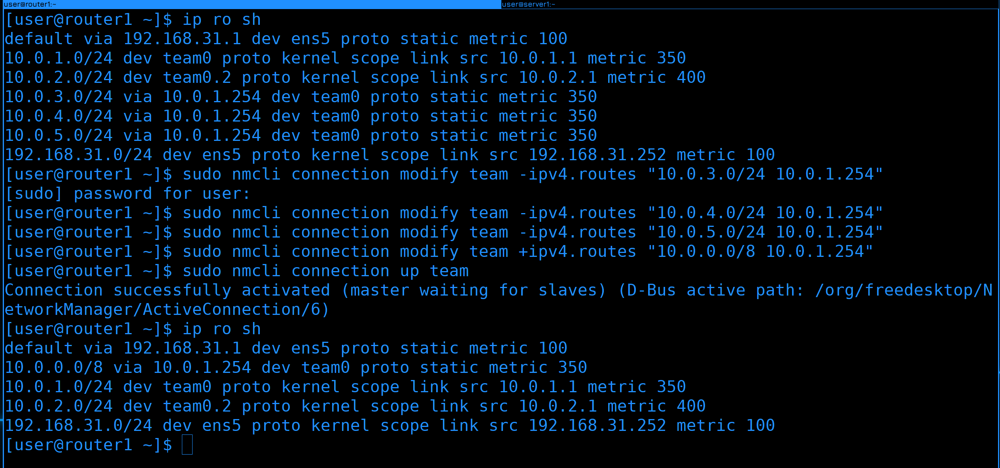

Пока не забыл. Недавно мы на роутере1 прописали 3 маршрута:

```
ip ro sh
```

3, 4 и 5 сети. Но если у нас количество сетей будет постоянно расти, чтобы не забывать их добавлять, давайте поменяем подход. Уберём эти 3 сети:

```
sudo nmcli connection modify team -ipv4.routes "10.0.3.0/24 10.0.1.254"
sudo nmcli connection modify team -ipv4.routes "10.0.4.0/24 10.0.1.254"
sudo nmcli connection modify team -ipv4.routes "10.0.5.0/24 10.0.1.254"
```

и вместо них пропишем всю подсеть 10.0.0.0/8 - сюда входит всё от 10.0.0.0 до 10.255.255.255.

```
sudo nmcli connection modify team +ipv4.routes "10.0.0.0/8 10.0.1.254"
```

Затем поднимем профиль и проверим таблицу маршрутизации:

```
sudo nmcli connection up team
ip ro sh
```

Теперь всё, что касается локальной сети, будет пересылаться на третий роутер.

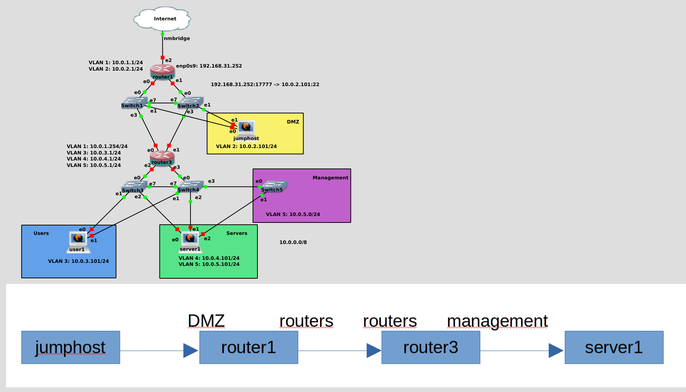

Давайте представим себе схему подключения jumphost-а к server1. Изначально пакет идёт от jumphost-а к router1. Для router1 jumphost находится в зоне DMZ. Дальше router1 передаёт пакет на router3. Для router1 router3 находится в зоне routers. Тоже самое для router3 - router1 находится в зоне routers. 

Что касается router3, в нашей схеме сейчас трафик из DMZ зоны, чтобы попасть во внутреннюю сеть, должен будет проходить сначала через router1, и только потом через роутер3. А это значит, что мы будем перегонять лишний трафик через роутер1. Поэтому давайте лучше добавим к роутеру3 второй влан, чтобы устройства из DMZ напрямую проходили через роутер3. Я пропущу добавление второго влана на роутере 3 и настройку транк портов на свитчах, мы это уже разбирали.

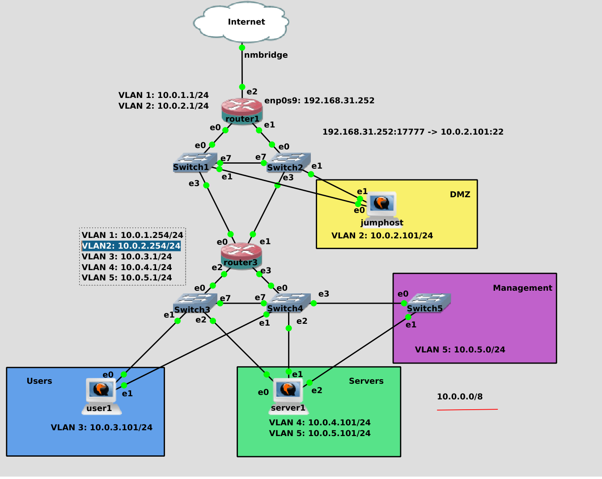

На роутере 3 я создал новый влан интерфейс с адресом 10.0.2.254 и добавил его в зону DMZ.

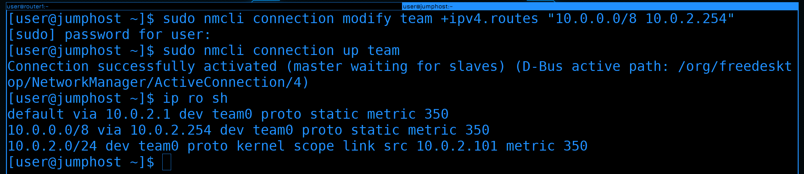

На самом jumphost-е, чтобы он направлял все пакеты во внутреннюю сеть через адрес третьего роутера, пропишем новый маршрут:

```
sudo nmcli connection modify team +ipv4.routes "10.0.0.0/8 10.0.2.254"
```

Затем поднимем интерфейс и проверим таблицу маршрутизации:

```
sudo nmcli connection up team
ip ro sh
```

Тут мы видим, что все пакеты, идущие в сеть 10.0.0.0/8 будут проходить через роутер3. А все другие адреса - через роутер 1.


Теперь подключение от jumphost-а на сервер выглядит попроще - посреди только роутер3. Jumphost для роутера3 находится в зоне DMZ, а сервер1 в зоне management. Точнее в двух зонах - servers и management, но нас сейчас интересует только вторая зона.

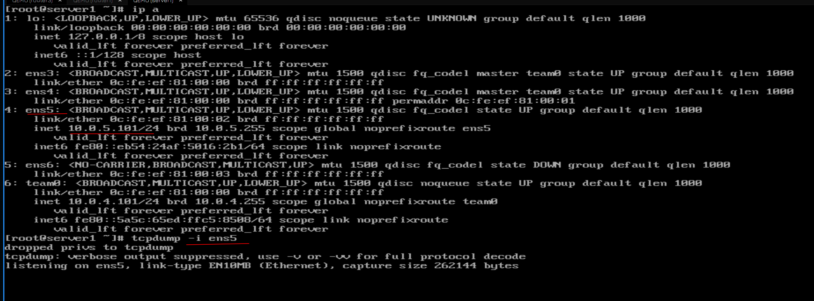

Подключимся к серверу1. К нему по ssh можно подрубиться только с 5 влана:

```
ip a
```

А он у нас на интерфейсе ens5. Давайте посмотрим tcpdump на этом интерфейсе:

```
tcpdump -i ens5
```


Теперь идём на jumphost и пытаемся пингануть:

```
ping 10.0.5.101
```

Пинга нет. Но дело не в файрволе, он у нас все пинги по-умолчанию разрешает. Также не получается подключиться по ssh:

```
ssh 10.0.5.101
```

Но это ещё понятно, тут дело в файрволе. К нему мы ещё придём, а пока попытаемся разобраться, почему server1 не пингуется.


Идём и смотрим tcpdump. Как видите, пакетов по ssh не было, но вот пинги приходили. Но на них не было ответа. Почему?

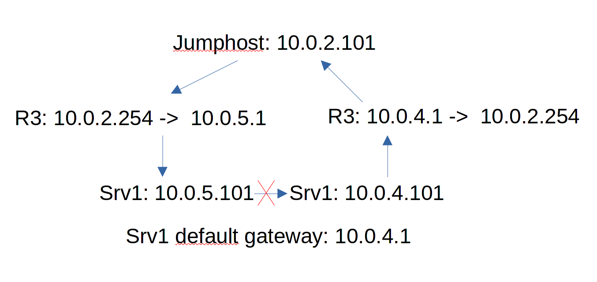

Есть одна особенность, когда у вас в системе несколько IP адресов, как на нашем сервере1. У него два адреса - 10.0.4.101 и 10.0.5.101. А вот default gateway всего 1 - 10.0.4.1. И вот представьте - джампхост посылает пинг на адрес 10.0.5.101. Сервер1 должен ответить на адрес 10.0.2.101. Но у него в таблице маршрутизации сказано, что этот адрес доступен за адресом 10.0.4.1 - а значит ответ надо посылать с другого интерфейса, на котором IP - 10.0.4.101. Т.е. пакет приходит с одного интерфейса, а ответить надо с другого. С одной стороны, мы могли бы для адреса 10.0.2.101 прописать маршрут через 10.0.5.1. Но тогда бы возникла обратная проблема - если запрос будет приходить на 4.101, то ответ будет посылаться с 5.101 - что приведёт к такой же проблеме. 


Обычно так не должно быть. Поэтому ядро по-умолчанию блокирует такие ответы. Т.е. если пакет приходит с одного интерфейса, а ответ нужно послать с другого - то ядро не разрешает. В целом, конечно, можно разрешить, но с точки зрения маршрутизации это не совсем верно. Есть более правильный способ. Нам надо для интерфейса, где адрес 5.101 прописать свою таблицу маршрутизации. 

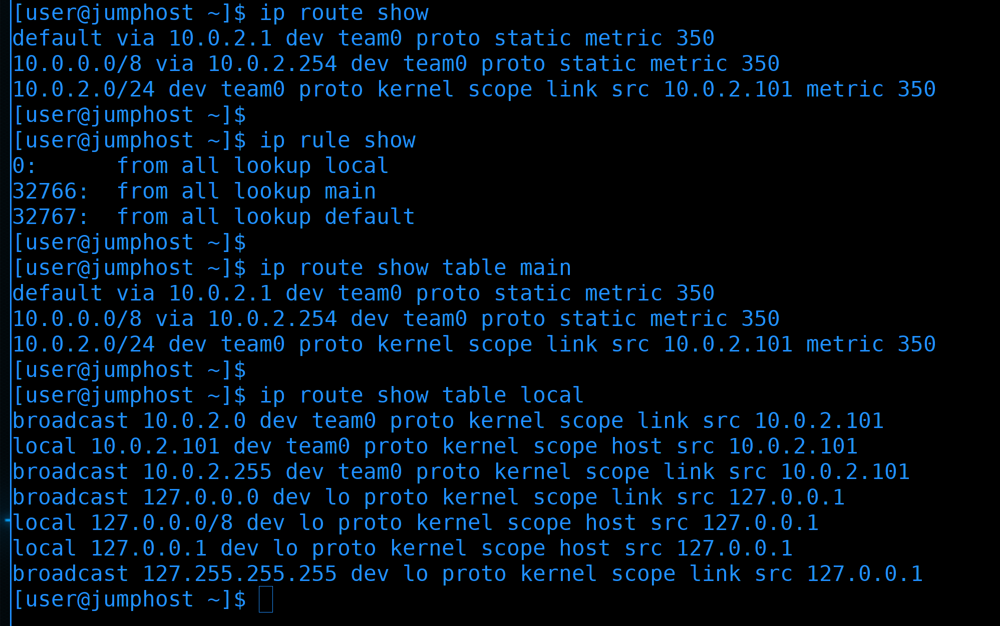

Для начала разберёмся с таблицами и правилами маршрутизации. Вкратце, есть таблица маршрутизации:

```
ip route sh
```

Ничего такого. Есть ещё правила маршрутизации:

```
ip rule show
```

Числа слева - приоритет. Чем ближе к 0 - тем он выше. Дальше "от кого" - from all. Тут мы указываем исходящую сеть. И потом lookup и 3 значения - local, main и default. Это и есть таблицы маршрутизации. Та таблица маршрутизации, которую мы видим при вводе ip ro sh - одна из них - main. Можем убедиться в этом введя команду:

```
ip route show table main
```

Есть ещё local:

```
ip route show table local
```

Здесь, в основном, про локальные сети. 

Т.е. мы можем создать несколько таблиц маршрутизации и можем написать, что для запросов с таких-то сетей нужно использовать такую-то таблицу маршрутизации, при этом учитывая ещё и приоритет. Чтобы было понятнее, сделаем это на сервере1. 

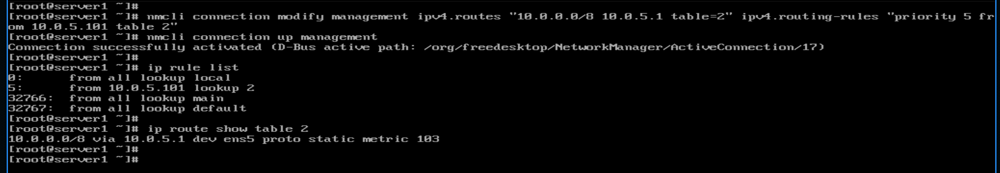

Добавим для интерфейса ens5 в профиле NetworkManager-а новый маршрут, при этом указав таблицу с каким-то числом, допустим, 2:

```
nmcli con mod management ipv4.routes "10.0.0.0/8 10.0.5.1 table=2" ipv4.routing-rules "priority 5 from 10.0.5.101 table 2"
```

И так, мы в профиле интерфейса ens5 сказали, что для сети 10.0.0.0/8 нужно использовать в качестве гейтвея 10.0.5.1, при этом это относится к таблицу маршрутизации 2. И сразу же добавили правило с приоритетом 5, исходящим IP 10.0.5.101 и этой таблицей 2.

Поднимем интерфейс и посмотрим правила и таблицу маршрутизации:

```
nmcli con up management
ip rule list
ip route show table 2
```

Как видите, теперь у нас есть правило с приоритетом 5, которое указывает на таблицу 2, где и указан маршрут для локальной сети. Теоретически, вместо 10.0.0.0/8 можно было бы указать 0.0.0.0/0, чтобы у каждого интерфейса был свой default gateway, но так как речь касается management интерфейса, я не хочу, чтобы у него был маршрут в интернет. 


Теперь с самого jumphost-а можно пинговать server1 как по адресу 4.101, так и по 5.101:

```
ping 10.0.4.101
ping 10.0.5.101
```


В итоге получается такая картина: когда запрос приходит на интерфейс с адресом 4.101, то для ответа используется таблица маршрутизации main, в которой default gateway-ем является адрес роутера 4.1. А вот если запрос придёт на адрес 5.101, то будет использоваться таблица маршрутизации 2, в которой есть обратный маршрут через адрес роутера 5.1.


Теперь, когда мы привели в порядок маршрутизацию, вернёмся к файрволу. И так, мы на внутреннем роутере должны разрешить джампхосту подключаться по ssh к серверу1. Для этого нужны политики файрвола. 

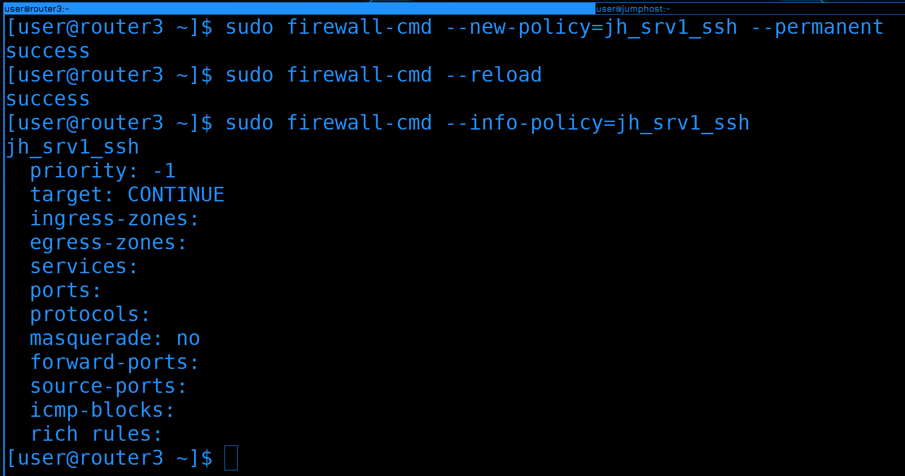

Для начала на роутере3 создадим новую политику:

```
sudo firewall-cmd --new-policy=jh_srv1_ssh --permanent
sudo firewall-cmd --reload
```

Она должна разрешать подключение от jumphost-а к серверу1 по ssh. Такое название и дадим, чтобы было понятнее. 

После создания политика почти пустая:

```
sudo firewall-cmd --info-policy=jh_srv1_ssh
```

Политика сильно напоминает зону. Но если в зоне мы указываем порты и сервисы, по которым могут подключаться к нам, то в политике мы указываем порты и сервисы, которые мы разрешаем в проходящих пакетах от одной зоны к другой. Поэтому здесь есть два дополнительных поля - ingress-zone и egress-zone - входящая зона и исходящая. 

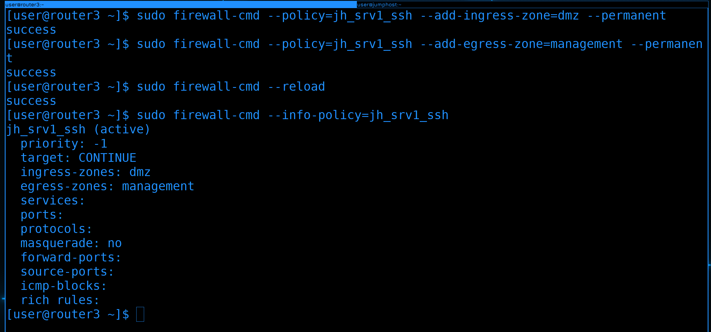

Как вы поняли - теперь мы должны добавить ingress и egress зоны в эту политику:

```
sudo firewall-cmd --policy=jh_srv1_ssh --add_ingress_zone=dmz --permanent
sudo firewall-cmd --policy=jh_srv1_ssh --add-egress-zone=management --permanent
sudo firewall-cmd --reload
```

Соответственно, подключение будет из зоны dmz, значит ingress zone это dmz, а направляться пакеты будут в зону management - значит это egress зона. Проверим политику:

```
sudo firewall-cmd --info-policy=jh_srv1_ssh
```

Как видите, зоны прописались. 

Но так как тут нет возможности добавить source и destination адреса, нам остаётся два варианта. Либо придётся просто прописать сервис, что приведёт к тому, что с любого адреса из зоны dmz можно будет по ssh подрубиться к management зоне. А мы этого не хотим.


Либо придётся писать rich rule, что мы и сделаем. 

```
sudo firewall-cmd --policy=jh_srv1_ssh --permanent --add-rich-rule='rule family=ipv4 source address=10.0.2.101/32 destination address=10.0.5.101/32 port port=22 protocol=tcp accept'
```

И так, здесь мы говорим, что разрешаем подключение от адреса 10.0.2.101 к адресу 10.0.5.101 по порту 22 и протоколу tcp. И это всё применяется на политику с зоны dmz на management.

Перезагрузим файрвол и проверим политику:

```
sudo firewall-cmd --reload
sudo firewall-cmd --info-policy=jh_srv1_ssh
```

Да, появилось правило. 

На мой взгляд, здесь политики сделаны немного нелогично. Как минимум нужна возможность добавить source и destination адреса, а не возиться с rich rule-ами. Но это относительно новый функционал у firewalld и не то чтобы кто-то кроме нас использует firewalld как сетевой файрвол. Поэтому на это можно закрыть глаза. У политик есть приоритеты, от которых зависит порядок их проверки, но мы не будем сильно с этим заморачиваться, курс всё таки не об этом. 

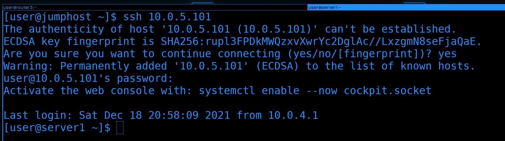

Давайте попробуем с jumphost-а подключиться к серверу1:

```
ssh 10.0.5.101
```

И всё работает. 


Теперь у нас есть возможность попасть во внутреннюю сеть, подключаясь от jumphost-а к серверу1. По сути, теперь server1 будет выступать нашим вторым jumphost-ом. Через него есть выход в 5 влан, откуда мы можем подрубаться к менеджмент интерфейсам. Например, роутера3.


Теперь смотрите какую цепочку мы можем создать в ssh подключении. И так, из интернета у нас доступен только jumphost. Но сам jumphost не может подключаться куда угодно, единственный доступный ему сервер - сервер1. Сам сервер1 может видеть роутер3, так как они находятся в одном management vlan-е. А из роутера3 я могу подключиться к роутеру1. Последнее, на самом деле, не обязательно. Для роутера 1 вы также можете использовать сервер1 в качестве джамп хоста, но тогда надо будет прописать политику файрвола на роутере3, чтобы он разрешал подключение от сервера1 к роутеру1. 


Попробуем подключиться. При первом подключении надо будет сохранить ключи от всех промежуточных хостов и ввести все пароли от систем, куда мы не закинули ключи.


Больше мы этих сообщений не увидим:

```
ssh router1
```

А на хосты, которые просят пароли, можем закинуть ключи:

```
ssh-copy-id -i .ssh/servers.pub server1
ssh-copy-id -i .ssh/servers.pub router3
```

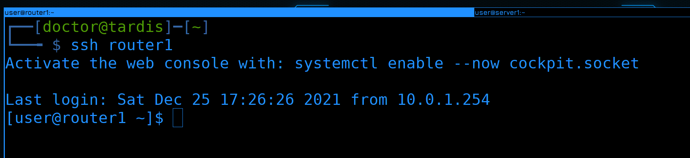

И теперь простой командой:

```
ssh router1
```

мы через 3 джампхоста попадаем на роутер1. Да и в целом можем на любой хост в сети. 


Вообще, если использовать роутер3 в качестве джампхоста, можно попасть на любой хост. Но так как настоящие роутеры не очень годятся в качестве джампхостов, вместо этого мы будем писать правила для файрвола и использовать маршрутизацию. Поэтому это будет небольшим заданием для вас - прописать на нём политики, чтобы можно было с сервера1 подключаться к юзеру1 и роутеру1. 

Давайте подведём итоги. Сегодня мы с вами разобрали таблицы и правила маршрутизации, а также политики для файрволов. Хотя пока мы написали всего одну политику, но это в основном было сделано для будущих задач. Когда мы будем поднимать различные сервисы в разных зонах, нам нужно будет постоянно лезть в файрвол и писать политики. А сеть у нас почти готова - дальше можно сконцентрироваться на самих сервисах. 