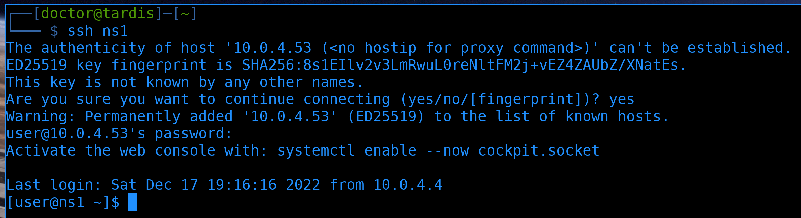
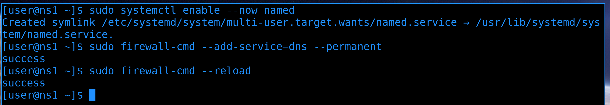

# 13. Основы DNS ч.2

<iframe width="560" height="315" src="https://www.youtube.com/embed/Ox1A4sI6WW8" title="YouTube video player" frameborder="0" allow="accelerometer; autoplay; clipboard-write; encrypted-media; gyroscope; picture-in-picture" allowfullscreen></iframe>

## Вступление 

В прошлый раз мы с вами разобрали, что такое домен, что такое зона, делегирование, SOA, NS записи и некоторые другие основы DNS. Предлагаю не тратить время на очередную теорию про другие основные типы DNS записей, этого в интернете и так полно, мы же их будем рассматривать по мере практической необходимости. К примеру, будем разбирать почтовый сервер - зайдём на DNS сервер, пропишем необходимые типы записей для почтового сервера, там же их и разберём. 


А пока, давайте поднимем DNS сервер. Есть разные реализации, мы будем учиться на bind. Это сервер от той же организации, которая разрабатывает dhcp сервер, разбираемый в предыдущих темах. Почему именно bind? С одной стороны он известный, много где применяется, а с другой - это хороший пример для обучения работы с сервисами в командой строке Linux. Если раньше в отношении сервисов мы просто редактировали конфиг файл и рестартовали сервис, то с bind всё чуть комплекснее - помимо настроек самого демона, у него есть ещё файлы зон и утилиты, которые управляют DNS сервером.  

## Подготовка виртуальной машины


Начнём с того, что добавим ещё одну виртуалку в нашу схему, назовём её ns1 и подключим в серверный влан используя оба свитча. Настройку тиминга и выдачу хостнейма сделайте сами. 

DNS сервер, в некотором роде, будет связывать все системы внутри нашей инфраструктуры. И если вдруг у него поменяется IP адрес - это может привести к плохим последствиям. Поэтому давайте зарезервируем IP адрес на dhcp сервере.


Заходим на dhcp сервер и смотрим список выданных адресов:

```
perl /usr/share/doc/dhcp-server/dhcp-lease-list.pl
```

В табличке с помощью колонки hostname находим наш сервер ns1 и копируем его мак адрес.


Дальше заходим в конфиг с резервациями нашего dhcp сервера и добавляем новую запись.

`/etc/dhcp/dhcpd.conf.d/reservation.conf`
```
host ns1 {
  hardware ethernet 0c:35:c4:37:00:00;
  fixed-address 10.0.4.53;
}
```

Я дал адрес 53, так как DNS работает на 53 порту. Так будет легче запомнить, что за этим адресом DNS сервер.


Не забываем после изменений скопировать конфиг файл с резервациями на второй dhcp сервер, а дальше перезапускаем сервис dhcpd:

```
systemctl restart dhcpd
```


Чтобы наш новый сервер получил новый адрес, переподключаем на нём сетевой интерфейс и проверяем IP адрес.

```
nmcli con up team
ip a show team0
```



Правим ssh конфиг и подключаемся к новому DNS серверу:

```
ssh ns1
```

## Установка bind


Установим bind:

```
sudo yum install bind -y
```

Тут с названиями довольно запутано - пакет называется bind, его сервис в systemd называется named, а в файроволе сервис называется просто dns.



Так как мы в тестовой среде, можем сразу запустить сервис и добавить его на файрвол:

```
sudo systemctl enable --now named
sudo firewall-cmd --add-service=dns --permanent
sudo firewall-cmd --reload
````

Но в реальной среде так делать не стоит, лучше предварительно настроить, а уже потом запускать сервис и добавлять его на файрволе. Если вы будете разворачивать сервис в интернете, то может сложиться ситуация, что у какого-то демона, по-умолчанию, не безопасные настройки. И пока вы будете с ними возиться, кто-то уже успеет сделать что-то плохое.

## Разбор настроек


Основной файл настроек bind-а - /etc/named.conf. Тут у нас всё что касается самого демона - на каких портах он работает, всякие настройки кэширования, безопасности и прочее. Ещё здесь указываются зоны, но всё что касается самих DNS записей прописывается в других файлах, до них мы ещё дойдём. Пока разберём этот файл.


Сверху мы видим небольшую подсказку. Она может привести нас к примерам, где можно найти чуть более детальные конфиги:

```
ls /usr/share/doc/bind*/sample/
ls /usr/share/doc/bind*/sample/etc
cat /usr/share/doc/bind*/sample/etc/named.conf
```

Да, всё это можно найти и в интернете, но иногда, если что-то вылетело из головы, легче взглянуть на пример и вспомнить, чем пытаться это нагуглить. Ну и взглянув на готовые примеры можно встретить то, что и не думал искать раньше. К примеру, пока я не взглянул на этот конфиг, я и не думал, что у bind есть графическая утилита для настройки.

Сам конфиг напоминает конфиг для DHCP сервера - также используются точки с запятыми как разделители, комментарии со слешами и звёздочками, секции с фигурными скобками, также есть возможность расширить настройки на несколько файлов с помощью include. Основные настройки самого демона находятся в секции options, есть отдельная секция logging, есть секции под специфичные нужды, такие как view, key, trusted-keys, zone. Всё это мы будем разбирать по мере необходимости.


Вернёмся к основному конфигу и пройдёмся по секции options:

```
sudo nano /etc/named.conf
```

- `listen-on` - указывает, на каких адресах и портах работает этот демон. DNS по умолчанию работает на 53 порту, и вы, скорее всего, никогда не поменяете стандартный порт. Большинство DNS клиентов даже не позволяют указать другой порт. То есть, если вы настроите здесь не стандартный порт - то ваши клиенты просто не смогут достучаться до DNS сервера. Да, есть DNS-over-TLS или DNS-over-HTTPS, они используют не 53 порт, но это настраивается по другому и не связано с этим параметром. Разве что DNS сервера могут обращаться друг к другу по нестандартным портам, и это может быть полезно в каких-то специфичных случаях.

  В фигурных скобках мы видим 127.0.0.1. Это означает, что этот DNS сервер слушает только на этом адресе, а значит он доступен только сам для себя. Чтобы другие компьютеры могли к нему обращаться, давайте добавим сюда также его основной адрес. И не забудьте поставить точку с запятой после:

  `listen-on port 53 { 127.0.0.1; 10.0.4.53; };` 

- `listen-on-v6` - тоже самое, что и listen-on, но предназначенное для ipv6.

Дальше идут несколько параметров, которые полезно понимать, но зачастую нет смысла трогать:

- `directory` - основная директория с файлами. Здесь обычно всякие файлы с DNS записями, временные файлы и прочее. Мы ещё сюда зайдём.

- `dump-file` - Файл, куда сохраняется кэш во время работы DNS сервера. Огромная часть работы DNS сервера - работа с кэшем, чтоб не узнавать ответ на каждый запрос повторно, что занимает гораздо больше времени и ресурсов. Если у вас есть высоконагруженный DNS сервер, на него приходит огромное количество DNS запросов, и вдруг сервис падает, даже если он моментально заново поднимется, восстановление кэша с нуля может быть лишней тратой времени и ресурсов. А при наличии такого dump-файла процесс восстановления будет гораздо быстрее.

- `statistics-file` - файл, куда сливается статистика с работы сервиса - количество и типы DNS запросов, сколько заняли времени и т.п.

- `memstatistics-file` - ещё один файл статистики, но больше связанный с потреблением памяти.

- `secroots-file` - файл, куда кэшируются ключи для проверки подписей для DNSSEC. DNSSEC это отдельная тема, которую я не хочу пока мешать с основами DNS, её мы разберём отдельно.

- `recursing-file` - файл, куда будет записан вывод команды `rndc recursing`, который покажет текущие рекурсивные запросы. Может пригодится при поиске проблем с рекурсивными запросами.

Теперь перейдём к параметрам поинтереснее:

- `allow-query` - разрешить запросы - и в скобках мы указываем откуда. `listen-on` просто позволяет сервису слушать на указанных адресах, но это не значит, что он будет отвечать всем, кто пришёл на этот адрес. В нашем случае, сейчас:

  `allow-query     { localhost; };`

  настроено так, что сервер будет отвечать только на свои запросы, а на все запросы с других IP адресов он будет отвечать отказом. В скобках мы можем указать конкретные IP адреса, подсети или просто `any`, чтобы отвечать всем. 

  Так как мы поднимаем сервис для нашей локальной сети, давайте укажем `10.0.0.0/8`:

  `allow-query     { localhost; 10.0.0.0/8; };`

  И ещё раз напомню - не забывайте ставить точку с запятой в конце.


Обратите внимание, что нигде в этом конфиг файле нет какого-то комментария с объяснением параметра кроме одного специфичного места:

- `recursion` - позволяет сделать DNS сервер рекурсивным или отрубить этот функционал. Рекурсивный DNS сервер - это такой DNS сервер, который, получая запрос от клиента, ищет у себя в кэше, и если не найдёт - он идёт на другой DNS сервер, чтобы узнать ответ там. Узнав ответ, он отвечает клиенту и сохраняет ответ у себя в кэше, на случай, если будут ещё такие запросы. 

  То есть задача рекурсивного DNS сервера - находиться поближе к клиентам и быстро отвечать на запросы, чтобы ускорить работу с DNS и не гонять трафик просто так. Поэтому его также называют кэширующим DNS сервером.

  Если есть DNS сервера, которые перенаправляют запросы, значит есть и сервера, которые предоставляют ответы - авторитетные DNS сервера. Задача таких DNS серверов - предоставлять информацию о зонах. К примеру, если у вас есть домен и вы хотите для него создать DNS записи, то вам нужен авторитетный DNS сервер.

  Скажем, DNS на вашем домашнем дешёвом роутере может быть только кэширующим. Если вы поднимаете DNS сервер в интернете, чтобы делиться информацией о вашем домене, то не стоит его делать рекурсивным, иначе с помощью вашего сервера будут делать DDOS атаки. Об этом и предупреждают в комментарии в этом конфиге.

  Но не то чтобы авторитетный и рекурсивный сервера были взаимоисключающими. Например, немало компаний используют Microsoft Active Directory, где встроена служба DNS, которая одновременно и рекурсивная, и авторитетная. Да, к DNS сервису Active Directory из интернета доступ давать не стоит, но вот внутри сети компании можно пользоваться.

  В этой теме мы сделаем кэширующий DNS сервер, поэтому оставляем этот параметр со значением `yes`.


И так, мы решили, что наш DNS сервер будет рекурсивным. А рекурсивный должен узнавать ответы от других серверов. А из каких? Правильно, нам нужен параметр:

- `forwarders` - указывает, к каким DNS серверам нужно обращаться за ответами. Здесь вы можете указать DNS адреса провайдеров, так как они обычно ближе по сети, или какие-либо другие более доверенные сервера. Тут уже на ваше усмотрение. По личному опыту, я встречал несколько раз ситуации, когда у провайдеров возникают проблемы с DNS серверами и от этого страдает сеть компании. Но на вопрос "кому доверять DNS запросы компании в интернете" нет простого ответа, и, для примера, я просто указал сервера Cloudflare и Google.

  `forwarders { 1.1.1.1; 8.8.8.8; };`

Дальше идёт несколько параметров, связанных с DNSSEC, но мы это разберём в отдельной теме, поэтому сейчас их пропустим.


Перейдём к секции logging. bind делит логи на различные [категории][1]. 


Категории могут быть связаны с клиентскими запросами, конфиг файлами, dnssec и прочим. 

Эти категории можно направить в различные [каналы][2].


Вы создаёте каналы, где указываете, что делать с логом - записать в файл, отправить в syslog, добавить ли время лога, или может в целом ничего не делать с этим логом.

И в секции logging вы указываете, какую категорию в какие каналы стоит направлять:

```
logging {
     category default { default_logfile; default_debug; };
     category unmatched { null; };
};
```


Дальше у нас секция про корневую зону ".". 


Давайте посмотрим на содержимое указанного файла `named.ca`:

```
sudo cat /var/named/named.ca
```

Здесь мы видим адреса корневых DNS серверов. 


Помните, мы говорили, что DNS адрес как путь в Linux, только читается наоборот и вместо slash - точка? Благодаря этому файлу наш DNS сервер знает об адресах корневых DNS серверов. Если бы мы оставили параметр `recursion yes`, при этом не добавив `forwarders`, то наш DNS сервер сначала бы посылал запрос на эти корневые сервера, чтобы узнать DNS сервера для доменов первого уровня, затем обращался к тем, чтобы найти адреса DNS серверов для доменов второго уровня и дальше в зависимости от необходимой зоны. В прошлой теме мы с nslookup проходились по всей этой цепочке, поэтому советую предварительно посмотреть предыдущую тему. 

Так вот, если бы за каждым запросом мы бы ходили через такую огромную цепочку, то всё работало бы в разы медленнее, не говоря уже о том, что нагрузка на все эти сервера была бы безумной. Вот почему важно указывать forwarders.


И в конце у нас два include:

```
include "/etc/named.rfc1912.zones";
include "/etc/named.root.key";
```

Давайте посмотрим что в них.


```
sudo cat /etc/named.rfc1912.zones
```

Первый файл содержит специфичные зоны, связанные с localhost.


А второй файл, опять же, связан с DNSSEC.

## Запуск сервиса


И так, давайте сохраним файл. Так как мы поменяли пару настроек, не забудем перезапустить named для применения наших изменений:

```
sudo systemctl restart named
```

Мы сделали restart, так как пока что нашим DNS сервером никто не пользуется и перезагрузка сервиса не страшна. Но в будущем, когда нужно будет применить настройки на рабочем DNS сервисе, которым уже пользуются клиенты, так делать не стоит, потому что это приведёт к недоступности DNS сервера, а это может привести к серьезным последствиям.


Для безболезненного применения настроек можем использовать reload вместо restart:

```
sudo systemctl cat named | grep Reload
```

Как видите, reload задействует утилиту rndc - с помощью неё можно управлять bind, при чем не только локальным.


Если вы где-то опечатались, а очень часто новички забывают где-то точку с запятой и сервис потом не стартует, то легче всего посмотреть в логи, где можно будет найти номер строки с ошибкой:

```
sudo journalctl -eu named
```

В моих логах я вижу другую ошибку - host unreachable resolving, timeout и прочее. Это говорит о том, что у моего DNS сервера нет доступа к указанным DNS серверам.

## Настройка firewall


Давайте попытаемся разобраться. Пустим ping на 1.1.1.1, чтобы понять, есть ли сетевой доступ:

```
ping 1.1.1.1
```

Да, единички пингуются, значит у этой системы есть доступ в интернет.


Однако, если мы попытаемся пингануть `google.com` то увидим ошибку `Name or service not known`:

```
ping google.com
```

Это нам говорит о том, что не резолвятся имена.


Давайте проверим resolv.conf:

```
cat /etc/resolv.conf
```

И здесь мы видим, что у нас прописаны эти самые единички, и они у нас пингуются. И так, пинг у нас доходит, но DNS запросы нет. Почему?


Самое время вспомнить, что у нас сервера существуют не в вакууме, а в нашей сети. И в нашей сети есть файрволы, которые не пускают ничего, кроме пингов. Значит нам надо разрешить нашим DNS серверам доступ в интернет, хотя бы для сервиса DNS.


Идём на router3 и смотрим все политики:

```
sudo firewall-cmd --list-all-policies
```

И обнаружимваем, что оказывается, мы уже разрешали нашим серверам доступ в интернет, в том числе по DNS.


Однако, если зайти на router4, можем заметить, что такой политики нет.

```
sudo firewall-cmd --list-all-policies
```

Мы забыли её добавить. Ладно, не страшно, быстренько вспоминаем:


Просто скопируем из [второй темы по DHCP][3] команды для создания политики, добавления в неё зон, добавление сервисов и, собственно, рестарт firewall.

```
sudo firewall-cmd --permanent --new-policy=srv_to_internet
sudo firewall-cmd --permanent --policy=srv_to_internet --add-ingress-zone=servers
sudo firewall-cmd --permanent --policy=srv_to_internet --add-egress-zone=routers
sudo firewall-cmd --permanent --policy=srv_to_internet --add-service={dns,http,https}
sudo firewall-cmd --reload
```


Возвращаемся на ns1 и проверяем пинг:

```
ping google.com
```

Теперь всё пингуется и резолвится. Но, обратите внимание, пинг идёт не благодаря нашему новому DNS сервису, в /etc/resolv.conf были прописаны единички. То есть мы пока что не тестировали наш DNS сервер.

То что мы подняли DNS сервер не значит, что все компьютеры в нашей сети автоматом стали его использовать. Они даже его не знают. А как они могут узнать, что у нас в сети есть DNS сервер? Правильно, DHCP! Это DHCP сервер говорит всем нашим компьютерам адреса DNS серверов.


Пойдём на DHCP сервера и прежде всего проверим, могут ли они использовать наш DNS сервер. Как проверить, работает ли DNS сервер? Правильно, к примеру с помощью nslookup с указанием сервера:

```
nslookup google.com 10.0.4.53
```

Мы видим, что есть ответ. Значит что? Значит наш DNS работает. Но наш DHCP сервер находится в той же подсети, что и DNS сервер, а это значит, что мы не учитываем firewall. 


Попробуем тоже самое с пользовательского компьютера.

```
nslookup google.com 10.0.4.53
```

И на этот раз мы видим `connection timed out`. Как мы и предполагали, все кто находится в серверной сети могут достучаться до DNS, а вот для остальных стоит прописать политику на наших файрволах.


Идём на router3. Добавим политику, назовём её просто - dns:

```
sudo firewall-cmd --new-policy=dns --permanent
```

Для этой политики входящей зоной будет любая - ANY, а исходящей - сервера:

```
sudo firewall-cmd --policy=dns --add-ingress-zone=ANY --permanent
sudo firewall-cmd --policy=dns --add-egress-zone=servers --permanent
```

Мы не хотим, чтобы любой пользователь мог подключиться к любому серверу по DNS, а только к одному определённому. Поэтому добавляем rich-rule:

```
sudo firewall-cmd --policy=dns --permanent --add-rich-rule='rule family=ipv4 source address=10.0.0.0/8 destination address=10.0.4.53/32 port port=53 protocol=udp accept'
```

Не забываем перезапустить файрвол:

```
sudo firewall-cmd --reload
```

Ну и самое главное, на этот раз, не забудем добавить тоже самое на втором файрволе. Будь у нас какой-нибудь коммерческий firewall, он бы в режиме репликации копировал настройки на оба наших файрвола, но вряд ли firewalld рассчитан на такое применение. Но я в своих темах показываю идею, что и для чего делать, и в данном случае: поднял сервис - надо добавить на файрволе.


Вернёмся и проверим снова - и теперь мы видим, что user1 получает ответ от DNS сервера.

## Настройка DHCP

Отлично, значит мы можем обновить настройки на DHCP серверах.


Идём на dhcp1, заходим в настройки подсетей:

```
sudo nano /etc/dhcp/dhcpd.conf.d/subnets.conf
```

Раньше в параметре `domain-name-servers` у нас было два DNS сервера, но мы пока что подняли только один, так что укажем только его:

```
option domain-name-servers 10.0.4.53;
```


Сохраняем изменения, выходим и перезапускаем сервис для применения настроек.


Проделываем ту же операцию на втором DHCP сервере.


Мы могли бы дождаться, пока dhcp клиенты свяжутся с сервером по поводу обновления lease time и получат новые настройки, но это может занять время. И чтобы ускорить этот процесс, я просто переподключусь к сети на пользовательском компьютере:

```
nmcli con up ens3
```

Проверю `/etc/resolv.conf`:

```
cat /etc/resolv.conf
```

И здесь мы видим, что адрес DNS сервера обновился. Можем для проверки ещё раз пустить nslookup:

```
nslookup 10.0.4.53
```

И всё работает.

## Итоги


По хорошему, нам теперь надо вернуться на файрвол, убрать доступ к DNS в интернете всем серверам и прописать специфичное правило - чтобы только ns1 мог подключаться в интернет только к своим forwarders. Но это будет заданием для вас.

Ну и другое задание - поднять ns2. Поднять второй кэширующий DNS сервер будет довольно просто - нужно поднять точно такой же сервис, точно с такими же настройками, добавить его на файрволе и в DHCP. Сервера между собой никак не связаны, не делятся никакими пулами, как тот же DHCP, не нужно разделять один и тот же IP адрес. Все DNS клиенты поддерживают несколько DNS серверов, благодаря чему можно прописав на клиентах два DNS адреса сделать отказоустойчивость. 

И так, подытожим. Мы сегодня поставили bind, прошлись по настройкам и настроили его как кэширующий DNS сервер. При этом интегрировали его в нашу сеть - обновили правила на файрволах, обновили настройки DHCP серверов и проверили работоспособность. В будущих темах мы разберём, как поднять авторитетный DNS сервер, поговорим про DNSSEC, DNS-over-TLS и прочее.


[1]: https://bind9.readthedocs.io/en/latest/reference.html#the-category-phrase
[2]: https://bind9.readthedocs.io/en/latest/reference.html#the-channel-phrase
[3]: https://infra.gnulinux.pro/ru/latest/infra/11/11._DHCP_%D1%81%D0%B5%D1%80%D0%B2%D0%B5%D1%80_%D1%87.2.html?highlight=srv_to_internet